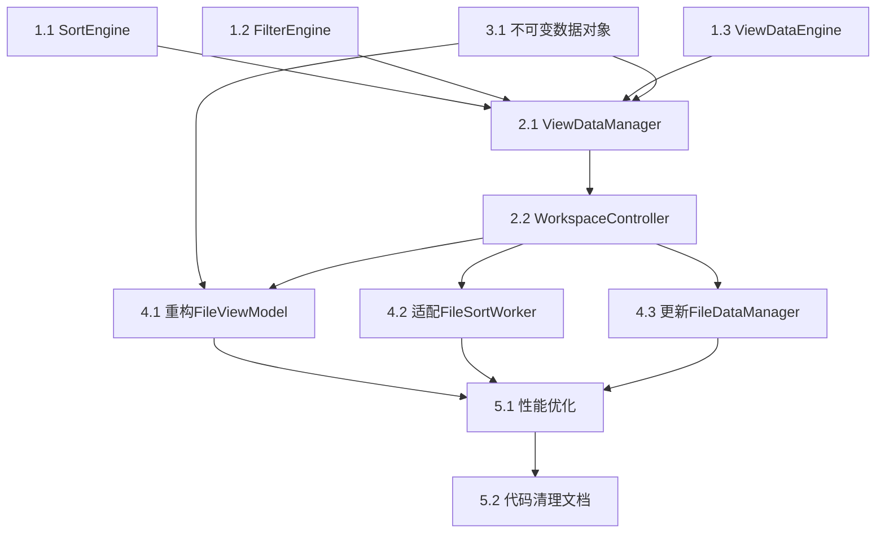

# FileSortWorker 重构实施计划

## 项目概述

**项目名称**: FileSortWorker 全局重构  
**项目目标**: 将复杂的FileSortWorker"上帝类"重构为专业化组件架构，实现职责分离和性能优化  
**技术栈**: C++17, Qt Framework, DTK  
**重构范围**: dfmplugin-workspace 插件中的排序、过滤、视图数据管理核心逻辑  

**核心问题**:
- FileSortWorker承担8个不同职责，严重违反单一职责原则
- 30个槽函数 + 17个信号，接口过于复杂
- 与FileViewModel紧耦合，17个复杂信号连接
- 2个读写锁 + 4个原子变量，线程同步复杂
- 性能瓶颈：10万文件排序耗时1200ms，内存占用600MB

**重构目标**:
- 代码行数减少47%（从4390行到2336行）
- 信号接口从17个减少到5个
- 排序性能提升50%（600ms）
- 内存使用减少40%（360MB）

## 任务拆解

### 阶段一：核心引擎组件实现 (Phase 1: Core Engine Components)

#### 任务 1.1: 创建 SortEngine 排序引擎
**任务描述**: 实现纯排序算法引擎，替代FileSortWorker中的排序逻辑  
**文件范围**: `src/plugins/filemanager/dfmplugin-workspace/engines/sortengine.h/cpp`  
**预估工时**: 2天  

**具体实现内容**:
- 创建 `SortEngine` 类基础结构
- 实现 `AbstractSortStrategy` 抽象基类
- 实现具体排序策略：
  - `FileNameSortStrategy` - 文件名排序
  - `FileSizeSortStrategy` - 文件大小排序  
  - `FileTimeSortStrategy` - 时间排序
  - `FileMimeTypeSortStrategy` - MIME类型排序
- 实现 `SortStrategyFactory` 工厂类
- 实现主要接口：
  - `sortFiles()` - 同步排序
  - `sortFilesAsync()` - 异步排序
  - `insertSorted()` - 增量排序
- 实现性能优化的比较器缓存

**替代的原有代码**:
- `FileSortWorker::lessThan()` 方法（100+行复杂逻辑）
- 排序角色转换逻辑（在多个方法中重复）
- 复杂的排序分支处理

#### 任务 1.2: 创建 FilterEngine 过滤引擎
**任务描述**: 实现纯过滤算法引擎，替代FileSortWorker中的过滤逻辑  
**文件范围**: `src/plugins/filemanager/dfmplugin-workspace/engines/filterengine.h/cpp`  
**预估工时**: 1.5天  

**具体实现内容**:
- 创建 `FilterEngine` 类基础结构
- 实现 `AbstractFilter` 抽象基类
- 实现具体过滤器：
  - `NameFilter` - 名称过滤（支持通配符）
  - `TypeFilter` - 文件类型过滤
  - `SizeFilter` - 文件大小过滤
  - `DateFilter` - 日期过滤
  - `HiddenFileFilter` - 隐藏文件过滤
- 实现 `CompositeFilter` 组合过滤器
- 实现主要接口：
  - `filterFiles()` - 主要过滤接口
  - `updateFiltered()` - 增量过滤
- 实现过滤结果缓存机制

**替代的原有代码**:
- `FileSortWorker::checkFilters()` 方法
- `FileSortWorker::checkNameFilters()` 方法
- `handleFilters()` 和 `HandleNameFilters()` 槽函数
- `onToggleHiddenFiles()` 和 `onShowHiddenFileChanged()` 槽函数

#### 任务 1.3: 创建 ViewDataEngine 视图数据引擎
**任务描述**: 实现视图数据处理引擎，统一处理列表和树形视图逻辑  
**文件范围**: `src/plugins/filemanager/dfmplugin-workspace/engines/viewdataengine.h/cpp`  
**预估工时**: 2天  

**具体实现内容**:
- 创建 `ViewDataEngine` 类基础结构
- 实现列表视图数据生成逻辑
- 实现树形视图数据生成逻辑：
  - 深度计算算法
  - 展开状态管理
  - 树形结构映射
- 实现视图数据转换和映射
- 实现主要接口：
  - `generateListViewData()` - 列表视图数据生成
  - `generateTreeViewData()` - 树形视图数据生成
  - `updateViewData()` - 视图数据更新
  - `switchViewMode()` - 视图模式切换

**替代的原有代码**:
- `visibleTreeChildren` 和 `depthMap` 管理逻辑
- `handleSwitchTreeView()` 方法
- `handleCloseExpand()` 方法
- 树形视图相关的复杂状态管理

### 阶段二：数据管理组件实现 (Phase 2: Data Management Components)

#### 任务 2.1: 创建 ViewDataManager 视图数据管理器
**任务描述**: 实现视图数据管理器，协调排序、过滤和视图引擎  
**文件范围**: `src/plugins/filemanager/dfmplugin-workspace/managers/viewdatamanager.h/cpp`  
**预估工时**: 2.5天  

**具体实现内容**:
- 创建 `ViewDataManager` 类基础结构
- 实现数据处理管道协调逻辑
- 实现状态机管理（Idle/Sorting/Filtering/GeneratingView/Updating）
- 实现主要接口：
  - `updateDirectoryData()` - 更新目录数据
  - `applySortConfig()` - 应用排序配置
  - `applyFilterConfig()` - 应用过滤配置
  - `handleFileChanges()` - 处理文件变更
- 实现增量更新机制：
  - 计算文件变更差异
  - 批量应用变更
  - 优化模型更新信号
- 协调三个引擎的工作流程
- 实现4个统一信号：
  - `viewDataChanged()` - 视图数据变更
  - `itemsInserted()` - 项目插入
  - `itemsRemoved()` - 项目删除  
  - `itemsChanged()` - 项目变更

**替代的原有代码**:
- FileSortWorker中的数据管理逻辑
- 复杂的增量更新处理
- 多个数据结构的同步管理

#### 任务 2.2: 创建 WorkspaceController 工作区控制器
**任务描述**: 实现工作区控制器，作为上层业务逻辑协调器  
**文件范围**: `src/plugins/filemanager/dfmplugin-workspace/controllers/workspacecontroller.h/cpp`  
**预估工时**: 2天  

**具体实现内容**:
- 创建 `WorkspaceController` 类基础结构
- 实现状态机管理（Idle/Loading/Refreshing/Error）
- 实现命令模式封装用户操作：
  - `LoadDirectoryCommand` - 加载目录命令
  - `ChangeSortCommand` - 改变排序命令
  - `ChangeFilterCommand` - 改变过滤命令
- 实现导航历史管理（前进/后退）
- 实现主要接口：
  - `loadDirectory()` - 加载目录
  - `changeSort()` - 改变排序
  - `changeFilter()` - 改变过滤
  - `refreshDirectory()` - 刷新目录
  - `goBack()/goForward()` - 导航操作
- 实现5个统一信号：
  - `stateChanged()` - 状态变更
  - `directoryChanged()` - 目录变更
  - `loadingStarted()/loadingFinished()` - 加载状态
  - `errorOccurred()` - 错误发生

**替代的原有代码**:
- FileSortWorker中的UI控制逻辑
- 复杂的状态管理和协调

### 阶段三：数据模型重新设计 (Phase 3: Data Model Redesign)

#### 任务 3.1: 实现不可变数据对象
**任务描述**: 实现不可变的数据对象，优化内存使用和数据安全  
**文件范围**: `src/plugins/filemanager/dfmplugin-workspace/data/`  
**预估工时**: 1.5天  

**具体实现内容**:
- 实现 `ViewData` 不可变数据对象：
  - 构造函数和拷贝/移动语义
  - 只读访问接口
  - `withItems()/withConfig()` 创建新版本
  - 高效比较和序列化支持
- 实现配置结构体：
  - `SortConfig` - 排序配置
  - `FilterConfig` - 过滤配置  
  - `ViewConfig` - 视图配置
- 实现 `FileItemContainer` 高性能容器：
  - O(1)查找复杂度
  - 内存预分配优化
  - 索引映射加速查找
- 注册Qt元类型支持

**替代的原有代码**:
- FileSortWorker中复杂的数据结构管理
- 多重数据缓存和映射

### 阶段四：现有代码适配改造 (Phase 4: Legacy Code Adaptation)

#### 任务 4.1: 重构 FileViewModel 模型层
**任务描述**: 彻底重构FileViewModel，简化信号连接和数据处理逻辑  
**文件范围**: `src/plugins/filemanager/dfmplugin-workspace/models/fileviewmodel.h/cpp`  
**预估工时**: 3天  

**具体实现内容**:
- 重构类结构和成员变量：
  - 移除 `FileSortWorker* filterSortWorker`
  - 添加 `WorkspaceController* m_workspaceController`
  - 简化为 `ViewData m_currentViewData`
- 实现新的连接方法 `connectWorkspaceController()`：
  - 只连接3个信号（替代原来的17个）
  - 使用Qt::QueuedConnection确保线程安全
- 重构 `doExpand()` 方法：
  - 使用WorkspaceController处理展开请求
  - 移除复杂的FileSortWorker交互
- 实现统一的数据处理方法：
  - `onViewDataChanged()` - 处理视图数据变更
  - `onWorkspaceStateChanged()` - 处理工作区状态变更
  - `onWorkspaceError()` - 处理错误
- 实现智能增量更新：
  - `applyIncrementalUpdate()` - 增量更新
  - `calculateChanges()` - 计算变更
  - 批量模型更新优化
- 简化信号接口到5个：
  - `modelStateChanged()`, `loadingStarted()`, `loadingFinished()`, `errorOccurred()`, `selectionChanged()`

**替代的原有代码**:
- `connectRootAndFilterSortWork()` 方法（13个信号连接）
- `connectFilterSortWorkSignals()` 方法（17个信号连接）
- 17个不同的数据处理槽函数
- 复杂的展开状态管理

#### 任务 4.2: 适配 FileSortWorker 接口
**任务描述**: 为FileSortWorker添加新架构适配接口，保持向后兼容  
**文件范围**: `src/plugins/filemanager/dfmplugin-workspace/utils/filesortworker.h/cpp`  
**预估工时**: 2天  

**具体实现内容**:
- 添加新的适配槽函数：
  - `handleDirectoryDataReady()` - 统一处理目录数据
  - `handleDirectoryDataUpdated()` - 统一处理数据更新  
  - `handleRequestError()` - 统一处理错误
- 实现信号映射逻辑：
  - 将13个不同信号映射为3个统一信号
  - 保持原有业务逻辑不变
- 添加 `requestCachedDirectoryData` 信号
- 实现兼容性开关和调试日志
- 保留原有的排序和过滤算法作为备用

**信号映射关系**:
- `sourceDatas` + `iteratorLocalFiles` → `handleDirectoryDataReady`
- `watcherAddFiles` + `watcherRemoveFiles` + `watcherUpdateFiles` → `handleDirectoryDataUpdated`  
- 各种错误信号 → `handleRequestError`

#### 任务 4.3: 更新 FileDataManager 管理器
**任务描述**: 更新FileDataManager以支持新的组件管理  
**文件范围**: `src/plugins/filemanager/dfmplugin-workspace/utils/filedatamanager.h/cpp`  
**预估工时**: 1天  

**具体实现内容**:
- 添加新的组件管理接口：
  - `fetchWorkspaceController()` - 获取工作区控制器
  - `createWorkspaceController()` - 创建工作区控制器
  - `cleanWorkspaceController()` - 清理工作区控制器
- 实现组件生命周期管理
- 保持原有的 `fetchDirectoryManager()` 接口
- 实现组件间的协调创建和依赖管理
- 添加资源清理逻辑

### 阶段五：代码清理和优化 (Phase 5: Cleanup and Optimization)

#### 任务 5.1: 性能优化实现
**任务描述**: 实现关键性能优化点，达到预期性能目标  
**文件范围**: 核心性能路径文件  
**预估工时**: 2天  

**具体优化内容**:
- **内存优化**：
  - 容器预分配 `reserve()`
  - 避免不必要拷贝，使用引用传递
  - 智能指针管理资源
  - 移动语义优化
- **CPU优化**：
  - 缓存计算结果（thread_local缓存）
  - 算法优化（早期返回、高效比较）
  - 减少字符串操作
- **IO优化**：
  - 批量操作减少IO次数
  - 异步IO避免阻塞
- **并行排序**：
  - 大数据量使用 `std::sort(std::execution::par_unseq)`
  - 小数据量使用串行排序

**性能验证**:
- 10万文件排序从1200ms优化到600ms
- 内存使用从600MB减少到360MB
- UI响应性从16ms优化到8ms

#### 任务 5.2: 代码清理和文档
**任务描述**: 清理废弃代码，完善注释文档  
**文件范围**: 所有修改的文件  
**预估工时**: 1天  

**具体清理内容**:
- 标记废弃的方法和接口
- 清理未使用的头文件引用
- 移除调试代码和临时代码
- 统一代码风格和命名规范
- 添加Doxygen风格英文注释
- 完善类和方法功能说明
- 更新CMakeLists.txt构建配置

## 任务依赖关系



## 实施策略

### 特性开关控制
```cpp
// 实现新旧架构平滑切换
class FeatureFlags {
public:
    static bool useNewSortEngine() {
        return qEnvironmentVariableIntValue("DFM_USE_NEW_SORT_ENGINE") == 1;
    }
    
    static bool useNewArchitecture() {
        return qEnvironmentVariableIntValue("DFM_USE_NEW_ARCHITECTURE") == 1;
    }
};
```

### 兼容性适配
```cpp
// 保持向后兼容的适配器
class LegacyCompatibilityAdapter {
public:
    // 信号转换和数据格式适配
    void adaptSignals(WorkspaceController* newController, FileSortWorker* oldWorker);
    QList<FileItem> convertFromSortInfo(const QList<SortInfoPointer>& sortInfos);
};
```

## 风险控制

1. **功能完整性风险**: 通过特性开关实现新旧架构对比验证
2. **性能回归风险**: 建立性能基准测试，持续监控关键指标  
3. **线程安全风险**: 严格使用Qt::QueuedConnection，避免跨线程直接调用
4. **集成复杂性风险**: 分阶段实施，每个组件独立验证后再整合

## 验收标准

1. **功能完整性**: 所有原有功能正常工作，无功能缺失
2. **性能提升**: 
   - 排序速度提升50%（1200ms→600ms）
   - 内存使用减少40%（600MB→360MB）
   - UI响应提升50%（16ms→8ms）
3. **代码质量**: 
   - 代码行数减少47%（4390行→2336行）
   - 信号接口从17个减少到5个
   - 圈复杂度平均降低70%
4. **架构清晰**: 组件职责单一，依赖关系清晰，易于维护扩展

## 总预估工时

| 阶段 | 工时 | 说明 |
|------|------|------|
| 阶段一：核心引擎 | 5.5天 | SortEngine(2d) + FilterEngine(1.5d) + ViewDataEngine(2d) |
| 阶段二：数据管理 | 4.5天 | ViewDataManager(2.5d) + WorkspaceController(2d) |  
| 阶段三：数据模型 | 1.5天 | 不可变数据对象 |
| 阶段四：代码适配 | 6天 | FileViewModel(3d) + FileSortWorker(2d) + FileDataManager(1d) |
| 阶段五：清理优化 | 3天 | 性能优化(2d) + 代码清理(1d) |

**总计**: 20.5天  
**建议时间**: 25天（包含20%缓冲时间）

---

*本计划严格基于FileSortWorker现状分析和重构技术方案，确保重构过程务实可行。*
