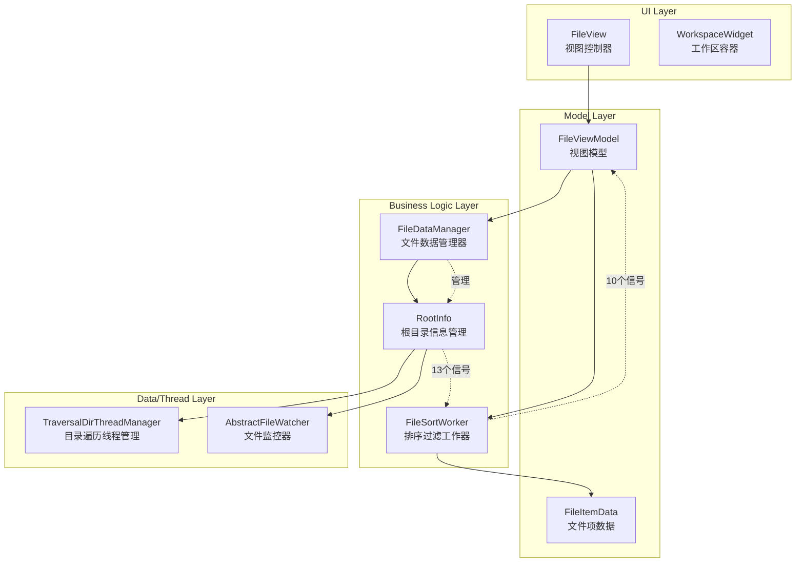
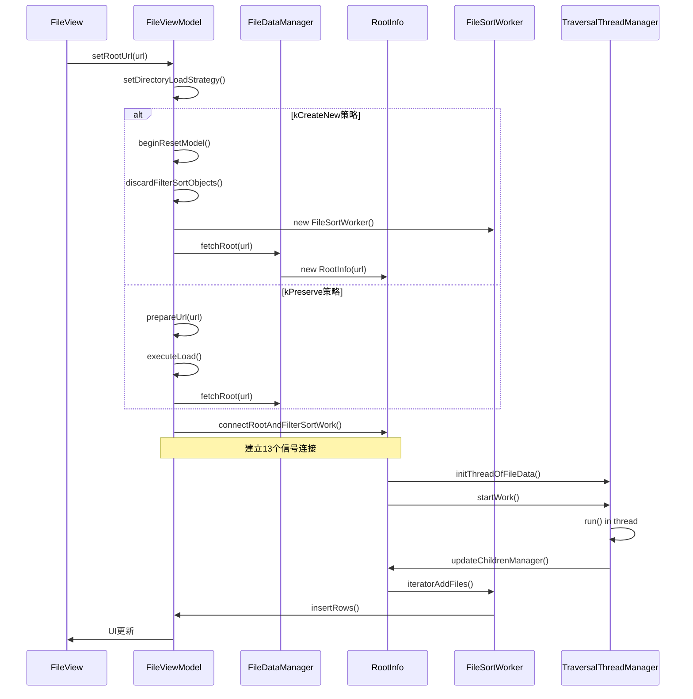
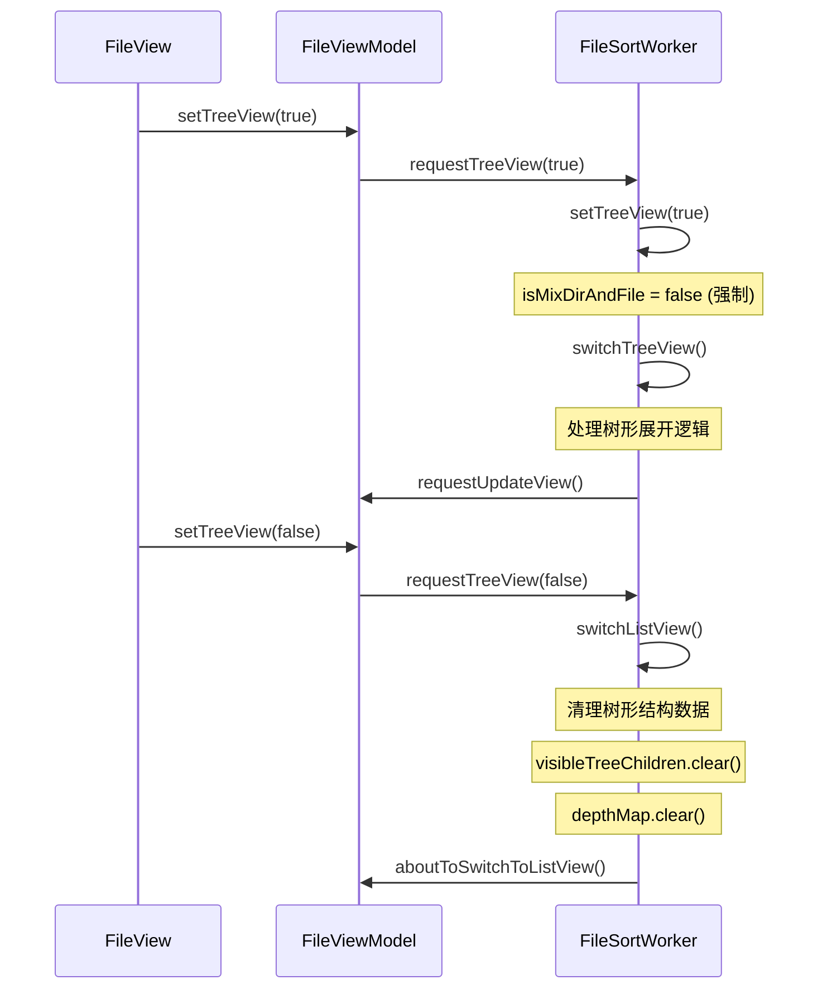
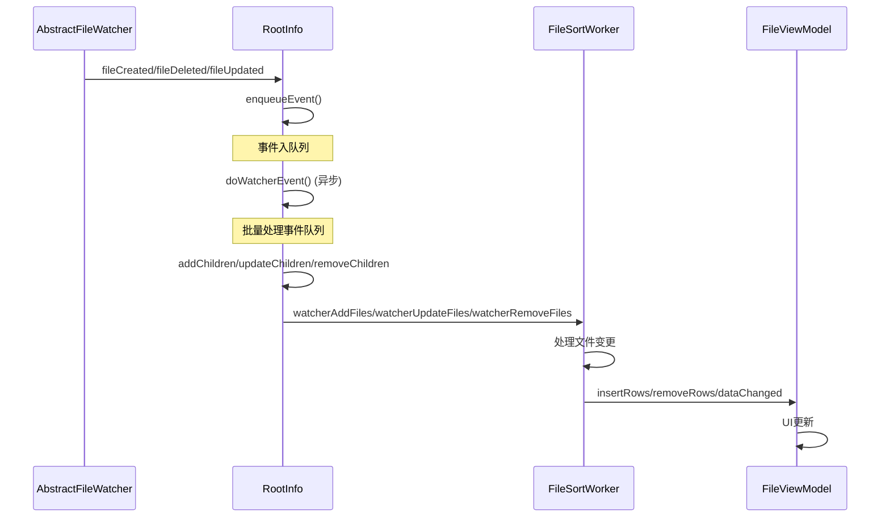
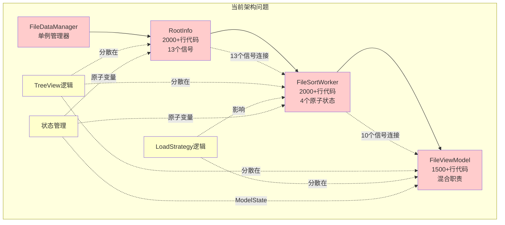
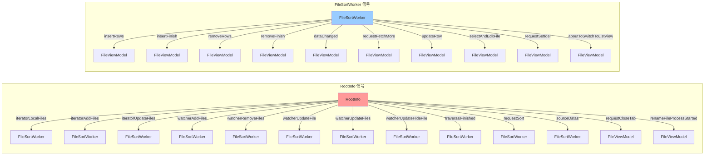
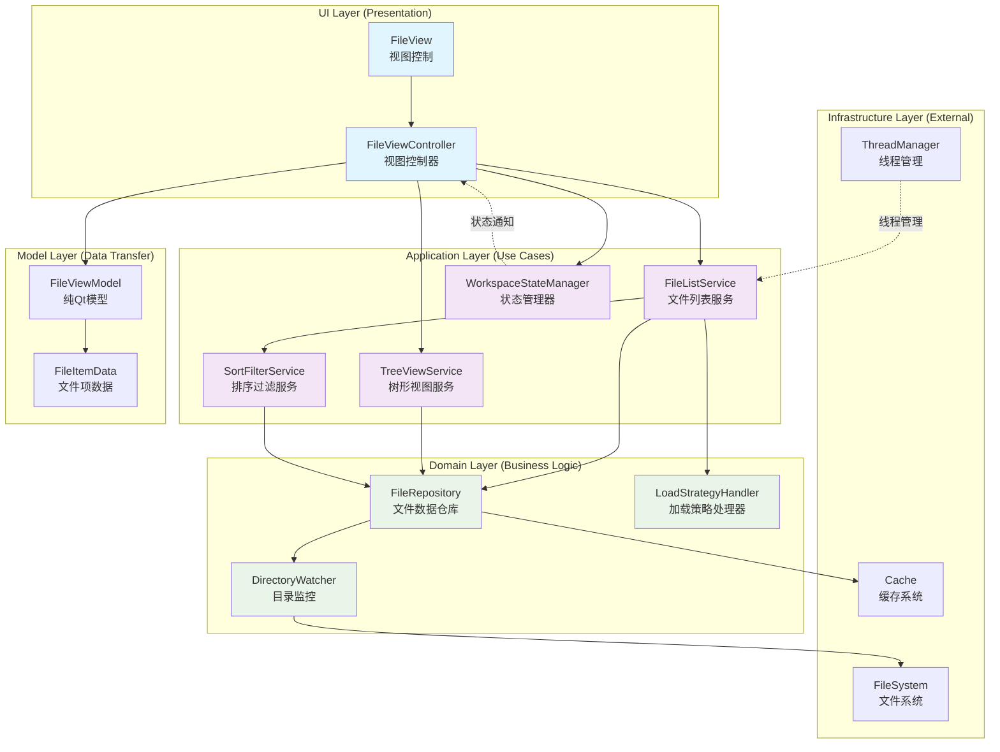
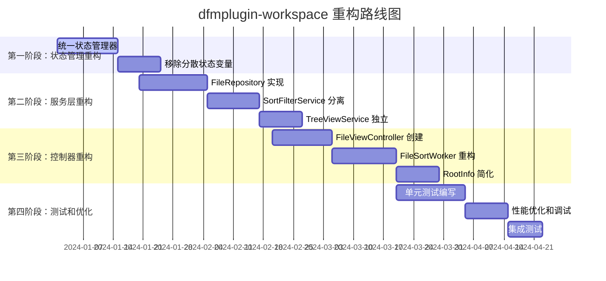

# dfmplugin-workspace 模块现状深度分析

## 概述

dfmplugin-workspace 是 DDE 文件管理器的核心工作区插件，负责文件列表的显示、排序、过滤、树形视图等核心功能。该模块目前存在严重的架构混乱问题，主要体现在多个核心类之间过度纠缠、职责不清、状态管理复杂等方面。

## 核心类架构分析

### 1. 核心类关系图



### 2. 各核心类职责分析

#### 2.1 FileDataManager（文件数据管理器）
**设计意图**: 单例管理器，负责 RootInfo 的生命周期管理
**实际职责**:
- 管理 `QMap<QUrl, RootInfo*> rootInfoMap` - 所有根目录信息的缓存
- 控制混合排序配置 `isMixFileAndFolder`
- 处理挂载点移除事件
- 管理 RootInfo 的创建、清理和删除

**问题**:
- 职责过于单一，仅作为 RootInfo 的工厂和缓存
- 与 Application 强耦合，监听全局配置变化
- 生命周期管理复杂，存在 `deleteLaterList` 延迟删除机制

#### 2.2 RootInfo（根目录信息管理）
**设计意图**: 管理单个目录的文件信息和遍历
**实际职责**:
- 管理目录遍历线程 `QMap<QString, QSharedPointer<DirIteratorThread>> traversalThreads`
- 维护文件监控器 `AbstractFileWatcherPointer watcher`
- 处理文件系统事件队列 `QQueue<QPair<QUrl, EventType>> watcherEvent`
- 管理源数据列表 `QList<SortInfoPointer> sourceDataList`
- 通过 13 个信号与 FileSortWorker 通信

**状态管理**:
```cpp
std::atomic_bool traversalFinish { false };
std::atomic_bool traversaling { false };
std::atomic_bool isFirstBatch { false };
```

**问题**:
- 职责过重，同时处理数据管理、线程管理、事件处理
- 复杂的原子状态管理，难以调试和维护
- 与 FileSortWorker 过度耦合，通过大量信号进行通信

#### 2.3 FileSortWorker（排序过滤工作器）
**设计意图**: 在独立线程中处理文件排序和过滤
**实际职责**:
- 维护可见文件列表 `QList<QUrl> visibleChildren`
- 管理树形视图的层次结构 `QHash<QUrl, QHash<QUrl, SortInfoPointer>> children`
- 处理文件过滤逻辑 `FileViewFilterCallback filterCallback`
- 管理文件项数据缓存 `QHash<QUrl, FileItemDataPointer> childrenDataMap`
- 处理树形视图特殊逻辑

**复杂状态**:
```cpp
std::atomic_bool isCanceled { false };
std::atomic_bool istree { false };
std::atomic_bool currentSupportTreeView { false };
std::atomic_bool mimeSorting { false };
```

**问题**:
- 代码量过大（2000+ 行），职责不清
- 树形视图和列表视图逻辑混杂在同一个类中
- 大量的特殊处理逻辑，如 `switchTreeView()` 和 `switchListView()`
- 与 RootInfo 和 FileViewModel 都有复杂的信号连接

#### 2.4 FileViewModel（视图模型）
**设计意图**: Qt 模型，连接数据和视图
**实际职责**:
- 实现 QAbstractItemModel 接口
- 管理 FileSortWorker 的生命周期
- 处理 DirectoryLoadStrategy 策略
- 管理模型状态 `ModelState { kIdle, kBusy }`

**问题**:
- 同时管理模型接口和业务逻辑
- DirectoryLoadStrategy 的 kPreserve 策略实现复杂
- 与 FileSortWorker 和 RootInfo 都有直接耦合

## 业务流程分析

### 1. 目录切换流程



### 2. 树形视图切换流程



### 3. 文件监控事件处理流程



## 主要问题分析

### 1. 架构层面问题

#### 1.1 职责边界不清
- **FileSortWorker**: 既处理排序过滤，又管理树形视图逻辑，还处理UI更新信号
- **RootInfo**: 既管理数据，又处理线程，还管理文件监控
- **FileViewModel**: 既是Qt模型，又管理业务逻辑，还处理加载策略

#### 1.2 过度耦合
```cpp
// FileViewModel 中连接 RootInfo 和 FileSortWorker 的13个信号
connect(root, &RootInfo::iteratorLocalFiles, filterSortWorker.data(), &FileSortWorker::handleIteratorLocalChildren);
connect(root, &RootInfo::iteratorAddFiles, filterSortWorker.data(), &FileSortWorker::handleIteratorChildren);
connect(root, &RootInfo::iteratorUpdateFiles, filterSortWorker.data(), &FileSortWorker::handleIteratorChildrenUpdate);
// ... 还有10个类似连接
```

#### 1.3 状态管理混乱
- 多个类都有自己的原子状态变量
- 状态同步通过信号完成，调试困难
- 缺乏统一的状态管理机制

### 2. 特殊逻辑处理问题

#### 2.1 TreeView 特殊处理
```cpp
void FileSortWorker::setTreeView(const bool isTree)
{
    istree = isTree;
    isMixDirAndFile = istree ? false : isMixDirAndFile;  // 强制禁用混合排序
}

void FileSortWorker::switchTreeView()
{
    if (isMixDirAndFile) {
        handleResort(sortOrder, orgSortRole, false);  // 强制重新排序
    }
}
```

**问题**: 树形视图逻辑散布在多个方法中，强制修改排序行为，逻辑不清晰

#### 2.2 DirectoryLoadStrategy 策略混乱
```cpp
// kCreateNew: 立即清空视图，创建新模型
// kPreserve: 保留当前视图内容，异步加载新数据
case DirectoryLoadStrategy::kPreserve: {
    dirRootUrl = urlToLoad;
    RootInfo *newRoot = FileDataManager::instance()->fetchRoot(dirRootUrl);
    connectRootAndFilterSortWork(newRoot, true);
    changeState(ModelState::kBusy);
    fetchMore(index);  // 触发异步加载
}
```

**问题**: 策略实现复杂，kPreserve 策略需要特殊的状态管理和信号处理

### 3. 线程和同步问题

#### 3.1 多线程复杂度
- **UI 线程**: FileView, FileViewModel
- **工作线程**: FileSortWorker（通过 QThread）
- **遍历线程**: TraversalDirThreadManager
- **事件处理**: QtConcurrent::run 异步执行

#### 3.2 同步机制混乱
```cpp
// RootInfo 中的事件处理
std::atomic_bool processFileEventRuning { false };
QMutex watcherEventMutex;
QQueue<QPair<QUrl, EventType>> watcherEvent;

// FileSortWorker 中的状态
QReadWriteLock locker;
QReadWriteLock childrenDataLocker;
```

**问题**: 使用了多种同步机制，容易死锁，调试困难

### 4. 性能问题

#### 4.1 频繁的信号发射
```cpp
// FileSortWorker 中频繁发射信号
Q_EMIT insertRows(startPos, filterUrls.size());
Q_EMIT insertFinish();
Q_EMIT removeRows(startPos, size);
Q_EMIT removeFinish();
Q_EMIT dataChanged(first, last);
```

#### 4.2 重复的数据处理
- RootInfo 维护 `sourceDataList`
- FileSortWorker 维护 `visibleChildren` 和 `childrenDataMap`
- FileItemData 维护文件信息缓存
- 数据在多个层次间重复转换和缓存

## 建议的重构方向

### 1. 明确职责分离

#### 1.1 数据层
- **FileRepository**: 统一的文件数据仓库，替代当前的多重缓存
- **DirectoryWatcher**: 专职文件系统监控，与业务逻辑解耦

#### 1.2 业务逻辑层  
- **FileListService**: 处理文件列表业务逻辑
- **SortFilterService**: 专职排序和过滤
- **TreeViewService**: 专门处理树形视图逻辑

#### 1.3 表现层
- **FileViewModel**: 纯粹的 Qt 模型实现
- **FileViewController**: 处理视图控制逻辑

### 2. 统一状态管理
```cpp
enum class WorkspaceState {
    Idle,           // 空闲状态
    Loading,        // 加载中
    Filtering,      // 过滤中
    Sorting,        // 排序中
    TreeExpanding   // 树形展开中
};

class WorkspaceStateManager {
public:
    void setState(WorkspaceState state);
    WorkspaceState currentState() const;
    
signals:
    void stateChanged(WorkspaceState oldState, WorkspaceState newState);
};
```

### 3. 简化异步处理
- 使用统一的异步任务队列
- 减少信号连接，使用更直接的回调机制
- 实现取消机制，避免状态不一致

### 4. 分离特殊逻辑
- TreeView 逻辑独立成专门的服务类
- DirectoryLoadStrategy 策略模式重构
- 移除硬编码的特殊处理

## 结论

dfmplugin-workspace 模块当前存在严重的架构债务，主要表现为：

1. **过度耦合**: 核心类之间通过大量信号连接，形成网状依赖
2. **职责混乱**: 单个类承担多重职责，违反单一职责原则  
3. **状态管理复杂**: 多套状态管理机制并存，同步困难
4. **特殊逻辑处理**: TreeView 和 LoadStrategy 的特殊处理逻辑散布各处
5. **性能问题**: 重复缓存、频繁信号发射、复杂的线程同步

建议进行全面重构，采用更清晰的分层架构和职责分离，统一状态管理，简化异步处理机制。这将大大提高代码的可维护性、可测试性和性能。

## 附录：详细分析图表

### 1. 当前架构的复杂度分析



### 2. 信号连接复杂度图



### 3. 建议的重构架构



### 4. 重构前后对比

| 方面 | 重构前 | 重构后 |
|------|--------|--------|
| **核心类数量** | 4个巨型类 | 8个职责单一的类 |
| **代码行数** | FileSortWorker: 2000+ | 每个服务类: <500行 |
| **信号连接** | 23个复杂信号连接 | 统一回调机制 |
| **状态管理** | 分散的原子变量 | 集中式状态管理器 |
| **线程同步** | 4种同步机制 | 统一的异步任务队列 |
| **特殊逻辑** | 硬编码分散处理 | 策略模式独立服务 |
| **测试难度** | 高（耦合严重） | 低（职责清晰） |
| **维护难度** | 高（逻辑复杂） | 低（单一职责） |

### 5. 重构实施路线图

