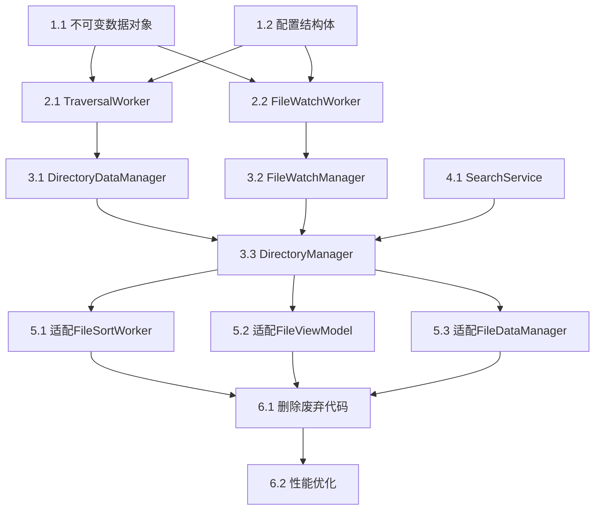

# RootInfo 重构实施计划

## 项目概述

**项目名称**: RootInfo 架构重构  
**项目目标**: 将混乱复杂的 RootInfo 类重构为现代化的分层架构，消除线程安全问题，提高可维护性  
**技术栈**: C++17, Qt Framework, DTK  
**重构范围**: dfmplugin-workspace 插件中的目录管理核心逻辑  

## 任务拆解

### 阶段一：基础数据结构实现 (Phase 1: Core Data Structures)

#### 任务 1.1: 创建不可变数据对象
**任务描述**: 实现线程间传递的不可变数据结构  
**文件范围**: `src/plugins/filemanager/dfmplugin-workspace/data/`  
**预估工时**: 0.5天  

**子任务清单**:
- 实现 `FileItem` 类 - 不可变文件项对象
- 实现 `DirectoryData` 类 - 不可变目录数据容器
- 实现 `FileChange` 类 - 不可变文件变更事件
- 实现 `DirectoryRequest` 类 - 不可变目录请求对象
- 添加 Qt 元类型注册支持信号槽传递

**AI 编程助手提示词**:
```
你是一个资深的 C++/Qt 开发专家，当前任务是为 dde-file-manager 项目实现线程安全的不可变数据对象。

背景信息：
- 项目使用 C++17 标准和 Qt Framework
- 需要实现线程间安全传递的数据结构
- 所有数据对象必须是完全不可变的（immutable）
- 数据对象需要支持 Qt 的信号槽机制传递

技术要求：
1. 所有成员变量必须是 const 的
2. 只提供 const 访问方法，不提供任何修改接口
3. 构造函数接收所有必要参数，构造后不可修改
4. 实现适当的拷贝构造和移动语义
5. 添加 Q_DECLARE_METATYPE 声明支持信号槽
6. 使用现代 C++ 特性（auto, 范围 for 循环等）
7. 添加详细的英文 Doxygen 注释

需要实现的类：
- FileItem: 封装文件基本信息（URL、大小、时间戳、属性等）
- DirectoryData: 封装目录完整数据（URL、文件列表、排序配置、过滤配置）
- FileChange: 封装文件变更事件（文件URL、变更类型、时间戳、旧URL）
- DirectoryRequest: 封装目录请求（URL、请求ID、排序配置、过滤配置、缓存标志）

每个类都需要：
- 完整的构造函数
- const 访问方法
- 适当的辅助方法（如 FileItem::createSortInfo()）
- 英文注释说明用途和线程安全性

请按照现代 C++ 和 Qt 最佳实践实现这些类。
```

#### 任务 1.2: 创建配置结构体
**任务描述**: 实现排序和过滤配置结构  
**文件范围**: `src/plugins/filemanager/dfmplugin-workspace/data/`  
**预估工时**: 0.3天  

**子任务清单**:
- 实现 `SortConfig` 结构体 - 排序配置
- 实现 `FilterConfig` 结构体 - 过滤配置
- 添加比较运算符重载
- 添加序列化支持（如需要）

**AI 编程助手提示词**:
```
你是一个资深的 C++/Qt 开发专家，当前任务是为 dde-file-manager 项目实现配置相关的数据结构。

背景信息：
- 需要实现排序和过滤的配置结构体
- 这些结构体将在多个组件间传递
- 需要支持相等性比较
- 使用 Qt 的枚举和类型系统

技术要求：
1. 使用 struct 而不是 class（数据载体）
2. 提供默认值
3. 实现 operator== 用于比较
4. 使用 Qt 的枚举类型（如 Qt::SortOrder）
5. 添加清晰的英文注释
6. 保持结构简单，易于理解和使用

需要实现：
- SortConfig: 包含排序角色、排序顺序、是否混合文件夹
- FilterConfig: 包含名称过滤器、目录过滤器、是否显示隐藏文件

请确保这些结构体设计简洁、高效，并且易于在不同组件间传递和比较。
```

### 阶段二：Worker 线程组件实现 (Phase 2: Worker Components)

#### 任务 2.1: 实现 TraversalWorker
**任务描述**: 实现目录遍历工作器，保留 iteratorAll/iteratorOneByOne 机制  
**文件范围**: `src/plugins/filemanager/dfmplugin-workspace/workers/`  
**预估工时**: 1.5天  

**子任务清单**:
- 创建 `TraversalWorker` 类基础结构
- 实现 `processBatchMode` 方法（对应原 iteratorAll）
- 实现 `processStreamMode` 方法（对应原 iteratorOneByOne）
- 实现遍历上下文管理
- 实现批量处理和进度报告
- 实现取消机制

**AI 编程助手提示词**:
```
你是一个资深的 C++/Qt 开发专家，精通多线程编程。当前任务是实现 TraversalWorker 类，这是 dde-file-manager 重构项目的核心组件。

背景信息：
- 替代原有复杂的 TraversalDirThreadManager
- 必须完整保留 iteratorAll（批量模式）和 iteratorOneByOne（流式模式）的业务逻辑
- 运行在独立的工作线程中
- 使用纯 Qt 信号槽通信，避免直接的跨线程调用

原有业务逻辑分析：
1. iteratorAll 模式：本地目录一次性获取所有文件，性能极佳
2. iteratorOneByOne 模式：SMB/搜索等场景流式获取，200ms/500文件批量发送
3. 决策逻辑：通过 AbstractDirIterator::oneByOne() 判断使用哪种模式

技术要求：
1. 继承 QObject，支持信号槽
2. 使用 Q_OBJECT 宏
3. 所有跨线程通信使用信号槽
4. 实现取消机制，支持中途停止
5. 保持原有的批量处理逻辑（200ms 或 500 个文件）
6. 使用现代 C++ 特性（智能指针、RAII）
7. 详细的英文注释和日志

需要实现的主要方法：
- startTraversal(DirectoryRequest) - 开始遍历
- cancelTraversal(QString requestId) - 取消遍历
- processBatchMode() - 批量模式处理
- processStreamMode() - 流式模式处理
- processNextBatch() - 处理下一批文件

信号：
- traversalProgress(requestId, items, isFirstBatch) - 进度更新
- traversalCompleted(requestId, data, noDataProduced) - 遍历完成
- traversalError(requestId, errorMessage) - 遍历错误

请确保完整保留原有的业务逻辑，特别是两种模式的决策和处理方式。
```

#### 任务 2.2: 实现 FileWatchWorker
**任务描述**: 实现文件监控工作器，处理文件系统事件  
**文件范围**: `src/plugins/filemanager/dfmplugin-workspace/workers/`  
**预估工时**: 1天  

**子任务清单**:
- 创建 `FileWatchWorker` 类
- 实现文件变更事件处理
- 实现批量处理机制（保留 200ms 批量逻辑）
- 实现事件去重和合并
- 实现定时器管理

**AI 编程助手提示词**:
```
你是一个资深的 C++/Qt 开发专家，精通文件系统监控和事件处理。当前任务是实现 FileWatchWorker 类。

背景信息：
- 替代原有 RootInfo 中复杂的文件监控逻辑
- 运行在独立线程中，处理文件系统变更事件
- 必须保留原有的 200ms 批量处理和去重逻辑
- AbstractFileWatcher 只能在主线程创建，但事件处理在工作线程

原有业务逻辑：
- 文件变更事件入队列
- 200ms 定时器批量处理
- 相同文件的多个变更事件去重
- 支持添加、删除、修改、移动四种事件类型

技术要求：
1. 继承 QObject，运行在工作线程
2. 使用 QTimer 实现批量处理
3. 实现事件队列和去重算法
4. 保持原有的 200ms 批量间隔
5. 使用 FileChange 不可变对象传递事件
6. 详细的英文注释和调试日志

需要实现的主要方法：
- handleFileChange(FileChange) - 处理单个文件变更
- processBatchChanges() - 批量处理变更
- mergeAndDeduplicateChanges() - 去重和合并逻辑
- startWatching(QUrl) - 开始监控目录
- stopWatching(QUrl) - 停止监控目录

信号：
- batchChangesReady(directoryUrl, changes) - 批量变更就绪

请确保完整保留原有的批量处理和去重逻辑，这对性能至关重要。
```

### 阶段三：管理器组件实现 (Phase 3: Manager Components)

#### 任务 3.1: 实现 DirectoryDataManager
**任务描述**: 实现目录数据管理器，处理数据缓存和遍历协调  
**文件范围**: `src/plugins/filemanager/dfmplugin-workspace/managers/`  
**预估工时**: 1天  

**子任务清单**:
- 创建 `DirectoryDataManager` 类
- 实现缓存数据获取（替代 handleGetSourceData）
- 实现遍历请求协调
- 实现数据缓存管理
- 实现与 TraversalWorker 的通信

**AI 编程助手提示词**:
```
你是一个资深的 C++/Qt 开发专家，精通数据管理和缓存机制。当前任务是实现 DirectoryDataManager 类。

背景信息：
- 替代原有 RootInfo 中的数据管理逻辑
- 运行在主线程中，协调各个工作线程
- 必须完整替代原有的 handleGetSourceData 业务逻辑
- 管理目录数据缓存，避免重复遍历

原有 handleGetSourceData 业务逻辑：
1. 检查是否需要启动文件监控
2. 获取已缓存的源数据
3. 发送缓存数据给 FileSortWorker
4. 如果没有在遍历，发送遍历完成信号

技术要求：
1. 运行在主线程，继承 QObject
2. 管理 DirectoryData 缓存
3. 协调 TraversalWorker 的遍历请求
4. 实现请求-响应模式
5. 使用 Qt::QueuedConnection 与工作线程通信
6. 详细的英文注释和日志

需要实现的主要方法：
- requestTraversal(DirectoryRequest) - 请求遍历
- requestCachedData(requestId, url) - 请求缓存数据
- cancelTraversal(requestId) - 取消遍历
- onTraversalCompleted() - 处理遍历完成

信号：
- dataReady(requestId, data) - 数据就绪
- dataError(requestId, error) - 数据错误
- requestStartWatching(url) - 请求启动监控

请确保完整替代原有的缓存和数据获取逻辑。
```

#### 任务 3.2: 实现 FileWatchManager
**任务描述**: 实现文件监控管理器，处理 Watcher 创建和事件转发  
**文件范围**: `src/plugins/filemanager/dfmplugin-workspace/managers/`  
**预估工时**: 0.8天  

**子任务清单**:
- 创建 `FileWatchManager` 类
- 实现 AbstractFileWatcher 创建和管理
- 实现事件转发到 FileWatchWorker
- 实现监控启动/停止控制

**AI 编程助手提示词**:
```
你是一个资深的 C++/Qt 开发专家，精通文件系统监控。当前任务是实现 FileWatchManager 类。

背景信息：
- 管理 AbstractFileWatcher 的创建和生命周期
- AbstractFileWatcher 只能在主线程创建和使用
- 需要将监控事件转发到工作线程处理
- 替代原有 RootInfo 中的监控管理逻辑

技术约束：
- AbstractFileWatcher 必须在主线程创建
- 监控事件的处理需要在 FileWatchWorker 线程中进行
- 使用信号槽实现主线程到工作线程的事件转发

技术要求：
1. 运行在主线程，管理 Watcher 生命周期
2. 使用 WatcherFactory 创建 AbstractFileWatcher
3. 连接 Watcher 信号到本类的槽函数
4. 将事件转换为 FileChange 对象
5. 通过信号转发到 FileWatchWorker
6. 管理多个目录的监控状态

需要实现的主要方法：
- startWatching(QUrl) - 开始监控目录
- stopWatching(QUrl) - 停止监控目录
- onFileCreated/Deleted/Updated/Moved() - 处理各种文件事件

信号：
- fileChangeDetected(FileChange) - 文件变更检测

请确保正确处理 AbstractFileWatcher 的线程约束问题。
```

#### 任务 3.3: 实现 DirectoryManager
**任务描述**: 实现统一的目录管理入口，协调所有组件  
**文件范围**: `src/plugins/filemanager/dfmplugin-workspace/managers/`  
**预估工时**: 1.2天  

**子任务清单**:
- 创建 `DirectoryManager` 类
- 实现统一的对外接口
- 实现组件间协调逻辑
- 实现缓存数据请求处理（替代 handleGetSourceData）
- 实现请求生命周期管理

**AI 编程助手提示词**:
```
你是一个资深的 C++/Qt 开发专家，精通系统架构设计。当前任务是实现 DirectoryManager 类，这是整个重构的核心组件。

背景信息：
- 作为外部统一接口，替代原有的复杂 RootInfo 类
- 协调 DirectoryDataManager、FileWatchManager、SearchService
- 管理请求生命周期和缓存数据
- 提供简化的 API，从原来的 25 个接口减少到 7 个

核心职责：
1. 统一的目录数据请求入口
2. 协调各个管理器和工作器
3. 管理请求 ID 和生命周期
4. 处理缓存数据请求（替代 handleGetSourceData）
5. 提供搜索关键字提取

技术要求：
1. 运行在主线程，继承 QObject
2. 组合各个管理器组件
3. 实现请求-响应模式
4. 管理活动请求映射
5. 提供清晰的对外 API
6. 详细的英文注释

主要接口：
- requestDirectoryData() - 请求目录数据
- cancelRequest() - 取消请求
- refreshDirectory() - 刷新目录
- enableWatching() - 启用监控
- handleCachedDataRequest() - 处理缓存数据请求

信号：
- directoryDataReady(requestId, data)
- directoryDataUpdated(url, changes)
- requestError(requestId, error)

请确保接口设计简洁明了，易于使用和理解。
```

### 阶段四：服务组件实现 (Phase 4: Service Components)

#### 任务 4.1: 实现 SearchService
**任务描述**: 实现搜索服务，处理关键字提取  
**文件范围**: `src/plugins/filemanager/dfmplugin-workspace/services/`  
**预估工时**: 0.5天  

**子任务清单**:
- 创建 `SearchService` 类
- 实现关键字提取逻辑
- 集成现有的 KeywordExtractor

**AI 编程助手提示词**:
```
你是一个资深的 C++/Qt 开发专家。当前任务是实现 SearchService 类，处理搜索相关的业务逻辑。

背景信息：
- 替代原有 RootInfo 中的搜索逻辑
- 使用现有的 KeywordExtractor 和 KeywordExtractorManager
- 运行在主线程，提供同步服务
- 业务相对简单，主要是关键字解析

技术要求：
1. 运行在主线程，继承 QObject
2. 集成现有的 KeywordExtractor
3. 提供简洁的接口
4. 支持 URL 关键字提取
5. 处理搜索 URL 判断

需要实现的方法：
- extractKeywords(QUrl) - 从 URL 提取关键字
- isSearchUrl(QUrl) - 判断是否为搜索 URL

请保持实现简单，专注于关键字提取功能。
```

### 阶段五：现有代码适配 (Phase 5: Legacy Code Adaptation)

#### 任务 5.1: 适配 FileSortWorker
**任务描述**: 修改 FileSortWorker 以适配新的信号接口  
**文件范围**: `src/plugins/filemanager/dfmplugin-workspace/utils/filesortworker.h/cpp`  
**预估工时**: 1天  

**子任务清单**:
- 添加新的槽函数处理统一的数据信号
- 实现 `handleDirectoryDataReady` 方法
- 实现 `handleDirectoryDataUpdated` 方法
- 添加缓存数据请求信号
- 保留原有的业务逻辑

**AI 编程助手提示词**:
```
你是一个资深的 C++/Qt 开发专家，精通文件管理器的排序和过滤逻辑。当前任务是适配现有的 FileSortWorker 类。

背景信息：
- FileSortWorker 是现有的核心组件，处理文件排序和过滤
- 原来接收 RootInfo 的 13 个不同信号，现在需要适配为 3 个统一信号
- 必须保留所有现有的业务逻辑，不能丢失任何功能
- 需要替代原有的 getSourceData 信号机制

原有信号映射：
- sourceDatas + iteratorLocalFiles → handleDirectoryDataReady
- watcherAddFiles + watcherRemoveFiles + watcherUpdateFiles → handleDirectoryDataUpdated
- 各种错误 → handleRequestError

技术要求：
1. 保持现有类结构不变
2. 添加新的槽函数，不删除现有方法
3. 实现信号业务逻辑的完整映射
4. 保留原有的排序和过滤算法
5. 添加新的信号用于请求缓存数据
6. 详细的英文注释说明变更

需要添加的方法：
- handleDirectoryDataReady() - 处理完整目录数据
- handleDirectoryDataUpdated() - 处理目录数据更新
- handleRequestError() - 处理请求错误
- requestCachedDirectoryData() - 请求缓存数据信号

请确保完整保留原有的排序、过滤、缓存逻辑。
```

#### 任务 5.2: 适配 FileViewModel
**任务描述**: 修改 FileViewModel 以使用新的 DirectoryManager  
**文件范围**: `src/plugins/filemanager/dfmplugin-workspace/models/fileviewmodel.h/cpp`  
**预估工时**: 1.2天  

**子任务清单**:
- 替换 RootInfo 相关的连接逻辑
- 实现新的 `connectDirectoryManager` 方法
- 修改 `doExpand` 方法使用新架构
- 实现新的数据处理槽函数
- 管理展开请求映射

**AI 编程助手提示词**:
```
你是一个资深的 C++/Qt 开发专家，精通 Qt 的 Model/View 架构。当前任务是适配 FileViewModel 类。

背景信息：
- FileViewModel 是文件管理器的核心视图模型
- 原来与 RootInfo 有复杂的 13 个信号连接
- doExpand 方法需要彻底重写，使用新的 DirectoryManager
- 需要管理展开请求的生命周期

原有复杂逻辑：
- connectRootAndFilterSortWork() 建立 13 个信号连接
- doExpand() 为每个展开的目录创建独立的 RootInfo
- 复杂的 fetchMore() 逻辑

新架构要求：
- 使用 DirectoryManager 替代 RootInfo
- 简化连接从 13 个减少到 4 个
- 统一的数据处理逻辑
- 展开请求的跟踪和管理

技术要求：
1. 保持现有的 Model/View 接口不变
2. 替换内部实现，使用新的组件
3. 简化信号连接逻辑
4. 实现展开请求映射管理
5. 保留所有现有功能
6. 详细的英文注释

需要实现的方法：
- connectDirectoryManager() - 连接目录管理器
- onDirectoryDataReady() - 处理目录数据就绪
- onDirectoryDataUpdated() - 处理目录数据更新
- findExpandIndexByRequestId() - 查找展开索引

请确保保留所有现有的视图功能，特别是树形展开逻辑。
```

#### 任务 5.3: 适配 FileDataManager
**任务描述**: 修改 FileDataManager 以管理 DirectoryManager 而非 RootInfo  
**文件范围**: `src/plugins/filemanager/dfmplugin-workspace/utils/filedatamanager.h/cpp`  
**预估工时**: 0.8天  

**子任务清单**:
- 替换 RootInfo 相关的方法和成员
- 实现 `fetchDirectoryManager` 方法
- 实现 `createDirectoryManager` 方法
- 修改清理逻辑

**AI 编程助手提示词**:
```
你是一个资深的 C++/Qt 开发专家，精通资源管理和生命周期控制。当前任务是适配 FileDataManager 类。

背景信息：
- FileDataManager 是单例类，管理目录相关对象的生命周期
- 原来管理 RootInfo 对象，现在需要管理 DirectoryManager 对象
- 需要保持相同的接口模式和生命周期管理

原有接口：
- fetchRoot() → fetchDirectoryManager()
- createRoot() → createDirectoryManager()
- cleanRoot() → cleanDirectoryManager()

技术要求：
1. 保持单例模式不变
2. 替换内部管理的对象类型
3. 保持相同的生命周期管理逻辑
4. 保持线程安全性
5. 添加适当的英文注释

需要修改的方法：
- fetchDirectoryManager() - 获取或创建目录管理器
- createDirectoryManager() - 创建新的目录管理器
- cleanDirectoryManager() - 清理目录管理器

请确保保持原有的资源管理模式和线程安全性。
```

### 阶段六：清理和优化 (Phase 6: Cleanup and Optimization)

#### 任务 6.1: 删除废弃代码
**任务描述**: 删除 RootInfo 和 TraversalDirThreadManager 相关文件  
**文件范围**: 多个文件  
**预估工时**: 0.3天  

**子任务清单**:
- 删除 `rootinfo.h` 和 `rootinfo.cpp`
- 删除 `traversaldirthreadmanager.h` 和 `traversaldirthreadmanager.cpp`
- 清理相关的 include 引用
- 更新前向声明

**AI 编程助手提示词**:
```
你是一个资深的 C++/Qt 开发专家，精通代码重构和清理。当前任务是清理重构后的废弃代码。

背景信息：
- RootInfo 和 TraversalDirThreadManager 已被新架构完全替代
- 需要安全地删除这些文件和相关引用
- 确保不破坏编译和运行时

技术要求：
1. 删除指定的头文件和实现文件
2. 清理所有相关的 #include 引用
3. 更新前向声明
4. 检查是否有遗漏的引用
5. 确保编译通过

需要删除的文件：
- src/plugins/filemanager/dfmplugin-workspace/models/rootinfo.h
- src/plugins/filemanager/dfmplugin-workspace/models/rootinfo.cpp
- src/plugins/filemanager/dfmplugin-workspace/utils/traversaldirthreadmanager.h
- src/plugins/filemanager/dfmplugin-workspace/utils/traversaldirthreadmanager.cpp

请仔细检查所有引用，确保清理彻底且安全。
```

#### 任务 6.2: 性能优化实现
**任务描述**: 实现对象池和缓存优化  
**文件范围**: `src/plugins/filemanager/dfmplugin-workspace/utils/`  
**预估工时**: 0.8天  

**子任务清单**:
- 实现 `FileItemPool` 对象池
- 实现 `DirectoryDataCache` LRU 缓存
- 添加写时复制优化
- 性能监控和日志

**AI 编程助手提示词**:
```
你是一个资深的 C++/Qt 开发专家，精通性能优化和内存管理。当前任务是实现性能优化组件。

背景信息：
- 文件管理器处理大量文件对象，需要优化内存分配
- 目录数据需要缓存以避免重复遍历
- 使用现代 C++ 技术实现高效的资源管理

技术要求：
1. 实现对象池模式减少内存分配
2. 实现 LRU 缓存策略
3. 使用写时复制优化数据共享
4. 线程安全的实现
5. 性能监控和统计
6. 详细的英文注释

需要实现的组件：
- FileItemPool - 文件项对象池
- DirectoryDataCache - 目录数据 LRU 缓存
- 写时复制的 DirectoryData 实现

请确保实现高效且线程安全。
```

## 任务依赖关系



## 风险控制

1. **编译风险**: 每个任务完成后立即编译验证
2. **功能风险**: 保持原有接口，分阶段替换内部实现
3. **性能风险**: 重点测试大目录和网络目录场景
4. **线程安全风险**: 严格使用 Qt::QueuedConnection，避免直接调用

## 验收标准

1. **功能完整性**: 所有原有功能正常工作
2. **性能标准**: 不低于原有性能，大目录场景有提升
3. **代码质量**: 通过代码审查，符合现代 C++ 标准
4. **线程安全**: 无数据竞争，无死锁风险
5. **可维护性**: 代码结构清晰，职责分离明确

## 总预估工时

**总计**: 9.4 天  
**建议时间**: 12 天（包含缓冲时间）

---

*本计划文档基于 refactor_rootinfo2.md 技术方案制定，确保重构过程的有序进行和风险控制。* 