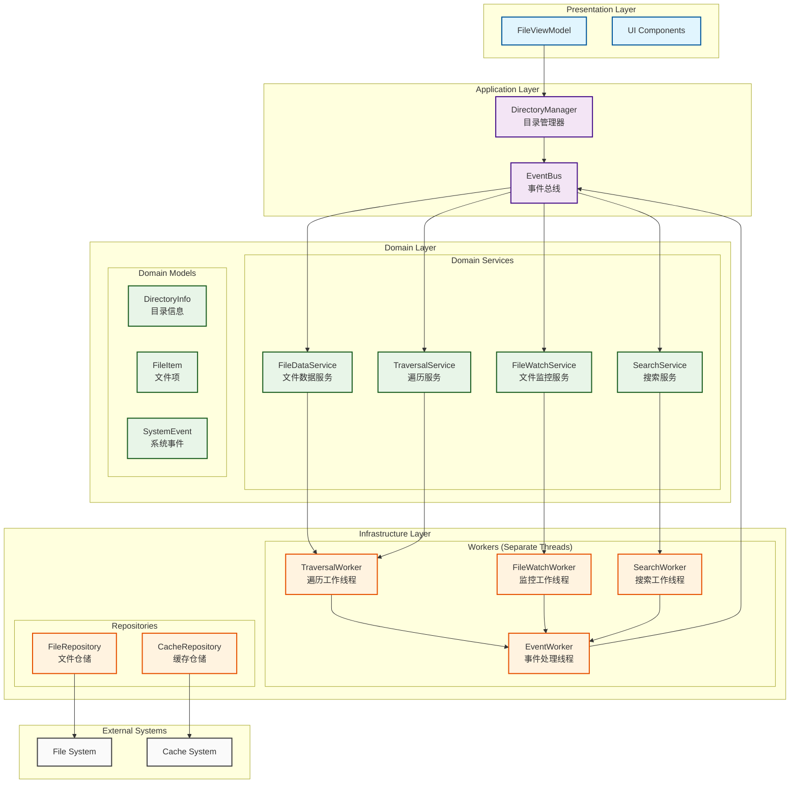
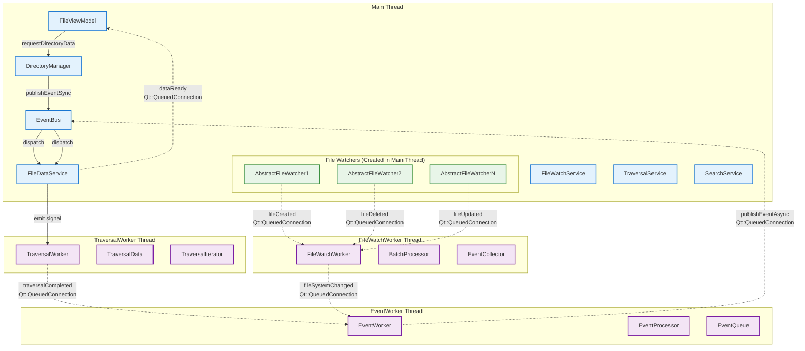

# RootInfo 重构方案

## 重构目标

### 核心目标
1. **业务逻辑零丢失**：确保所有现有功能完整保留
2. **零BUG引入**：通过渐进式重构和全面测试保证稳定性
3. **现代软件架构**：遵循SOLID、DDD、Clean Architecture原则
4. **线程安全**：采用Qt事件循环机制，消除临界区和竞态条件
5. **高性能**：优化数据结构和算法，减少不必要的开销
6. **易维护性**：清晰的职责分离，良好的抽象层次

### 设计原则
- **事件驱动架构**：基于Qt的信号槽和事件循环
- **单线程原则**：每个Worker在独立线程中运行，避免共享状态
- **消息传递**：线程间通过不可变消息对象通信
- **职责分离**：每个组件只负责单一职责
- **依赖注入**：通过接口和工厂模式实现松耦合

## 整体架构设计

### 新架构概览



### 核心组件职责

#### 1. DirectoryManager (目录管理器)
- **职责**：作为外部接口的统一入口点
- **功能**：协调各个服务，管理目录生命周期
- **线程**：主线程

#### 2. EventBus (事件总线)
- **职责**：统一的事件分发和处理
- **功能**：解耦组件间通信，支持异步事件处理
- **线程**：主线程

#### 3. Domain Services (领域服务)
- **FileDataService**：文件数据管理
- **FileWatchService**：文件监控管理  
- **TraversalService**：目录遍历管理
- **SearchService**：搜索功能管理

#### 4. Workers (工作线程)
- **TraversalWorker**：专门负责目录遍历，运行在独立线程
- **FileWatchWorker**：专门负责文件监控事件处理，运行在独立线程
- **EventWorker**：专门负责批量事件处理和分发，运行在独立线程

**注意**：搜索功能经分析后发现只是简单的关键词解析，无需独立Worker，直接在主线程的SearchService中处理即可。

## 详细设计方案

### 1. 事件驱动架构

#### 事件定义
```cpp
namespace Events {
    // 基础事件类
    class BaseEvent {
    public:
        enum Type {
            DirectoryTraversalRequested,
            DirectoryTraversalCompleted,
            FileSystemChanged,
            FileAdded,
            FileRemoved,
            FileUpdated,
            FileMoved,
            SearchRequested,
            SearchCompleted,
            CacheUpdated
        };
        
        virtual ~BaseEvent() = default;
        virtual Type type() const = 0;
        virtual QDateTime timestamp() const = 0;
        virtual QString requestId() const = 0;
    };
    
    // 目录遍历请求事件
    class DirectoryTraversalRequestedEvent : public BaseEvent {
    private:
        QUrl m_directoryUrl;
        QString m_requestId;
        SortConfig m_sortConfig;
        FilterConfig m_filterConfig;
        bool m_useCache;
        
    public:
        explicit DirectoryTraversalRequestedEvent(
            const QUrl& url, 
            const QString& requestId,
            const SortConfig& sortConfig = {},
            const FilterConfig& filterConfig = {},
            bool useCache = true
        );
        
        Type type() const override { return DirectoryTraversalRequested; }
        const QUrl& directoryUrl() const { return m_directoryUrl; }
        const SortConfig& sortConfig() const { return m_sortConfig; }
        const FilterConfig& filterConfig() const { return m_filterConfig; }
        bool useCache() const { return m_useCache; }
    };
    
    // 文件系统变更事件
    class FileSystemChangedEvent : public BaseEvent {
    private:
        QUrl m_fileUrl;
        ChangeType m_changeType;
        QUrl m_oldUrl; // for move operations
        
    public:
        enum ChangeType { Added, Removed, Updated, Moved };
        
        explicit FileSystemChangedEvent(
            const QUrl& fileUrl, 
            ChangeType changeType,
            const QUrl& oldUrl = {}
        );
        
        Type type() const override { return FileSystemChanged; }
        const QUrl& fileUrl() const { return m_fileUrl; }
        ChangeType changeType() const { return m_changeType; }
        const QUrl& oldUrl() const { return m_oldUrl; }
    };
}
```

#### EventBus 详细实现

**设计目标**：
- 同步事件：立即处理，用于关键业务逻辑
- 异步事件：队列处理，用于批量操作和性能优化
- 线程安全：支持跨线程事件发布和订阅

```cpp
class EventBus : public QObject {
    Q_OBJECT
    
public:
    static EventBus& instance();
    
    // 同步发布事件 - 立即处理，阻塞调用者
    void publishEventSync(std::unique_ptr<Events::BaseEvent> event);
    
    // 异步发布事件 - 加入队列，定时器处理
    void publishEventAsync(std::unique_ptr<Events::BaseEvent> event);
    
    // 订阅事件
    template<typename EventType>
    void subscribe(QObject* subscriber, 
                   std::function<void(const EventType&)> handler) {
        QMutexLocker locker(&m_subscriptionMutex);
        
        Subscription sub;
        sub.subscriber = subscriber;
        sub.eventType = EventType::staticType();
        sub.handler = [handler](const Events::BaseEvent& baseEvent) {
            const auto& typedEvent = static_cast<const EventType&>(baseEvent);
            handler(typedEvent);
        };
        
        m_subscriptions.append(sub);
        
        // 当订阅者销毁时自动取消订阅
        connect(subscriber, &QObject::destroyed, this, [this, subscriber]() {
            unsubscribe(subscriber);
        });
    }
    
    // 取消订阅
    void unsubscribe(QObject* subscriber);
    
    // 获取事件队列大小（用于监控）
    int pendingEventCount() const {
        QMutexLocker locker(&m_queueMutex);
        return m_eventQueue.size();
    }

private slots:
    void processAsyncEvents();
    
private:
    EventBus();
    ~EventBus() = default;
    
    struct Subscription {
        QObject* subscriber;
        std::function<void(const Events::BaseEvent&)> handler;
        Events::BaseEvent::Type eventType;
    };
    
    // 异步事件队列
    mutable QMutex m_queueMutex;
    QQueue<std::unique_ptr<Events::BaseEvent>> m_eventQueue;
    QTimer* m_asyncTimer;
    
    // 订阅管理
    mutable QMutex m_subscriptionMutex;
    QList<Subscription> m_subscriptions;
    
    // 内部方法
    void dispatchEvent(const Events::BaseEvent& event);
    QList<Subscription> getSubscriptionsForEvent(Events::BaseEvent::Type eventType) const;
};

// 实现细节
EventBus::EventBus() {
    // 异步事件处理定时器，每10ms处理一次队列
    m_asyncTimer = new QTimer(this);
    m_asyncTimer->setInterval(10);
    m_asyncTimer->setSingleShot(false);
    connect(m_asyncTimer, &QTimer::timeout, this, &EventBus::processAsyncEvents);
    m_asyncTimer->start();
}

void EventBus::publishEventSync(std::unique_ptr<Events::BaseEvent> event) {
    fmDebug() << "Publishing sync event:" << event->type() << "requestId:" << event->requestId();
    dispatchEvent(*event);
}

void EventBus::publishEventAsync(std::unique_ptr<Events::BaseEvent> event) {
    fmDebug() << "Publishing async event:" << event->type() << "requestId:" << event->requestId();
    {
        QMutexLocker locker(&m_queueMutex);
        m_eventQueue.enqueue(std::move(event));
    }
    // 异步事件由定时器处理，不阻塞调用者
}

void EventBus::processAsyncEvents() {
    QQueue<std::unique_ptr<Events::BaseEvent>> eventsToProcess;
    
    // 批量取出事件，减少锁竞争
    {
        QMutexLocker locker(&m_queueMutex);
        eventsToProcess.swap(m_eventQueue);
    }
    
    // 处理事件
    while (!eventsToProcess.isEmpty()) {
        auto event = eventsToProcess.dequeue();
        dispatchEvent(*event);
    }
}

void EventBus::dispatchEvent(const Events::BaseEvent& event) {
    auto subscriptions = getSubscriptionsForEvent(event.type());
    
    for (const auto& sub : subscriptions) {
        try {
            sub.handler(event);
        } catch (const std::exception& e) {
            fmWarning() << "Error handling event:" << event.type() 
                       << "subscriber:" << sub.subscriber 
                       << "error:" << e.what();
        }
    }
}

// 使用示例
void FileDataService::requestDirectoryData(const QUrl& url) {
    auto event = std::make_unique<Events::DirectoryTraversalRequestedEvent>(
        url, generateRequestId(), m_sortConfig, m_filterConfig, true
    );
    
    // 关键业务逻辑使用同步事件
    EventBus::instance().publishEventSync(std::move(event));
}

void FileWatchWorker::onFileCreated(const QUrl& fileUrl) {
    auto event = std::make_unique<Events::FileSystemChangedEvent>(
        fileUrl, Events::FileSystemChangedEvent::Added
    );
    
    // 文件监控事件使用异步处理，避免阻塞监控线程
    EventBus::instance().publishEventAsync(std::move(event));
}
```

### 2. 线程安全的Worker设计

#### TraversalWorker 实现
```cpp
class TraversalWorker : public QObject {
    Q_OBJECT
    
public:
    explicit TraversalWorker(QObject* parent = nullptr);
    
public slots:
    void startTraversal(const TraversalRequest& request);
    void stopTraversal(const QString& requestId);
    
signals:
    void traversalProgress(const QString& requestId, 
                          const QList<FileItemData>& items,
                          bool isComplete);
    void traversalCompleted(const QString& requestId, 
                           const TraversalResult& result);
    void traversalError(const QString& requestId, 
                       const QString& error);
    
private slots:
    void processTraversalQueue();
    
private:
    struct TraversalContext {
        QString requestId;
        QUrl directoryUrl;
        SortConfig sortConfig;
        FilterConfig filterConfig;
        bool useCache;
        std::unique_ptr<AbstractDirIterator> iterator;
        QElapsedTimer timer;
        bool isCancelled = false;
    };
    
    QQueue<TraversalRequest> m_requestQueue;
    QMap<QString, std::unique_ptr<TraversalContext>> m_activeTraversals;
    QTimer* m_processTimer;
    QMutex m_queueMutex;
    
    void processRequest(const TraversalRequest& request);
    void processDirectory(TraversalContext* context);
    QList<FileItemData> createFileItems(
        const QList<FileInfoPointer>& fileInfos,
        const SortConfig& sortConfig
    );
};
```

#### FileWatchWorker 详细实现

**关键设计要点**：
1. **主线程创建Watcher**：文件监控器只能在主线程创建和管理
2. **子线程处理事件**：监控信号的处理在FileWatchWorker线程中进行
3. **批量事件处理**：避免频繁的单个文件事件，提高性能

```cpp
class FileWatchWorker : public QObject {
    Q_OBJECT
    
public:
    explicit FileWatchWorker(QObject* parent = nullptr);
    
    // 这些方法在主线程调用，通过信号槽转发到Worker线程
public slots:
    void startWatching(const QUrl& directoryUrl);
    void stopWatching(const QUrl& directoryUrl);
    void stopAllWatching();
    
    // 这些是真正在Worker线程中执行的槽函数
private slots:
    void doStartWatching(const QUrl& directoryUrl);
    void doStopWatching(const QUrl& directoryUrl);
    void doStopAllWatching();
    
    // 文件监控事件处理（在Worker线程中）
    void onFileCreated(const QUrl& fileUrl);
    void onFileDeleted(const QUrl& fileUrl);
    void onFileUpdated(const QUrl& fileUrl);
    void onFileMoved(const QUrl& fromUrl, const QUrl& toUrl);
    void processBatchedChanges();
    
signals:
    // 发送给主线程的信号
    void fileSystemChanged(const QUrl& directoryUrl,
                          const QList<FileSystemChange>& changes);
    void watcherError(const QUrl& directoryUrl, 
                     const QString& error);
    
    // 内部信号，用于线程间通信
    void requestStartWatching(const QUrl& directoryUrl);
    void requestStopWatching(const QUrl& directoryUrl);
    void requestStopAllWatching();
    
private:
    struct WatchContext {
        QUrl directoryUrl;
        AbstractFileWatcherPointer watcher;  // 在主线程创建，在Worker线程使用
        QList<FileSystemChange> pendingChanges;
        QElapsedTimer lastChangeTime;
        QMutex changesMutex;  // 保护pendingChanges
    };
    
    QMap<QUrl, std::unique_ptr<WatchContext>> m_watchContexts;
    QTimer* m_batchTimer;
    QMutex m_contextMutex;  // 保护m_watchContexts
    
    void connectWatcherSignals(AbstractFileWatcherPointer watcher, const QUrl& directoryUrl);
    void batchChange(const QUrl& directoryUrl, const FileSystemChange& change);
    QUrl findDirectoryForFile(const QUrl& fileUrl) const;
};

// 实现细节
FileWatchWorker::FileWatchWorker(QObject* parent) 
    : QObject(parent) {
    
    // 批量处理定时器，每200ms处理一次
    m_batchTimer = new QTimer(this);
    m_batchTimer->setInterval(200);
    m_batchTimer->setSingleShot(false);
    connect(m_batchTimer, &QTimer::timeout, this, &FileWatchWorker::processBatchedChanges);
    m_batchTimer->start();
    
    // 连接内部信号槽，确保在Worker线程中执行
    connect(this, &FileWatchWorker::requestStartWatching,
            this, &FileWatchWorker::doStartWatching, Qt::QueuedConnection);
    connect(this, &FileWatchWorker::requestStopWatching,
            this, &FileWatchWorker::doStopWatching, Qt::QueuedConnection);
    connect(this, &FileWatchWorker::requestStopAllWatching,
            this, &FileWatchWorker::doStopAllWatching, Qt::QueuedConnection);
}

// 主线程调用的接口
void FileWatchWorker::startWatching(const QUrl& directoryUrl) {
    fmDebug() << "Request start watching:" << directoryUrl.toString();
    // 通过信号转发到Worker线程
    emit requestStartWatching(directoryUrl);
}

// 在Worker线程中执行的实际逻辑
void FileWatchWorker::doStartWatching(const QUrl& directoryUrl) {
    fmDebug() << "Starting watching in worker thread:" << directoryUrl.toString();
    
    QMutexLocker locker(&m_contextMutex);
    
    if (m_watchContexts.contains(directoryUrl)) {
        fmDebug() << "Already watching:" << directoryUrl.toString();
        return;
    }
    
    // 创建监控上下文
    auto context = std::make_unique<WatchContext>();
    context->directoryUrl = directoryUrl;
    context->lastChangeTime.start();
    
    // 在主线程中创建Watcher（通过元对象调用）
    AbstractFileWatcherPointer watcher;
    QMetaObject::invokeMethod(qApp, [&]() {
        watcher = WatcherFactory::create<AbstractFileWatcher>(directoryUrl);
    }, Qt::BlockingQueuedConnection);
    
    if (watcher.isNull()) {
        fmWarning() << "Failed to create watcher for:" << directoryUrl.toString();
        emit watcherError(directoryUrl, "Failed to create file watcher");
        return;
    }
    
    context->watcher = watcher;
    connectWatcherSignals(watcher, directoryUrl);
    
    // 启动监控
    QMetaObject::invokeMethod(qApp, [watcher]() {
        watcher->restartWatcher();
    }, Qt::QueuedConnection);
    
    m_watchContexts.insert(directoryUrl, std::move(context));
    fmInfo() << "Started watching:" << directoryUrl.toString();
}

void FileWatchWorker::connectWatcherSignals(AbstractFileWatcherPointer watcher, const QUrl& directoryUrl) {
    // 使用Qt::QueuedConnection确保在Worker线程中处理
    connect(watcher.data(), &AbstractFileWatcher::subfileCreated,
            this, &FileWatchWorker::onFileCreated, Qt::QueuedConnection);
    connect(watcher.data(), &AbstractFileWatcher::fileDeleted,
            this, &FileWatchWorker::onFileDeleted, Qt::QueuedConnection);
    connect(watcher.data(), &AbstractFileWatcher::fileAttributeChanged,
            this, &FileWatchWorker::onFileUpdated, Qt::QueuedConnection);
    connect(watcher.data(), &AbstractFileWatcher::fileRename,
            this, &FileWatchWorker::onFileMoved, Qt::QueuedConnection);
}

void FileWatchWorker::onFileCreated(const QUrl& fileUrl) {
    fmDebug() << "File created in worker thread:" << fileUrl.toString();
    
    QUrl directoryUrl = findDirectoryForFile(fileUrl);
    if (!directoryUrl.isValid()) {
        fmWarning() << "Cannot find directory for file:" << fileUrl.toString();
        return;
    }
    
    FileSystemChange change;
    change.fileUrl = fileUrl;
    change.changeType = FileSystemChange::Added;
    change.timestamp = QDateTime::currentDateTime();
    
    batchChange(directoryUrl, change);
}

void FileWatchWorker::batchChange(const QUrl& directoryUrl, const FileSystemChange& change) {
    QMutexLocker contextLocker(&m_contextMutex);
    
    auto it = m_watchContexts.find(directoryUrl);
    if (it == m_watchContexts.end()) {
        return;
    }
    
    auto& context = it.value();
    QMutexLocker changesLocker(&context->changesMutex);
    
    // 去重逻辑：相同文件的连续操作只保留最后一个
    auto existingIt = std::find_if(context->pendingChanges.begin(), context->pendingChanges.end(),
        [&change](const FileSystemChange& existing) {
            return existing.fileUrl == change.fileUrl;
        });
    
    if (existingIt != context->pendingChanges.end()) {
        *existingIt = change;  // 更新为最新的变更
    } else {
        context->pendingChanges.append(change);
    }
    
    context->lastChangeTime.restart();
}

void FileWatchWorker::processBatchedChanges() {
    QMutexLocker contextLocker(&m_contextMutex);
    
    for (auto it = m_watchContexts.begin(); it != m_watchContexts.end(); ++it) {
        auto& context = it.value();
        
        // 如果最近有变更且距离上次变更超过200ms，则处理批量变更
        if (context->lastChangeTime.isValid() && context->lastChangeTime.elapsed() > 200) {
            QList<FileSystemChange> changesToProcess;
            
            {
                QMutexLocker changesLocker(&context->changesMutex);
                if (!context->pendingChanges.isEmpty()) {
                    changesToProcess = context->pendingChanges;
                    context->pendingChanges.clear();
                    context->lastChangeTime.invalidate();
                }
            }
            
            if (!changesToProcess.isEmpty()) {
                fmDebug() << "Processing" << changesToProcess.size() 
                         << "batched changes for:" << context->directoryUrl.toString();
                emit fileSystemChanged(context->directoryUrl, changesToProcess);
            }
        }
    }
}

QUrl FileWatchWorker::findDirectoryForFile(const QUrl& fileUrl) const {
    QMutexLocker locker(&m_contextMutex);
    
    for (auto it = m_watchContexts.begin(); it != m_watchContexts.end(); ++it) {
        const QUrl& watchedDir = it.key();
        if (fileUrl.toString().startsWith(watchedDir.toString())) {
            return watchedDir;
        }
    }
    
    return QUrl();
}
```

### 3. 领域模型设计

#### DirectoryInfo 领域模型
```cpp
class DirectoryInfo {
public:
    explicit DirectoryInfo(const QUrl& url);
    
    // 基本信息
    const QUrl& url() const { return m_url; }
    const QString& displayName() const { return m_displayName; }
    bool isValid() const { return m_isValid; }
    
    // 文件列表管理
    void setFileItems(const QList<FileItem>& items);
    const QList<FileItem>& fileItems() const { return m_fileItems; }
    void addFileItem(const FileItem& item);
    void removeFileItem(const QUrl& fileUrl);
    void updateFileItem(const FileItem& item);
    
    // 搜索关键字
    void setKeywords(const QStringList& keywords);
    const QStringList& keywords() const { return m_keywords; }
    
    // 状态管理
    void setTraversalState(TraversalState state);
    TraversalState traversalState() const { return m_traversalState; }
    
    // 缓存管理
    void setCacheEnabled(bool enabled);
    bool isCacheEnabled() const { return m_cacheEnabled; }
    void setCacheTimestamp(const QDateTime& timestamp);
    const QDateTime& cacheTimestamp() const { return m_cacheTimestamp; }
    
    // 排序和过滤
    void setSortConfig(const SortConfig& config);
    const SortConfig& sortConfig() const { return m_sortConfig; }
    void setFilterConfig(const FilterConfig& config);
    const FilterConfig& filterConfig() const { return m_filterConfig; }
    
private:
    QUrl m_url;
    QString m_displayName;
    bool m_isValid = false;
    
    QList<FileItem> m_fileItems;
    QStringList m_keywords;
    
    TraversalState m_traversalState = TraversalState::Idle;
    bool m_cacheEnabled = true;
    QDateTime m_cacheTimestamp;
    
    SortConfig m_sortConfig;
    FilterConfig m_filterConfig;
    
    mutable QReadWriteLock m_lock;
};
```

#### FileItem 值对象
```cpp
class FileItem {
public:
    explicit FileItem(const FileInfoPointer& fileInfo);
    
    // 基本信息（不可变）
    const QUrl& url() const { return m_url; }
    const QString& displayName() const { return m_displayName; }
    qint64 size() const { return m_size; }
    const QDateTime& lastModified() const { return m_lastModified; }
    const QDateTime& lastRead() const { return m_lastRead; }
    const QDateTime& created() const { return m_created; }
    
    // 属性
    bool isDirectory() const { return m_isDirectory; }
    bool isFile() const { return !m_isDirectory; }
    bool isHidden() const { return m_isHidden; }
    bool isSymLink() const { return m_isSymLink; }
    bool isReadable() const { return m_isReadable; }
    bool isWritable() const { return m_isWritable; }
    bool isExecutable() const { return m_isExecutable; }
    
    // 排序支持
    SortInfoPointer createSortInfo() const;
    
    // 比较操作
    bool operator==(const FileItem& other) const;
    bool operator<(const FileItem& other) const;
    
private:
    QUrl m_url;
    QString m_displayName;
    qint64 m_size;
    QDateTime m_lastModified;
    QDateTime m_lastRead;
    QDateTime m_created;
    
    bool m_isDirectory;
    bool m_isHidden;
    bool m_isSymLink;
    bool m_isReadable;
    bool m_isWritable;
    bool m_isExecutable;
};
```

### 4. 服务层设计

#### FileDataService 实现
```cpp
class FileDataService : public QObject {
    Q_OBJECT
    
public:
    explicit FileDataService(QObject* parent = nullptr);
    
    // 目录管理
    QString requestDirectoryData(const QUrl& directoryUrl,
                                const SortConfig& sortConfig = {},
                                const FilterConfig& filterConfig = {},
                                bool useCache = true);
    
    void cancelRequest(const QString& requestId);
    void refreshDirectory(const QUrl& directoryUrl);
    void clearCache(const QUrl& directoryUrl);
    
    // 数据访问
    std::shared_ptr<DirectoryInfo> getDirectoryInfo(const QUrl& directoryUrl) const;
    QList<FileItem> getFileItems(const QUrl& directoryUrl) const;
    
signals:
    void dataRequested(const QString& requestId, const QUrl& directoryUrl);
    void dataReady(const QString& requestId, 
                   std::shared_ptr<DirectoryInfo> directoryInfo);
    void dataError(const QString& requestId, const QString& error);
    void dataUpdated(const QUrl& directoryUrl,
                    const QList<FileItem>& updatedItems);
    
private slots:
    void handleTraversalCompleted(const QString& requestId,
                                 const TraversalResult& result);
    void handleFileSystemChanged(const QUrl& directoryUrl,
                                const QList<FileSystemChange>& changes);
    
private:
    QMap<QUrl, std::shared_ptr<DirectoryInfo>> m_directoryInfos;
    QMap<QString, QUrl> m_activeRequests;
    
    std::unique_ptr<FileRepository> m_fileRepository;
    std::unique_ptr<CacheRepository> m_cacheRepository;
    
    mutable QReadWriteLock m_dataLock;
    
    void updateDirectoryInfo(const QUrl& directoryUrl,
                           const QList<FileItem>& fileItems);
    void applyFileSystemChanges(const QUrl& directoryUrl,
                               const QList<FileSystemChange>& changes);
};
```

### 5. 搜索功能简化处理

经过分析，当前的搜索功能只是简单的关键词解析，无需复杂的Worker线程：

```cpp
class SearchService : public QObject {
    Q_OBJECT
    
public:
    explicit SearchService(QObject* parent = nullptr);
    
    // 简单的关键词解析，在主线程中执行
    QStringList extractKeywords(const QUrl& searchUrl) const;
    QStringList extractKeywords(const QString& keyword) const;
    
private:
    std::unique_ptr<KeywordExtractor> m_keywordExtractor;
};

// 使用示例
void DirectoryManager::requestDirectoryData(const QUrl& url) {
    // 如果是搜索URL，提取关键词
    if (isSearchUrl(url)) {
        auto keywords = m_searchService->extractKeywords(url);
        // 将关键词添加到请求配置中
        RequestConfig config;
        config.searchKeywords = keywords;
        // 继续正常的目录请求流程...
    }
}
```

### 6. 旧代码改动详细说明

#### 6.1 RootInfo类的逐步替换

**第一步：创建适配器模式**
```cpp
// 创建适配器类，保持原有接口不变
class RootInfoAdapter : public QObject {
    Q_OBJECT
    
public:
    explicit RootInfoAdapter(const QUrl& url, bool canCache, QObject* parent = nullptr);
    
    // 保持原有的公共接口不变
    bool initThreadOfFileData(const QString &key, DFMGLOBAL_NAMESPACE::ItemRoles role, 
                             Qt::SortOrder order, bool isMixFileAndFolder);
    void startWork(const QString &key, const bool getCache = false);
    int clearTraversalThread(const QString &key, const bool isRefresh);
    void setFirstBatch(bool first);
    void reset();
    bool canDelete() const;
    QStringList getKeyWords() const;
    bool checkKeyOnly(const QString &key) const;
    
    // 保持原有的信号不变
signals:
    void iteratorLocalFiles(const QString &key, const QList<SortInfoPointer> children,
                           const dfmio::DEnumerator::SortRoleCompareFlag sortRole,
                           const Qt::SortOrder sortOrder, const bool isMixDirAndFile,
                           bool isFirstBatch = false);
    void iteratorAddFiles(const QString &key, const QList<SortInfoPointer> sortInfos, 
                         const QList<FileInfoPointer> infos, bool isFirstBatch = false);
    // ... 其他所有原有信号
    
public slots:
    void doFileDeleted(const QUrl &url);
    void dofileMoved(const QUrl &fromUrl, const QUrl &toUrl);
    void dofileCreated(const QUrl &url);
    void doFileUpdated(const QUrl &url);
    // ... 其他所有原有槽函数
    
private:
    // 内部使用新架构组件
    std::shared_ptr<DirectoryManager> m_directoryManager;
    QString m_currentRequestId;
    QUrl m_url;
    bool m_canCache;
    
    // 适配器方法
    void adaptNewToOldSignals();
    void handleNewDataReady(const QString& requestId, std::shared_ptr<DirectoryInfo> info);
    void handleNewDataUpdated(const QUrl& url, const QList<FileChange>& changes);
};
```

**第二步：FileDataManager的改动**
```cpp
// 修改 FileDataManager::createRoot 方法
RootInfo *FileDataManager::createRoot(const QUrl &url) {
    bool needCache = checkNeedCache(url);
    fmInfo() << "Creating RootInfoAdapter for URL:" << url.toString() << "cache needed:" << needCache;

    // 替换为适配器
    RootInfo *root = new RootInfoAdapter(url, needCache);  // 改动点1

    // 保持原有的连接不变
    rootInfoMap.insert(url, root);
    connect(root, &RootInfo::requestClearRoot, this, &FileDataManager::onHandleFileDeleted,
            Qt::QueuedConnection);

    fmDebug() << "RootInfoAdapter created and connected, total roots:" << rootInfoMap.size();
    return root;
}
```

**第三步：FileViewModel的改动**
```cpp
// FileViewModel::connectRootAndFilterSortWork 方法的改动
void FileViewModel::connectRootAndFilterSortWork(RootInfo *root, const bool refresh) {
    // 检查是否为新的适配器
    auto adapter = qobject_cast<RootInfoAdapter*>(root);
    if (adapter) {
        // 使用新的简化连接方式
        connect(adapter->directoryManager(), &DirectoryManager::dataReady,
                this, &FileViewModel::handleDataReady);
        connect(adapter->directoryManager(), &DirectoryManager::dataUpdated,
                this, &FileViewModel::handleDataUpdated);
        connect(adapter->directoryManager(), &DirectoryManager::requestError,
                this, &FileViewModel::handleError);
        return;
    }
    
    // 保持原有的复杂连接（向后兼容）
    if (filterSortWorker.isNull()) {
        fmWarning() << "Cannot connect root and filter sort work: filter sort worker is null";
        return;
    }
    
    // ... 原有的复杂连接代码保持不变
    connect(root, &RootInfo::sourceDatas, filterSortWorker.data(), &FileSortWorker::handleSourceChildren, Qt::QueuedConnection);
    // ... 其他10多个连接保持不变
}
```

#### 6.2 具体文件改动清单

**需要修改的文件**：

1. **src/plugins/filemanager/dfmplugin-workspace/models/rootinfo.h**
   - 重命名为 `rootinfo_legacy.h`
   - 添加适配器类声明

2. **src/plugins/filemanager/dfmplugin-workspace/models/rootinfo.cpp**
   - 重命名为 `rootinfo_legacy.cpp`
   - 添加适配器类实现

3. **src/plugins/filemanager/dfmplugin-workspace/utils/filedatamanager.cpp**
   - 修改 `createRoot` 方法，使用适配器
   - 修改头文件包含

4. **src/plugins/filemanager/dfmplugin-workspace/models/fileviewmodel.cpp**
   - 修改 `connectRootAndFilterSortWork` 方法
   - 添加新的信号处理方法

5. **新增文件**：
   ```
   src/plugins/filemanager/dfmplugin-workspace/
   ├── core/
   │   ├── eventbus.h
   │   ├── eventbus.cpp
   │   ├── events.h
   │   └── events.cpp
   ├── domain/
   │   ├── directoryinfo.h
   │   ├── directoryinfo.cpp
   │   ├── fileitem.h
   │   └── fileitem.cpp
   ├── services/
   │   ├── filedataservice.h
   │   ├── filedataservice.cpp
   │   ├── filewatchservice.h
   │   ├── filewatchservice.cpp
   │   ├── traversalservice.h
   │   ├── traversalservice.cpp
   │   ├── searchservice.h
   │   └── searchservice.cpp
   ├── workers/
   │   ├── traversalworker.h
   │   ├── traversalworker.cpp
   │   ├── filewatchworker.h
   │   ├── filewatchworker.cpp
   │   ├── eventworker.h
   │   └── eventworker.cpp
   ├── managers/
   │   ├── directorymanager.h
   │   └── directorymanager.cpp
   └── adapters/
       ├── rootinfoadapter.h
       └── rootinfoadapter.cpp
   ```

#### 6.3 CMakeLists.txt 改动

```cmake
# dfmplugin-workspace/CMakeLists.txt
set(FILES
    # 原有文件保持不变
    workspace.cpp
    dfmplugin_workspace_global.h
    
    # 原有模型文件重命名
    models/rootinfo_legacy.h
    models/rootinfo_legacy.cpp
    models/fileitemdata.h
    models/fileitemdata.cpp
    models/fileviewmodel.h
    models/fileviewmodel.cpp
    
    # 新增核心文件
    core/eventbus.h
    core/eventbus.cpp
    core/events.h
    core/events.cpp
    
    # 新增领域模型
    domain/directoryinfo.h
    domain/directoryinfo.cpp
    domain/fileitem.h
    domain/fileitem.cpp
    
    # 新增服务层
    services/filedataservice.h
    services/filedataservice.cpp
    services/filewatchservice.h
    services/filewatchservice.cpp
    services/traversalservice.h
    services/traversalservice.cpp
    services/searchservice.h
    services/searchservice.cpp
    
    # 新增工作线程
    workers/traversalworker.h
    workers/traversalworker.cpp
    workers/filewatchworker.h
    workers/filewatchworker.cpp
    workers/eventworker.h
    workers/eventworker.cpp
    
    # 新增管理器
    managers/directorymanager.h
    managers/directorymanager.cpp
    
    # 新增适配器
    adapters/rootinfoadapter.h
    adapters/rootinfoadapter.cpp
    
    # 其他原有文件保持不变...
)
```

### 7. 渐进式重构策略

#### 阶段1：基础设施搭建（1-2周）
1. **创建新的基础类**
   - 实现 EventBus
   - 创建基础事件类
   - 实现 DirectoryInfo 和 FileItem 模型

2. **建立Worker框架**
   - 创建 TraversalWorker 基础结构
   - 创建 FileWatchWorker 基础结构
   - 实现线程管理和通信机制

3. **添加单元测试**
   - 为新组件编写完整的单元测试
   - 建立测试基础设施

#### 阶段2：核心功能迁移（2-3周）
1. **目录遍历功能迁移**
   - 将 TraversalDirThreadManager 逻辑迁移到 TraversalWorker
   - 保持原有接口兼容性
   - 逐步替换调用点

2. **文件监控功能迁移**
   - 将文件监控逻辑迁移到 FileWatchWorker
   - 实现批量事件处理
   - 优化性能

3. **数据管理重构**
   - 实现 FileDataService
   - 迁移数据管理逻辑
   - 保持数据一致性

#### 阶段3：接口优化（1-2周）
1. **简化外部接口**
   - 创建 DirectoryManager 统一入口
   - 合并相关信号
   - 简化连接逻辑

2. **性能优化**
   - 优化缓存策略
   - 减少不必要的信号发射
   - 改进内存使用

#### 阶段4：清理和验证（1周）
1. **移除旧代码**
   - 逐步移除 RootInfo 类
   - 清理不再使用的代码
   - 更新文档

2. **全面测试**
   - 集成测试
   - 性能测试
   - 回归测试

### 6. 线程安全保证

#### 设计原则
1. **单线程所有权**：每个数据只属于一个线程
2. **不可变消息**：线程间只传递不可变对象
3. **事件循环通信**：使用Qt的信号槽机制
4. **无共享状态**：避免共享可变状态

#### 具体实现
```cpp
// 示例：线程安全的数据传递
class TraversalResult {
public:
    TraversalResult(const QString& requestId,
                   const QUrl& directoryUrl,
                   QList<FileItem> fileItems)  // 值传递，确保不可变
        : m_requestId(requestId)
        , m_directoryUrl(directoryUrl)
        , m_fileItems(std::move(fileItems))
        , m_timestamp(QDateTime::currentDateTime())
    {}
    
    // 只提供const访问
    const QString& requestId() const { return m_requestId; }
    const QUrl& directoryUrl() const { return m_directoryUrl; }
    const QList<FileItem>& fileItems() const { return m_fileItems; }
    const QDateTime& timestamp() const { return m_timestamp; }
    
private:
    const QString m_requestId;
    const QUrl m_directoryUrl;
    const QList<FileItem> m_fileItems;
    const QDateTime m_timestamp;
};

// Worker间通信示例
void TraversalWorker::completedTraversal(const TraversalResult& result) {
    // 通过信号发送不可变结果
    emit traversalCompleted(result.requestId(), result);
}

void FileDataService::handleTraversalCompleted(const QString& requestId,
                                              const TraversalResult& result) {
    // 在主线程中处理结果
    auto directoryInfo = getDirectoryInfo(result.directoryUrl());
    if (directoryInfo) {
        directoryInfo->setFileItems(result.fileItems());
        emit dataReady(requestId, directoryInfo);
    }
}
```

### 7. 性能优化策略

#### 内存优化
1. **对象池**：复用频繁创建的对象
2. **智能指针**：使用 shared_ptr 和 unique_ptr 管理内存
3. **写时复制**：对大对象使用 COW 策略

#### I/O优化
1. **批量处理**：批量处理文件系统事件
2. **异步I/O**：使用异步文件操作
3. **缓存策略**：智能缓存机制

#### 算法优化
1. **增量更新**：只处理变化的文件
2. **索引结构**：使用哈希表和树结构加速查找
3. **并行处理**：合理利用多核CPU

### 8. 测试策略

#### 单元测试
```cpp
class TraversalWorkerTest : public QObject {
    Q_OBJECT
    
private slots:
    void testBasicTraversal();
    void testCancelTraversal();
    void testErrorHandling();
    void testBatchProcessing();
    
private:
    std::unique_ptr<TraversalWorker> m_worker;
    QThread* m_workerThread;
};

void TraversalWorkerTest::testBasicTraversal() {
    // 准备测试数据
    TraversalRequest request;
    request.requestId = "test-001";
    request.directoryUrl = QUrl::fromLocalFile("/tmp/test");
    
    // 设置期望结果
    QSignalSpy completedSpy(m_worker.get(), 
                           &TraversalWorker::traversalCompleted);
    
    // 执行测试
    m_worker->startTraversal(request);
    
    // 验证结果
    QVERIFY(completedSpy.wait(5000));
    QCOMPARE(completedSpy.count(), 1);
    
    auto result = completedSpy.first().at(1).value<TraversalResult>();
    QCOMPARE(result.requestId(), "test-001");
}
```

#### 集成测试
1. **端到端测试**：模拟完整的用户操作流程
2. **并发测试**：测试多线程环境下的正确性
3. **压力测试**：测试大量文件和高频操作的性能

#### 性能测试
1. **基准测试**：建立性能基线
2. **回归测试**：确保重构不降低性能
3. **内存泄漏测试**：使用工具检测内存问题

## 风险控制

### 技术风险
1. **兼容性风险**：保持向后兼容性
2. **性能风险**：确保性能不降低
3. **稳定性风险**：充分测试避免引入BUG

### 缓解措施
1. **渐进式重构**：分阶段进行，每阶段都可回滚
2. **双轨运行**：新旧系统并行运行一段时间
3. **全面测试**：单元测试、集成测试、性能测试
4. **代码审查**：严格的代码审查流程
5. **监控告警**：运行时监控和告警机制

## 预期收益

### 短期收益（1-2个月）
1. **代码质量提升**：更清晰的架构和更好的可读性
2. **BUG减少**：线程安全问题的解决
3. **开发效率提升**：更容易理解和修改

### 长期收益（3-6个月）
1. **维护成本降低**：模块化设计便于维护
2. **扩展性增强**：新功能更容易添加
3. **性能提升**：优化的算法和数据结构
4. **测试覆盖率提升**：更容易编写测试

## 实施计划

### 时间规划
- **总时间**：6-8周
- **阶段1**：基础设施搭建（1-2周）
- **阶段2**：核心功能迁移（2-3周）
- **阶段3**：接口优化（1-2周）
- **阶段4**：清理和验证（1周）

### 资源需求
- **开发人员**：2-3人
- **测试人员**：1人
- **代码审查**：技术负责人参与

### 里程碑
1. **M1**：基础架构完成，通过单元测试
2. **M2**：核心功能迁移完成，功能测试通过
3. **M3**：接口优化完成，性能测试通过
4. **M4**：重构完成，所有测试通过，正式发布

## 接口简化对比

### 旧架构接口复杂性
```cpp
// 原 RootInfo 类 - 25个公共接口
class RootInfo : public QObject {
    // 13个信号
    void iteratorLocalFiles(...);
    void iteratorAddFiles(...);
    void iteratorUpdateFiles(...);
    void watcherAddFiles(...);
    void watcherRemoveFiles(...);
    void traversalFinished(...);
    void sourceDatas(...);
    // ... 6个更多信号
    
    // 12个槽函数
    void doFileDeleted(const QUrl &url);
    void dofileMoved(const QUrl &fromUrl, const QUrl &toUrl);
    void dofileCreated(const QUrl &url);
    // ... 9个更多槽函数
};

// FileViewModel 中需要连接的信号槽
connect(root, &RootInfo::sourceDatas, worker, &FileSortWorker::handleSourceChildren);
connect(root, &RootInfo::iteratorLocalFiles, worker, &FileSortWorker::handleIteratorLocalChildren);
connect(root, &RootInfo::iteratorAddFiles, worker, &FileSortWorker::handleIteratorChildren);
// ... 10多个类似连接
```

### 新架构接口简化
```cpp
// 新 DirectoryManager 类 - 简化的统一接口
class DirectoryManager : public QObject {
public:
    // 主要接口（仅4个）
    QString requestDirectoryData(const QUrl& url, const RequestConfig& config = {});
    void cancelRequest(const QString& requestId);
    void refreshDirectory(const QUrl& url);
    void setWatchingEnabled(const QUrl& url, bool enabled);
    
signals:
    // 简化的信号（仅3个）
    void dataReady(const QString& requestId, std::shared_ptr<DirectoryInfo> info);
    void dataUpdated(const QUrl& url, const QList<FileChange>& changes);
    void requestError(const QString& requestId, const QString& error);
};

// FileViewModel 中简化的连接
connect(directoryManager, &DirectoryManager::dataReady, 
        this, &FileViewModel::handleDataReady);
connect(directoryManager, &DirectoryManager::dataUpdated, 
        this, &FileViewModel::handleDataUpdated);
connect(directoryManager, &DirectoryManager::requestError, 
        this, &FileViewModel::handleError);
```

## 线程安全保证详解

上面的时序图展示了新架构如何通过以下机制确保线程安全：

### 1. 消息传递模式
- **不可变对象**：所有跨线程传递的对象都是不可变的
- **值语义**：使用值传递而非引用传递
- **深拷贝**：确保数据完全独立

### 2. Qt事件循环机制
```cpp
// 示例：安全的跨线程通信
class TraversalRequest {
public:
    // 所有成员都是const，确保不可变
    const QString requestId;
    const QUrl directoryUrl;
    const SortConfig sortConfig;
    const FilterConfig filterConfig;
    const bool useCache;
    
    TraversalRequest(QString id, QUrl url, SortConfig sort, FilterConfig filter, bool cache)
        : requestId(std::move(id))
        , directoryUrl(std::move(url))
        , sortConfig(std::move(sort))
        , filterConfig(std::move(filter))
        , useCache(cache)
    {}
};

// 线程间通信使用Qt::QueuedConnection
connect(this, &FileDataService::traversalRequested,
        traversalWorker, &TraversalWorker::startTraversal,
        Qt::QueuedConnection);
```

### 3. 单线程所有权
- **TraversalWorker**：只在自己的线程中访问遍历相关数据
- **FileWatchWorker**：只在自己的线程中处理文件监控
- **EventWorker**：只在自己的线程中处理事件队列
- **主线程**：只在主线程中更新UI和管理生命周期

### 4. 无共享可变状态
```cpp
// 错误的做法（原RootInfo中存在的问题）
class BadExample {
    QList<FileInfo> sharedData;  // 多线程共享可变数据
    QMutex mutex;                // 需要显式锁保护
    std::atomic_bool flag;       // 原子变量滥用
};

// 正确的做法（新架构）
class GoodExample {
    // Worker只拥有自己的数据
    QList<FileInfo> ownedData;   // 单线程所有权
    
    // 通过信号槽传递不可变消息
    void sendResult(const QList<FileInfo>& data) {
        emit resultReady(QList<FileInfo>(data));  // 值拷贝
    }
};
```

## 业务逻辑映射表

为确保零业务逻辑丢失，以下是详细的功能映射：

| 原RootInfo功能 | 新架构组件 | 实现方式 | 线程 |
|---|---|---|---|
| 目录遍历管理 | TraversalWorker + TraversalService | 独立线程处理，事件通信 | Worker线程 |
| 文件监控 | FileWatchWorker + FileWatchService | 主线程创建Watcher，Worker线程处理事件 | 主线程+Worker线程 |
| 文件数据缓存 | FileDataService + CacheRepository | 主线程管理，Repository模式 | 主线程 |
| 搜索关键字处理 | SearchService | 简单同步处理，无需独立线程 | 主线程 |
| 排序和过滤 | DirectoryInfo + SortConfig | 领域模型，配置对象 | 主线程 |
| 事件批量处理 | EventWorker + EventBus | 专门的事件处理线程 | Worker线程 |
| 线程生命周期管理 | DirectoryManager | 统一管理所有Worker线程 | 主线程 |
| 信号中转 | EventBus | 事件总线模式，同步+异步 | 主线程 |
| 错误处理 | 各Service层 | 结构化错误处理 | 主线程 |
| 性能优化 | 各Worker + Repository | 异步处理，智能缓存 | 多线程 |

## EventBus 使用场景详解

### 同步vs异步事件的选择原则

**同步事件（publishEventSync）**：
- 关键业务逻辑，需要立即响应
- 用户交互相关的操作
- 需要确保执行顺序的操作

**异步事件（publishEventAsync）**：
- 文件系统监控事件（高频率）
- 批量数据处理
- 日志记录和统计
- 缓存更新

### 具体使用示例

```cpp
// 1. 服务初始化时订阅事件
void FileDataService::initialize() {
    auto& eventBus = EventBus::instance();
    
    // 订阅目录遍历请求事件
    eventBus.subscribe<Events::DirectoryTraversalRequestedEvent>(
        this, 
        [this](const Events::DirectoryTraversalRequestedEvent& event) {
            handleTraversalRequest(event);
        }
    );
    
    // 订阅文件系统变更事件
    eventBus.subscribe<Events::FileSystemChangedEvent>(
        this,
        [this](const Events::FileSystemChangedEvent& event) {
            handleFileSystemChange(event);
        }
    );
}

// 2. DirectoryManager 发布同步事件
QString DirectoryManager::requestDirectoryData(const QUrl& url, const RequestConfig& config) {
    QString requestId = generateRequestId();
    
    auto event = std::make_unique<Events::DirectoryTraversalRequestedEvent>(
        url, requestId, config.sortConfig, config.filterConfig, config.useCache
    );
    
    fmInfo() << "Publishing directory traversal request:" << requestId;
    
    // 同步事件，确保立即处理
    EventBus::instance().publishEventSync(std::move(event));
    
    return requestId;
}

// 3. FileWatchWorker 发布异步事件
void FileWatchWorker::onFileCreated(const QUrl& fileUrl) {
    auto event = std::make_unique<Events::FileSystemChangedEvent>(
        fileUrl, Events::FileSystemChangedEvent::Added
    );
    
    // 异步事件，避免阻塞文件监控线程
    EventBus::instance().publishEventAsync(std::move(event));
}

// 4. 事件处理示例
void FileDataService::handleTraversalRequest(const Events::DirectoryTraversalRequestedEvent& event) {
    fmDebug() << "Handling traversal request for:" << event.directoryUrl().toString();
    
    // 创建遍历请求
    TraversalRequest request;
    request.requestId = event.requestId();
    request.directoryUrl = event.directoryUrl();
    request.sortConfig = event.sortConfig();
    request.filterConfig = event.filterConfig();
    request.useCache = event.useCache();
    
    // 发送到TraversalWorker
    emit traversalRequested(request);
}
```

### EventBus 监控和调试

```cpp
// 监控EventBus状态
class EventBusMonitor : public QObject {
    Q_OBJECT
    
public:
    EventBusMonitor() {
        // 定期检查事件队列大小
        auto timer = new QTimer(this);
        connect(timer, &QTimer::timeout, this, &EventBusMonitor::checkEventQueue);
        timer->start(5000); // 每5秒检查一次
    }
    
private slots:
    void checkEventQueue() {
        int pendingCount = EventBus::instance().pendingEventCount();
        if (pendingCount > 100) {
            fmWarning() << "EventBus queue is getting large:" << pendingCount << "pending events";
        }
    }
};
```

## 完整的线程交互架构图



**关键设计要点总结**：

1. **文件监控器在主线程创建**：`AbstractFileWatcher` 只能在主线程创建，但信号处理在Worker线程
2. **EventBus同步异步分离**：同步处理关键业务，异步处理高频事件
3. **完全基于Qt事件循环**：所有跨线程通信都使用 `Qt::QueuedConnection`
4. **不可变消息传递**：所有事件对象都是const，确保线程安全
5. **批量事件处理**：避免频繁的单个事件，提升性能
6. **清晰的职责分离**：每个Worker只负责自己的领域逻辑

这个重构方案通过现代软件工程的最佳实践，彻底解决了 RootInfo 的架构问题，同时确保了业务逻辑的完整性和系统的稳定性。 