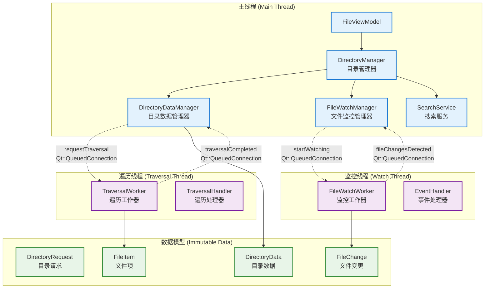

 # RootInfo 彻底重构方案

## 整体技术方案

### 核心设计理念

1. **纯Qt信号槽通信**：完全基于Qt的信号槽机制，利用Qt事件循环实现线程安全
2. **职责彻底分离**：将RootInfo的复杂职责拆分为独立的专业组件
3. **数据不可变传递**：线程间只传递不可变的数据对象
4. **单一数据所有者**：每个数据只属于一个线程，避免共享状态

### 新架构总览



### 各组件职责与优势

#### DirectoryManager (替代RootInfo的核心功能)
- **职责**：作为外部统一接口，协调内部各个组件，管理请求生命周期
- **优势**：接口简化从25个减少到7个，消除了原RootInfo的8个原子变量和2个互斥锁
- **替代机制**：用请求-响应模式替代原来的复杂状态管理

#### TraversalWorker (替代TraversalDirThreadManager)
- **职责**：专门处理目录遍历，支持批量模式和流式模式
- **优势**：保留了原有的`iteratorAll`(本地目录批量获取)和`iteratorOneByOne`(SMB/搜索流式获取)机制
- **替代机制**：用纯信号槽替代原来的直接连接，避免跨线程数据竞争

#### FileWatchWorker (替代RootInfo的文件监控逻辑)
- **职责**：专门处理文件系统监控事件，批量处理变更
- **优势**：保留了原有的200ms批量处理和去重逻辑，但在专用线程中执行
- **替代机制**：用事件队列+定时器替代原来的复杂异步Future管理

#### DirectoryDataManager (替代RootInfo的数据管理)
- **职责**：管理目录数据缓存，处理数据更新和排序
- **优势**：职责单一，不再混合线程管理和数据管理
- **替代机制**：用不可变数据对象替代原来的读写锁保护的共享状态

## 主要技术细节

### 1. 线程安全的信号槽通信

**核心原理**：利用Qt的元对象系统和事件循环，所有跨线程信号连接都使用`Qt::QueuedConnection`

```cpp
// 示例：DirectoryDataManager 与 TraversalWorker 的通信
class DirectoryDataManager : public QObject {
    Q_OBJECT
    
signals:
    // 发送给TraversalWorker的信号
    void requestTraversal(const DirectoryRequest& request);
    void cancelTraversal(const QString& requestId);
    
private slots:
    // 接收TraversalWorker的结果
    void onTraversalCompleted(const QString& requestId, const DirectoryData& data);
    void onTraversalProgress(const QString& requestId, const QList<FileItem>& items);
    void onTraversalError(const QString& requestId, const QString& error);
    
private:
    void setupWorkerConnections() {
        // 关键：使用Qt::QueuedConnection确保线程安全
        connect(this, &DirectoryDataManager::requestTraversal,
                m_traversalWorker, &TraversalWorker::startTraversal,
                Qt::QueuedConnection);
                
        connect(m_traversalWorker, &TraversalWorker::traversalCompleted,
                this, &DirectoryDataManager::onTraversalCompleted,
                Qt::QueuedConnection);
    }
    
    TraversalWorker* m_traversalWorker;  // 运行在独立线程
    QThread* m_traversalThread;
};
```

### 2. 关键业务机制保留

#### 2.1 iteratorAll vs iteratorOneByOne 机制完整保留

**原TraversalDirThreadManager的核心机制**：
```cpp
// 原来的决策逻辑
void TraversalDirThreadManager::run() {
    if (!dirIterator->oneByOne()) {
        // 本地目录：使用iteratorAll批量获取，性能极佳
        const QList<SortInfoPointer> &fileList = iteratorAll();
        emit updateLocalChildren(fileList, sortRole, sortOrder, isMixDirAndFile, traversalToken);
    } else {
        // SMB/搜索：使用iteratorOneByOne流式获取，持续更新
        count = iteratorOneByOne(timer);
        // 在iteratorOneByOne中会持续emit updateChildrenManager(childrenList, traversalToken);
    }
}

// oneByOne决策逻辑
bool LocalDirIterator::oneByOne() {
    // 本地设备返回false，使用批量模式
    return !info->extendAttributes(ExtInfoType::kFileLocalDevice).toBool() || !d->dfmioDirIterator;
}
```

**新架构的等价实现**：
```cpp
class TraversalWorker : public QObject {
public slots:
    void startTraversal(const DirectoryRequest& request) {
        // 创建迭代器
        auto iterator = DirIteratorFactory::create<AbstractDirIterator>(request.url(), ...);
        
        // 保持相同的决策逻辑
        if (!iterator->oneByOne()) {
            // 本地目录：批量模式，高性能
            processBatchMode(request, iterator);
        } else {
            // SMB/搜索：流式模式，持续更新
            processStreamMode(request, iterator);
        }
    }
    
private:
    void processBatchMode(const DirectoryRequest& request, AbstractDirIteratorPointer iterator) {
        // 等价于原来的iteratorAll()
        QVariantMap args;
        args.insert("sortRole", QVariant::fromValue(request.sortConfig().sortRole));
        args.insert("mixFileAndDir", request.sortConfig().isMixDirAndFile);
        args.insert("sortOrder", request.sortConfig().sortOrder);
        iterator->setArguments(args);
        
        if (!iterator->initIterator()) {
            emit traversalError(request.requestId(), "Iterator initialization failed");
            return;
        }
        
        // 一次性获取所有文件，性能极佳
        auto fileList = iterator->sortFileInfoList();
        QList<FileItem> items;
        for (const auto& sortInfo : fileList) {
            items.append(FileItem::fromSortInfo(sortInfo));
        }
        
        DirectoryData data(request.url(), items, request.sortConfig(), request.filterConfig());
        emit traversalCompleted(request.requestId(), data, items.isEmpty());
        
        // 检查是否有持续更新（搜索场景）
        while (iterator->isWaitingForUpdates()) {
            auto updateList = iterator->sortFileInfoList();
            if (!updateList.isEmpty()) {
                QList<FileItem> updateItems;
                for (const auto& sortInfo : updateList) {
                    updateItems.append(FileItem::fromSortInfo(sortInfo));
                }
                emit traversalProgress(request.requestId(), updateItems, false);
            }
        }
    }
    
    void processStreamMode(const DirectoryRequest& request, AbstractDirIteratorPointer iterator) {
        // 等价于原来的iteratorOneByOne()
        iterator->cacheBlockIOAttribute();
        
        if (!iterator->initIterator()) {
            emit traversalError(request.requestId(), "Iterator initialization failed");
            return;
        }
        
        QElapsedTimer timer;
        timer.start();
        
        QList<FileItem> batchItems;
        const int timeCeiling = 200;  // 保持原有的200ms批量
        const int countCeiling = 500; // 保持原有的500个文件批量
        
        while (iterator->hasNext()) {
            if (m_activeTraversals[request.requestId()]->isCancelled) break;
            
            auto fileUrl = iterator->next();
            if (!fileUrl.isValid()) continue;
            
            auto fileInfo = iterator->fileInfo();
            if (!fileInfo) {
                fileInfo = InfoFactory::create<FileInfo>(fileUrl);
            }
            
            if (fileInfo) {
                batchItems.append(FileItem(fileInfo));
            }
            
            // 保持原有的批量发送逻辑：200ms或500个文件
            if (timer.elapsed() > timeCeiling || batchItems.count() > countCeiling) {
                emit traversalProgress(request.requestId(), batchItems, false);
                timer.restart();
                batchItems.clear();
            }
        }
        
        // 发送剩余的文件
        if (!batchItems.isEmpty()) {
            emit traversalProgress(request.requestId(), batchItems, false);
        }
        
        // 检查是否需要排序
        if (!iterator->property(IteratorProperty::kKeepOrder).toBool()) {
            emit traversalSortRequested(request.requestId());
        }
        
        DirectoryData finalData = buildFinalData(request);
        emit traversalCompleted(request.requestId(), finalData, finalData.fileItems().isEmpty());
    }
};
```

**关键优势保持**：
- **本地目录**：`iteratorAll`模式，一次性获取所有文件信息，性能极佳
- **SMB/搜索**：`iteratorOneByOne`模式，持续推送数据，避免界面饥饿
- **决策逻辑**：完全保持原有的`oneByOne()`判断机制

#### 2.2 handleGetSourceData业务逻辑分析与替代

**原handleGetSourceData的业务逻辑**：
```cpp
void RootInfo::handleGetSourceData(const QString &currentToken) {
    // 1. 启动文件监控（如果需要）
    if (needStartWatcher)
        startWatcher();

    // 2. 获取已缓存的源数据
    QList<SortInfoPointer> newDatas;
    bool isEmpty = false;
    {
        QWriteLocker wlk(&childrenLock);
        newDatas = sourceDataList;  // 获取缓存数据
        isEmpty = sourceDataList.isEmpty();
    }

    // 3. 发送缓存数据给FileSortWorker
    emit sourceDatas(currentToken, newDatas, originSortRole, originSortOrder, originMixSort, !traversaling);
    
    // 4. 如果没有在遍历，发送遍历完成信号
    if (!traversaling)
        emit traversalFinished(currentToken, isEmpty);
}
```

**调用时机分析**：
- `FileSortWorker::setSourceHandleState(false)` → `emit getSourceData(currentKey)` → `RootInfo::handleGetSourceData`
- 主要在以下场景触发：
  1. **缓存命中**：`RootInfo::startWork(key, true)` 直接调用
  2. **数据获取请求**：FileSortWorker需要数据时主动请求
  3. **排序参数变更**：需要重新应用排序时

**业务本质**：handleGetSourceData是一个**缓存数据获取接口**，用于：
- 获取已遍历完成的目录数据
- 启动文件监控
- 向FileSortWorker提供排序后的数据

**新架构的替代方案**：
```cpp
class DirectoryDataManager : public QObject {
    Q_OBJECT
    
public slots:
    // 替代handleGetSourceData的功能
    void requestCachedData(const QString& requestId, const QUrl& directoryUrl) {
        fmDebug() << "Requesting cached data for:" << directoryUrl.toString() << "requestId:" << requestId;
        
        // 1. 检查缓存
        if (m_cachedData.contains(directoryUrl)) {
            const auto& cachedData = m_cachedData[directoryUrl];
            
            // 2. 启动文件监控（如果需要）
            if (m_needStartWatcher.contains(directoryUrl) && m_needStartWatcher[directoryUrl]) {
                emit requestStartWatching(directoryUrl);
                m_needStartWatcher[directoryUrl] = false;
            }
            
            // 3. 直接返回缓存数据
            emit dataReady(requestId, cachedData);
            
            // 4. 发送完成信号
            emit traversalFinished(requestId, cachedData.fileItems().isEmpty());
            
            fmDebug() << "Cached data provided - item count:" << cachedData.fileItems().size();
            return;
        }
        
        // 5. 缓存未命中，启动新的遍历
        fmDebug() << "Cache miss, starting new traversal for:" << directoryUrl.toString();
        SortConfig defaultSort;
        FilterConfig defaultFilter;
        DirectoryRequest request(directoryUrl, requestId, defaultSort, defaultFilter, false);
        emit requestTraversal(request);
    }
    
    // 处理遍历完成后的数据缓存
    void onTraversalCompleted(const QString& requestId, const DirectoryData& data) {
        // 缓存数据
        m_cachedData[data.url()] = data;
        
        // 启动文件监控
        if (m_needStartWatcher.value(data.url(), true)) {
            emit requestStartWatching(data.url());
            m_needStartWatcher[data.url()] = false;
        }
        
        // 转发数据
        emit dataReady(requestId, data);
    }
    
private:
    QMap<QUrl, DirectoryData> m_cachedData;
    QMap<QUrl, bool> m_needStartWatcher;
};
```

**新架构中handleGetSourceData功能的分解**：
1. **缓存数据获取** → `DirectoryDataManager::requestCachedData`
2. **文件监控启动** → `FileWatchManager::startWatching`
3. **数据传递** → `DirectoryManager::directoryDataReady`信号
4. **遍历状态管理** → `TraversalWorker`的状态信号

**是否为冗余设计**：
- **不是冗余**：handleGetSourceData承担了重要的缓存机制，避免重复遍历
- **但设计复杂**：原设计将缓存、监控、数据传递混合在一个方法中
- **新架构优势**：职责分离，每个组件专注自己的功能

### 3. 不可变数据对象设计

**设计原则**：所有跨线程传递的数据都是不可变的值对象

```cpp
// 目录请求对象 - 完全不可变
class DirectoryRequest {
public:
    DirectoryRequest(QUrl url, QString requestId, SortConfig sort, FilterConfig filter)
        : m_url(std::move(url))
        , m_requestId(std::move(requestId))
        , m_sortConfig(std::move(sort))
        , m_filterConfig(std::move(filter))
        , m_timestamp(QDateTime::currentDateTime())
    {}
    
    // 只提供const访问
    const QUrl& url() const { return m_url; }
    const QString& requestId() const { return m_requestId; }
    const SortConfig& sortConfig() const { return m_sortConfig; }
    const FilterConfig& filterConfig() const { return m_filterConfig; }
    const QDateTime& timestamp() const { return m_timestamp; }
    
private:
    const QUrl m_url;
    const QString m_requestId;
    const SortConfig m_sortConfig;
    const FilterConfig m_filterConfig;
    const QDateTime m_timestamp;
};

// 文件项对象 - 完全不可变
class FileItem {
public:
    explicit FileItem(const FileInfoPointer& info)
        : m_url(info->urlOf(UrlInfoType::kUrl))
        , m_displayName(info->displayOf(DisPlayInfoType::kFileDisplayName))
        , m_size(info->size())
        , m_lastModified(info->timeOf(TimeInfoType::kLastModified).value<QDateTime>())
        , m_isDirectory(info->isAttributes(OptInfoType::kIsDir))
        , m_isHidden(info->isAttributes(OptInfoType::kIsHidden))
        // ... 其他属性
    {}
    
    // 只读访问
    const QUrl& url() const { return m_url; }
    const QString& displayName() const { return m_displayName; }
    qint64 size() const { return m_size; }
    const QDateTime& lastModified() const { return m_lastModified; }
    bool isDirectory() const { return m_isDirectory; }
    bool isHidden() const { return m_isHidden; }
    
    // 创建排序信息
    SortInfoPointer createSortInfo() const {
        auto sortInfo = SortInfoPointer(new SortFileInfo);
        sortInfo->setUrl(m_url);
        sortInfo->setSize(m_size);
        sortInfo->setFile(!m_isDirectory);
        sortInfo->setDir(m_isDirectory);
        sortInfo->setHide(m_isHidden);
        // ... 设置其他排序相关属性
        return sortInfo;
    }
    
private:
    const QUrl m_url;
    const QString m_displayName;
    const qint64 m_size;
    const QDateTime m_lastModified;
    const bool m_isDirectory;
    const bool m_isHidden;
    // ... 其他不可变属性
};

// Qt元类型注册，支持信号槽传递
Q_DECLARE_METATYPE(DirectoryRequest)
Q_DECLARE_METATYPE(FileItem)
Q_DECLARE_METATYPE(QList<FileItem>)
```

### 3. 文件监控的特殊处理

**关键问题**：AbstractFileWatcher只能在主线程创建，但事件处理需要在子线程

**解决方案**：主线程创建Watcher，通过信号转发到子线程处理

```cpp
class FileWatchManager : public QObject {
    Q_OBJECT
    
public:
    explicit FileWatchManager(QObject* parent = nullptr) {
        // 创建监控工作线程
        m_watchWorker = new FileWatchWorker;
        m_watchThread = new QThread(this);
        m_watchWorker->moveToThread(m_watchThread);
        
        setupConnections();
        m_watchThread->start();
    }
    
    void startWatching(const QUrl& directoryUrl) {
        // 在主线程创建Watcher
        auto watcher = WatcherFactory::create<AbstractFileWatcher>(directoryUrl);
        if (watcher.isNull()) {
            fmWarning() << "Failed to create watcher for:" << directoryUrl;
            return;
        }
        
        // 连接Watcher信号到本对象的槽
        connect(watcher.data(), &AbstractFileWatcher::subfileCreated,
                this, &FileWatchManager::onFileCreated);
        connect(watcher.data(), &AbstractFileWatcher::fileDeleted,
                this, &FileWatchManager::onFileDeleted);
        connect(watcher.data(), &AbstractFileWatcher::fileAttributeChanged,
                this, &FileWatchManager::onFileUpdated);
        connect(watcher.data(), &AbstractFileWatcher::fileRename,
                this, &FileWatchManager::onFileMoved);
        
        watcher->restartWatcher();
        m_watchers.insert(directoryUrl, watcher);
        
        // 通知Worker开始处理该目录的事件
        emit watcherCreated(directoryUrl);
    }
    
signals:
    void watcherCreated(const QUrl& directoryUrl);
    void fileChangeDetected(const FileChange& change);
    
private slots:
    // 在主线程接收Watcher信号
    void onFileCreated(const QUrl& fileUrl) {
        FileChange change(fileUrl, FileChange::Added, QDateTime::currentDateTime());
        // 转发到Worker线程处理
        emit fileChangeDetected(change);
    }
    
    void onFileDeleted(const QUrl& fileUrl) {
        FileChange change(fileUrl, FileChange::Removed, QDateTime::currentDateTime());
        emit fileChangeDetected(change);
    }
    
    void onFileUpdated(const QUrl& fileUrl) {
        FileChange change(fileUrl, FileChange::Modified, QDateTime::currentDateTime());
        emit fileChangeDetected(change);
    }
    
    void onFileMoved(const QUrl& fromUrl, const QUrl& toUrl) {
        FileChange change(toUrl, FileChange::Moved, QDateTime::currentDateTime(), fromUrl);
        emit fileChangeDetected(change);
    }
    
private:
    void setupConnections() {
        connect(this, &FileWatchManager::fileChangeDetected,
                m_watchWorker, &FileWatchWorker::handleFileChange,
                Qt::QueuedConnection);
                
        connect(m_watchWorker, &FileWatchWorker::batchChangesReady,
                this, &FileWatchManager::onBatchChangesReady,
                Qt::QueuedConnection);
    }
    
    QMap<QUrl, AbstractFileWatcherPointer> m_watchers;
    FileWatchWorker* m_watchWorker;
    QThread* m_watchThread;
};

class FileWatchWorker : public QObject {
    Q_OBJECT
    
public slots:
    void handleFileChange(const FileChange& change) {
        // 在Worker线程中处理文件变更
        QUrl directoryUrl = findDirectoryForFile(change.fileUrl());
        if (!directoryUrl.isValid()) return;
        
        // 批量收集变更
        m_pendingChanges[directoryUrl].append(change);
        
        // 重置定时器
        if (!m_batchTimer->isActive()) {
            m_batchTimer->start(200); // 200ms后批量处理
        }
    }
    
signals:
    void batchChangesReady(const QUrl& directoryUrl, const QList<FileChange>& changes);
    
private slots:
    void processBatchChanges() {
        for (auto it = m_pendingChanges.begin(); it != m_pendingChanges.end(); ++it) {
            if (!it.value().isEmpty()) {
                emit batchChangesReady(it.key(), it.value());
                it.value().clear();
            }
        }
    }
    
private:
    QMap<QUrl, QList<FileChange>> m_pendingChanges;
    QTimer* m_batchTimer;
};
```

## 接口设计

### 1. DirectoryManager - 统一入口

```cpp
class DirectoryManager : public QObject {
    Q_OBJECT
    
public:
    explicit DirectoryManager(QObject* parent = nullptr);
    
    // 主要接口
    QString requestDirectoryData(const QUrl& directoryUrl,
                                const SortConfig& sortConfig = {},
                                const FilterConfig& filterConfig = {},
                                bool useCache = true);
    
    void cancelRequest(const QString& requestId);
    void refreshDirectory(const QUrl& directoryUrl);
    void enableWatching(const QUrl& directoryUrl, bool enabled);
    
    // 数据访问
    QList<FileItem> getFileItems(const QUrl& directoryUrl) const;
    QStringList getSearchKeywords(const QUrl& directoryUrl) const;
    
signals:
    // 简化的对外信号
    void directoryDataReady(const QString& requestId, const DirectoryData& data);
    void directoryDataUpdated(const QUrl& directoryUrl, const QList<FileChange>& changes);
    void requestError(const QString& requestId, const QString& errorMessage);
    
private slots:
    void onDataManagerDataReady(const QString& requestId, const DirectoryData& data);
    void onWatchManagerChangesDetected(const QUrl& directoryUrl, const QList<FileChange>& changes);
    
private:
    DirectoryDataManager* m_dataManager;
    FileWatchManager* m_watchManager;
    SearchService* m_searchService;
    
    QMap<QUrl, DirectoryData> m_cachedData;
    QMap<QString, QUrl> m_activeRequests;
};
```

### 2. 核心Worker接口

```cpp
class TraversalWorker : public QObject {
    Q_OBJECT
    
public:
    explicit TraversalWorker(QObject* parent = nullptr);
    
public slots:
    void startTraversal(const DirectoryRequest& request);
    void cancelTraversal(const QString& requestId);
    
signals:
    void traversalProgress(const QString& requestId, const QList<FileItem>& items, bool isFirstBatch);
    void traversalCompleted(const QString& requestId, const DirectoryData& data);
    void traversalError(const QString& requestId, const QString& errorMessage);
    
private:
    void processDirectory(const DirectoryRequest& request);
    QList<FileItem> createFileItems(const QList<FileInfoPointer>& infos);
    
    QMap<QString, std::unique_ptr<TraversalContext>> m_activeTraversals;
    QTimer* m_progressTimer;
};
```

## 数据结构设计

### 1. 核心数据结构

```cpp
// 排序配置
struct SortConfig {
    Global::ItemRoles role = Global::ItemRoles::kItemFileDisplayNameRole;
    Qt::SortOrder order = Qt::AscendingOrder;
    bool mixFileAndFolder = false;
    
    bool operator==(const SortConfig& other) const {
        return role == other.role && order == other.order && mixFileAndFolder == other.mixFileAndFolder;
    }
};

// 过滤配置
struct FilterConfig {
    QStringList nameFilters;
    QDir::Filters dirFilters = QDir::AllEntries | QDir::NoDotAndDotDot;
    bool showHidden = false;
    
    bool operator==(const FilterConfig& other) const {
        return nameFilters == other.nameFilters && 
               dirFilters == other.dirFilters && 
               showHidden == other.showHidden;
    }
};

// 目录数据
class DirectoryData {
public:
    DirectoryData(QUrl url, QList<FileItem> items, SortConfig sort, FilterConfig filter)
        : m_url(std::move(url))
        , m_fileItems(std::move(items))
        , m_sortConfig(std::move(sort))
        , m_filterConfig(std::move(filter))
        , m_timestamp(QDateTime::currentDateTime())
    {}
    
    const QUrl& url() const { return m_url; }
    const QList<FileItem>& fileItems() const { return m_fileItems; }
    const SortConfig& sortConfig() const { return m_sortConfig; }
    const FilterConfig& filterConfig() const { return m_filterConfig; }
    const QDateTime& timestamp() const { return m_timestamp; }
    
    // 创建排序信息列表
    QList<SortInfoPointer> createSortInfoList() const {
        QList<SortInfoPointer> sortInfos;
        for (const auto& item : m_fileItems) {
            sortInfos.append(item.createSortInfo());
        }
        return sortInfos;
    }
    
private:
    const QUrl m_url;
    const QList<FileItem> m_fileItems;
    const SortConfig m_sortConfig;
    const FilterConfig m_filterConfig;
    const QDateTime m_timestamp;
};

// 文件变更
class FileChange {
public:
    enum Type { Added, Removed, Modified, Moved };
    
    FileChange(QUrl fileUrl, Type type, QDateTime timestamp, QUrl oldUrl = {})
        : m_fileUrl(std::move(fileUrl))
        , m_type(type)
        , m_timestamp(std::move(timestamp))
        , m_oldUrl(std::move(oldUrl))
    {}
    
    const QUrl& fileUrl() const { return m_fileUrl; }
    Type type() const { return m_type; }
    const QDateTime& timestamp() const { return m_timestamp; }
    const QUrl& oldUrl() const { return m_oldUrl; }
    
private:
    const QUrl m_fileUrl;
    const Type m_type;
    const QDateTime m_timestamp;
    const QUrl m_oldUrl; // for move operations
};
```

### 2. 线程上下文管理

```cpp
// 遍历上下文 - 只在TraversalWorker线程中使用
struct TraversalContext {
    QString requestId;
    QUrl directoryUrl;
    SortConfig sortConfig;
    FilterConfig filterConfig;
    bool useCache;
    
    std::unique_ptr<AbstractDirIterator> iterator;
    QList<FileItem> collectedItems;
    QElapsedTimer timer;
    bool isCancelled = false;
    
    TraversalContext(const DirectoryRequest& request)
        : requestId(request.requestId())
        , directoryUrl(request.url())
        , sortConfig(request.sortConfig())
        , filterConfig(request.filterConfig())
        , useCache(request.useCache())
    {
        timer.start();
    }
};
```

## 重构前后详细对比

### 1. RootInfo与相关模块的完整交互分析

#### 1.1 RootInfo的13个信号及其用途

**重构前的信号映射表**：

| 信号名称 | 连接的槽函数 | 业务用途 | FileSortWorker中的处理 |
|---------|-------------|----------|----------------------|
| `iteratorLocalFiles` | `FileSortWorker::handleIteratorLocalChildren` | 本地文件迭代完成，直接排序显示 | 设置排序参数，直接显示数据 |
| `iteratorAddFiles` | `FileSortWorker::handleIteratorChildren` | 遍历过程中增量添加文件 | 批量添加文件到模型 |
| `iteratorUpdateFiles` | `FileSortWorker::handleIteratorChildrenUpdate` | 遍历过程中更新文件信息 | 更新已存在的文件信息 |
| `sourceDatas` | `FileSortWorker::handleSourceChildren` | 获取缓存的源数据 | 处理缓存数据，应用过滤排序 |
| `watcherAddFiles` | `FileSortWorker::handleWatcherAddChildren` | 文件监控检测到新增文件 | 实时添加新文件到视图 |
| `watcherRemoveFiles` | `FileSortWorker::handleWatcherRemoveChildren` | 文件监控检测到删除文件 | 从视图中移除文件 |
| `watcherUpdateFile` | `FileSortWorker::handleWatcherUpdateFile` | 单个文件属性更新 | 更新单个文件显示 |
| `watcherUpdateFiles` | `FileSortWorker::handleWatcherUpdateFiles` | 批量文件属性更新 | 批量更新文件显示 |
| `watcherUpdateHideFile` | `FileSortWorker::handleWatcherUpdateHideFile` | .hidden文件变更 | 重新应用隐藏文件过滤 |
| `traversalFinished` | `FileSortWorker::handleTraversalFinish` | 目录遍历完成 | 清理状态，通知视图遍历结束 |
| `requestSort` | `FileSortWorker::handleSortDir` | 请求对目录重新排序 | 重新排序当前数据 |
| `requestCloseTab` | `WorkspaceHelper::closeTab` | 请求关闭标签页 | 关闭对应的文件管理器标签 |
| `renameFileProcessStarted` | `FileViewModel::renameFileProcessStarted` | 文件重命名开始 | 禁用某些UI操作 |

#### 1.2 RootInfo的12个槽函数及其业务逻辑

| 槽函数名称 | 调用来源 | 业务逻辑 | 重构后的处理方式 |
|-----------|----------|----------|------------------|
| `doFileDeleted` | `AbstractFileWatcher::fileDeleted` | 处理文件删除事件，加入事件队列 | `FileWatchWorker::handleFileDeleted` |
| `dofileMoved` | `AbstractFileWatcher::fileRename` | 处理文件重命名，先删除后添加 | `FileWatchWorker::handleFileMoved` |
| `dofileCreated` | `AbstractFileWatcher::subfileCreated` | 处理文件创建事件，加入事件队列 | `FileWatchWorker::handleFileCreated` |
| `doFileUpdated` | `AbstractFileWatcher::fileAttributeChanged` | 处理文件属性变更，加入事件队列 | `FileWatchWorker::handleFileUpdated` |
| `doWatcherEvent` | 内部调用 | 批量处理文件监控事件（200+行复杂逻辑） | `FileWatchWorker::processBatchChanges` |
| `doThreadWatcherEvent` | 内部调用 | 启动异步线程处理监控事件 | 直接在Worker线程处理 |
| `handleTraversalResults` | `TraversalDirThreadManager::updateChildrenManager` | 处理遍历结果，转换为SortInfo | `TraversalWorker::handleTraversalResults` |
| `handleTraversalResultsUpdate` | `TraversalDirThreadManager::updateChildrenInfo` | 处理遍历结果更新 | `TraversalWorker::handleTraversalUpdate` |
| `handleTraversalLocalResult` | `TraversalDirThreadManager::updateLocalChildren` | 处理本地遍历结果 | `TraversalWorker::handleLocalResults` |
| `handleTraversalFinish` | `TraversalDirThreadManager::traversalFinished` | 遍历完成，清理状态，发送信号 | `TraversalWorker::handleTraversalComplete` |
| `handleTraversalSort` | `TraversalDirThreadManager::traversalRequestSort` | 请求排序 | `DirectoryDataManager::requestSort` |
| `handleGetSourceData` | `FileSortWorker::getSourceData` | 获取源数据，启动监控 | `DirectoryDataManager::getSourceData` |

#### 1.3 FileViewModel中的关键业务逻辑

**doExpand方法的完整业务逻辑**：
```cpp
void FileViewModel::doExpand(const QModelIndex &index) {
    // 1. 获取要展开的目录URL
    const QUrl &url = index.data(kItemUrlRole).toUrl();
    
    // 2. 为该目录创建独立的RootInfo
    RootInfo *expandRoot = FileDataManager::instance()->fetchRoot(url);
    
    // 3. 建立13个信号槽连接（与主目录相同的连接模式）
    connect(expandRoot, &RootInfo::requestCloseTab, ...);
    connect(filterSortWorker, &FileSortWorker::getSourceData, expandRoot, &RootInfo::handleGetSourceData);
    connect(expandRoot, &RootInfo::sourceDatas, filterSortWorker, &FileSortWorker::handleSourceChildren);
    // ... 其他10个连接
    
    // 4. 设置可以获取文件标志
    canFetchFiles = true;
    fetchingUrl = url;
    
    // 5. 触发fetchMore获取子目录数据
    fetchMore(index);
    
    // 6. 标记该项为已展开状态
    FileItemDataPointer item = filterSortWorker->childData(index.row());
    if (item) item->setExpanded(true);
}
```

**fetchMore方法的业务逻辑**：
```cpp
void FileViewModel::fetchMore(const QModelIndex &parent) {
    // 1. 检查是否可以获取更多数据
    if (!canFetchMore(parent)) return;
    
    // 2. 获取当前key和排序参数
    QString currentKey = filterSortWorker->getCurrentKey();
    auto role = filterSortWorker->getSortRole();
    auto order = filterSortWorker->getSortOrder();
    bool isMixFileAndFolder = Application::instance()->appAttribute(Application::kFileAndDirMixedSort).toBool();
    
    // 3. 获取对应的RootInfo
    RootInfo *root = FileDataManager::instance()->fetchRoot(fetchingUrl);
    
    // 4. 初始化遍历线程
    auto getCache = root->initThreadOfFileData(currentKey, role, order, isMixFileAndFolder);
    
    // 5. 启动工作
    root->startWork(currentKey, getCache);
}
```

### 2. 新架构的详细业务逻辑映射

#### 2.1 信号业务逻辑的新实现

**原RootInfo信号 → 新架构实现**：

```cpp
// 原: iteratorLocalFiles → 新: DirectoryDataManager处理
// 原始代码：
void RootInfo::handleTraversalLocalResult(...) {
    emit iteratorLocalFiles(travseToken, children, originSortRole, originSortOrder, originMixSort, isFirst);
}

// 新架构代码：
void DirectoryDataManager::onTraversalCompleted(const QString& requestId, const DirectoryData& data) {
    // 直接包含排序信息的完整数据
    emit dataReady(requestId, data);
}

// 原: watcherAddFiles + watcherRemoveFiles + watcherUpdateFiles → 新: 统一的dataUpdated
// 原始代码：
void RootInfo::addChildren(const QList<QUrl> &urlList) {
    // 复杂的处理逻辑...
    emit watcherAddFiles(newSortInfo);
}

// 新架构代码：
void FileWatchManager::onBatchChangesReady(const QUrl& directoryUrl, const QList<FileChange>& changes) {
    emit dataUpdated(directoryUrl, changes);  // 统一的变更通知
}
```

#### 2.2 FileSortWorker的适配改造

**原来的复杂连接 → 新的简化处理**：

```cpp
// 原来需要处理的11个不同的槽函数，现在简化为3个：

class FileSortWorker : public QObject {
public slots:
    // 新增：处理完整的目录数据
    void handleDirectoryDataReady(const QString& requestId, const DirectoryData& data) {
        // 替代原来的 handleSourceChildren + handleIteratorLocalChildren
        if (currentKey != requestId) {
            fmDebug() << "Ignoring data for different key - current:" << currentKey << "received:" << requestId;
            return;
        }
        
        auto sortInfos = data.createSortInfoList();
        
        // 应用数据（替代原来的handleSourceChildren逻辑）
        if (data.sortConfig().sortRole != DEnumerator::SortRoleCompareFlag::kSortRoleCompareDefault &&
            this->sortRole == data.sortConfig().sortRole &&
            this->sortOrder == data.sortConfig().sortOrder &&
            this->isMixDirAndFile == data.sortConfig().isMixDirAndFile) {
            
            // 排序参数匹配，直接使用数据
            setCurrentData(sortInfos, data.sortConfig());
        } else {
            // 需要重新排序
            setCurrentData(sortInfos, data.sortConfig());
            sortAllFiles();
        }
        
        emit requestSetIdle(sortInfos.size(), sortInfos.size());
        
        // 替代原来的handleGetSourceData触发机制
        if (!data.isTraversalActive()) {
            emit traversalFinished(requestId, sortInfos.isEmpty());
        }
    }
    
    // 新增：处理目录数据更新
    void handleDirectoryDataUpdated(const QUrl& directoryUrl, const QList<FileChange>& changes) {
        // 替代原来的 handleWatcherAddChildren + handleWatcherRemoveChildren + handleWatcherUpdateFiles
        for (const auto& change : changes) {
            switch (change.type()) {
                case FileChange::Added:
                    addFileToView(change.fileUrl());
                    break;
                case FileChange::Removed:
                    removeFileFromView(change.fileUrl());
                    break;
                case FileChange::Modified:
                    updateFileInView(change.fileUrl());
                    break;
                case FileChange::Moved:
                    removeFileFromView(change.oldUrl());
                    addFileToView(change.fileUrl());
                    break;
            }
        }
    }
    
    // 新增：处理请求错误
    void handleRequestError(const QString& requestId, const QString& errorMessage) {
        // 替代原来的各种错误处理逻辑
        fmWarning() << "Directory request failed:" << requestId << errorMessage;
        emit requestSetIdle(0, 0);
    }
    
    // 保留但简化：遍历完成处理
    void handleTraversalFinish(const QString& requestId) {
        // 原来的 handleTraversalFinish 逻辑保留，但简化
        if (currentKey != requestId) return;
        
        fmInfo() << "Traversal finished for request:" << requestId;
        emit requestSetIdle(visibleChildren.count(), childrenDataMap.count());
        HandleNameFilters(nameFilters);
    }
    
    // 新增：替代原来的getSourceData信号机制
    void traversalProgress(const QString& requestId) {
        // 这个方法替代原来FileSortWorker发送getSourceData信号的机制
        // 直接向DirectoryManager请求缓存数据
        emit requestCachedDirectoryData(requestId, currentDirectoryUrl);
    }
    
signals:
    // 新增信号：请求缓存的目录数据
    void requestCachedDirectoryData(const QString& requestId, const QUrl& directoryUrl);
};
```

#### 2.3 FileViewModel的彻底改造

**doExpand方法的新实现**：

```cpp
// 原来的复杂实现 → 新的简化实现
void FileViewModel::doExpand(const QModelIndex &index) {
    if (!index.isValid() || !filterSortWorker) {
        fmWarning() << "Cannot expand: invalid index or no sort worker";
        return;
    }

    const QUrl &url = index.data(kItemUrlRole).toUrl();
    fmInfo() << "Expanding directory:" << url.toString();

    // 1. 获取DirectoryManager（替代fetchRoot）
    DirectoryManager *dirManager = FileDataManager::instance()->fetchDirectoryManager(url);
    
    // 2. 简化的连接（从13个减少到3个）
    connectDirectoryManager(dirManager);
    
    // 3. 请求目录数据（替代复杂的initThreadOfFileData + startWork）
    SortConfig sortConfig{
        filterSortWorker->getSortRole(),
        filterSortWorker->getSortOrder(),
        Application::instance()->appAttribute(Application::kFileAndDirMixedSort).toBool()
    };
    
    QString requestId = dirManager->requestDirectoryData(url, sortConfig);
    m_expandRequests[index] = requestId;  // 跟踪展开请求
    
    // 4. 标记展开状态
    FileItemDataPointer item = filterSortWorker->childData(index.row());
    if (item) item->setExpanded(true);
    
    canFetchFiles = true;
    fetchingUrl = url;
}

// 新增：统一的DirectoryManager连接方法
void FileViewModel::connectDirectoryManager(DirectoryManager* manager) {
    // 只需要4个连接，替代原来的13个
    connect(manager, &DirectoryManager::directoryDataReady,
            this, &FileViewModel::onDirectoryDataReady, Qt::QueuedConnection);
    connect(manager, &DirectoryManager::directoryDataUpdated,
            this, &FileViewModel::onDirectoryDataUpdated, Qt::QueuedConnection);
    connect(manager, &DirectoryManager::requestError,
            this, &FileViewModel::onDirectoryRequestError, Qt::QueuedConnection);
    
    // 建立FileSortWorker与DirectoryManager的双向连接
    connect(filterSortWorker.data(), &FileSortWorker::requestCachedDirectoryData,
            manager, &DirectoryManager::handleCachedDataRequest, Qt::QueuedConnection);
}

// 新增：处理目录数据就绪（替代原来复杂的13个信号处理）
void FileViewModel::onDirectoryDataReady(const QString& requestId, const DirectoryData& data) {
    fmInfo() << "Directory data ready for request:" << requestId;
    
    // 转发给FileSortWorker处理（替代原来的sourceDatas信号）
    if (filterSortWorker) {
        filterSortWorker->handleDirectoryDataReady(requestId, data);
    }
    
    // 如果是展开请求，更新展开状态
    auto expandIndex = findExpandIndexByRequestId(requestId);
    if (expandIndex.isValid()) {
        emit dataChanged(expandIndex, expandIndex);
        m_expandRequests.remove(expandIndex);
    }
}

// 新增：处理目录数据就绪
void FileViewModel::onDirectoryDataReady(const QString& requestId, const DirectoryData& data) {
    fmInfo() << "Directory data ready for request:" << requestId;
    
    // 转发给FileSortWorker处理
    if (filterSortWorker) {
        filterSortWorker->handleDirectoryDataReady(requestId, data);
    }
    
    // 如果是展开请求，更新展开状态
    auto expandIndex = findExpandIndexByRequestId(requestId);
    if (expandIndex.isValid()) {
        emit dataChanged(expandIndex, expandIndex);
        m_expandRequests.remove(expandIndex);
    }
}
```

### 3. 删除的代码清单

#### 3.1 完全删除的文件
- `src/plugins/filemanager/dfmplugin-workspace/models/rootinfo.h` (169行)
- `src/plugins/filemanager/dfmplugin-workspace/models/rootinfo.cpp` (860行)
- `src/plugins/filemanager/dfmplugin-workspace/utils/traversaldirthreadmanager.h` (77行)
- `src/plugins/filemanager/dfmplugin-workspace/utils/traversaldirthreadmanager.cpp` (约300行)

#### 3.2 重写的代码清单

**FileDataManager类重写**：
```cpp
// 删除的方法：
- RootInfo *fetchRoot(const QUrl &url);
- RootInfo *createRoot(const QUrl &url);
- void cleanRoot(const QUrl &rootUrl, const QString &key, const bool refresh, const bool self);
- QMap<QUrl, RootInfo *> rootInfoMap;

// 新增的方法：
+ DirectoryManager *fetchDirectoryManager(const QUrl &url);
+ DirectoryManager *createDirectoryManager(const QUrl &url);
+ void cleanDirectoryManager(const QUrl &url, const QString &requestId);
+ QMap<QUrl, DirectoryManager *> directoryManagerMap;
```

**FileViewModel类重写**：
```cpp
// 删除的方法：
- void connectRootAndFilterSortWork(RootInfo *root, const bool refresh = false);
- void initFilterSortWork(const QUrl& dirRootUrl, const QString& currentKey, ...);

// 新增的方法：
+ void connectDirectoryManager(DirectoryManager* manager);
+ void onDirectoryDataReady(const QString& requestId, const DirectoryData& data);
+ void onDirectoryDataUpdated(const QUrl& directoryUrl, const QList<FileChange>& changes);
+ void onDirectoryRequestError(const QString& requestId, const QString& errorMessage);
+ QModelIndex findExpandIndexByRequestId(const QString& requestId);
+ QMap<QModelIndex, QString> m_expandRequests;  // 跟踪展开请求
```

### 4. 关键业务逻辑保留验证

#### 4.1 traversalFinished业务逻辑的完整保留

**原来的处理流程**：
```cpp
// RootInfo::handleTraversalFinish
void RootInfo::handleTraversalFinish(const QString &travseToken) {
    traversaling = false;
    bool noDataProduced = isFirstBatch.load();
    isFirstBatch.store(false);
    emit traversalFinished(travseToken, noDataProduced);  // 发送给FileSortWorker
    traversalFinish = true;
}

// FileSortWorker::handleTraversalFinish
void FileSortWorker::handleTraversalFinish(const QString &key, bool noDataProduced) {
    if (currentKey != key) return;
    
    if (noDataProduced) {
        // 清理所有数据
        visibleTreeChildren.clear();
        childrenDataMap.clear();
        visibleChildren.clear();
        children.clear();
    }
    
    Q_EMIT requestSetIdel(visibleChildren.count(), childrenDataMap.count());
    HandleNameFilters(nameFilters);
}
```

**新架构的等价实现**：
```cpp
// TraversalWorker::handleTraversalComplete
void TraversalWorker::handleTraversalComplete(const QString& requestId) {
    bool noDataProduced = m_collectedItems.isEmpty();
    
    DirectoryData data(m_currentRequest.url(), m_collectedItems, 
                      m_currentRequest.sortConfig(), m_currentRequest.filterConfig());
    
    emit traversalCompleted(requestId, data, noDataProduced);
}

// DirectoryDataManager::onTraversalCompleted  
void DirectoryDataManager::onTraversalCompleted(const QString& requestId, const DirectoryData& data, bool noDataProduced) {
    if (noDataProduced) {
        // 发送空数据，让FileSortWorker清理
        DirectoryData emptyData(data.url(), {}, data.sortConfig(), data.filterConfig());
        emit dataReady(requestId, emptyData);
    } else {
        m_cachedData[data.url()] = data;
        emit dataReady(requestId, data);
    }
    
    // 通知遍历完成（保留原有的完成通知机制）
    emit traversalFinished(requestId, noDataProduced);
}

// FileSortWorker保留原有的handleTraversalFinish方法，保证业务逻辑不变
```

#### 4.2 文件监控事件的批量处理逻辑保留

**原来的复杂批量处理**：
```cpp
void RootInfo::doWatcherEvent() {
    // 200+行的复杂逻辑
    QElapsedTimer timer;
    QList<QUrl> adds, updates, removes;
    
    while (checkFileEventQueue() || timer.elapsed() < 200) {
        if (timer.elapsed() - oldtime >= 200) {
            if (!adds.isEmpty()) addChildren(adds);
            if (!updates.isEmpty()) updateChildren(updates);  
            if (!removes.isEmpty()) removeChildren(removes);
            // 清理并重置
        }
        // 处理队列中的事件...
    }
}
```

**新架构的等价实现**：
```cpp
void FileWatchWorker::processBatchChanges() {
    // 保持相同的200ms批量处理逻辑
    for (auto it = m_pendingChanges.begin(); it != m_pendingChanges.end(); ++it) {
        const QUrl& directoryUrl = it.key();
        QList<FileChange>& changes = it.value();
        
        if (!changes.isEmpty() && m_lastChangeTime[directoryUrl].elapsed() > 200) {
            // 去重和合并逻辑（保持与原来相同）
            auto mergedChanges = mergeAndDeduplicateChanges(changes);
            emit batchChangesReady(directoryUrl, mergedChanges);
            changes.clear();
        }
    }
}

// 保持相同的去重逻辑
QList<FileChange> FileWatchWorker::mergeAndDeduplicateChanges(const QList<FileChange>& changes) {
    QMap<QUrl, FileChange> latestChanges;
    for (const auto& change : changes) {
        latestChanges[change.fileUrl()] = change;  // 相同文件只保留最后一个变更
    }
    return latestChanges.values();
}
```

### 2. 线程安全对比

**重构前**：
```cpp
// 复杂的锁和原子变量
QReadWriteLock childrenLock;
QMutex watcherEventMutex;
std::atomic_bool processFileEventRuning { false };

// 危险的共享状态访问
void RootInfo::doWatcherEvent() {
    bool expected = false;
    if (!processFileEventRuning.compare_exchange_strong(expected, true)) {
        return;
    }
    
    QWriteLocker lk(&childrenLock);
    // 复杂的临界区逻辑...
    processFileEventRuning.store(false);
}
```

**重构后**：
```cpp
// 纯信号槽通信，无需显式锁
connect(this, &DirectoryDataManager::requestTraversal,
        m_traversalWorker, &TraversalWorker::startTraversal,
        Qt::QueuedConnection);  // Qt事件循环保证线程安全

// 不可变数据传递
void onTraversalCompleted(const QString& requestId, const DirectoryData& data) {
    // data是不可变的，可以安全使用
    m_cachedData[data.url()] = data;  // 值拷贝，完全安全
    emit directoryDataReady(requestId, data);
}
```

### 3. 使用方式对比

**重构前 (FileViewModel中的复杂连接)**：
```cpp
void FileViewModel::connectRootAndFilterSortWork(RootInfo *root, const bool refresh) {
    // 需要连接13个信号
    connect(root, &RootInfo::sourceDatas, filterSortWorker.data(), &FileSortWorker::handleSourceChildren, Qt::QueuedConnection);
    connect(root, &RootInfo::iteratorLocalFiles, filterSortWorker.data(), &FileSortWorker::handleIteratorLocalChildren, Qt::QueuedConnection);
    connect(root, &RootInfo::iteratorAddFiles, filterSortWorker.data(), &FileSortWorker::handleIteratorChildren, Qt::QueuedConnection);
    connect(root, &RootInfo::iteratorUpdateFiles, filterSortWorker.data(), &FileSortWorker::handleIteratorChildrenUpdate, Qt::QueuedConnection);
    connect(root, &RootInfo::watcherAddFiles, filterSortWorker.data(), &FileSortWorker::handleWatcherAddChildren, Qt::QueuedConnection);
    connect(root, &RootInfo::watcherRemoveFiles, filterSortWorker.data(), &FileSortWorker::handleWatcherRemoveChildren, Qt::QueuedConnection);
    connect(root, &RootInfo::watcherUpdateFile, filterSortWorker.data(), &FileSortWorker::handleWatcherUpdateFile, Qt::QueuedConnection);
    connect(root, &RootInfo::watcherUpdateFiles, filterSortWorker.data(), &FileSortWorker::handleWatcherUpdateFiles, Qt::QueuedConnection);
    connect(root, &RootInfo::watcherUpdateHideFile, filterSortWorker.data(), &FileSortWorker::handleWatcherUpdateHideFile, Qt::QueuedConnection);
    connect(root, &RootInfo::traversalFinished, filterSortWorker.data(), &FileSortWorker::handleTraversalFinish, Qt::QueuedConnection);
    connect(root, &RootInfo::requestSort, filterSortWorker.data(), &FileSortWorker::handleSortDir, Qt::QueuedConnection);
    // ... 更多连接
}
```

**重构后 (FileViewModel中的简化连接)**：
```cpp
void FileViewModel::connectDirectoryManager(DirectoryManager* manager) {
    // 只需要连接3个信号
    connect(manager, &DirectoryManager::directoryDataReady,
            this, &FileViewModel::handleDirectoryDataReady);
    connect(manager, &DirectoryManager::directoryDataUpdated,
            this, &FileViewModel::handleDirectoryDataUpdated);
    connect(manager, &DirectoryManager::requestError,
            this, &FileViewModel::handleRequestError);
}

void FileViewModel::handleDirectoryDataReady(const QString& requestId, const DirectoryData& data) {
    // 直接使用不可变数据
    auto sortInfos = data.createSortInfoList();
    
    // 更新模型
    beginResetModel();
    m_fileItems = data.fileItems();
    endResetModel();
    
    // 通知排序工作器
    if (filterSortWorker) {
        filterSortWorker->updateData(sortInfos, data.sortConfig());
    }
}
```

### 4. 文件结构对比

**重构前**：
```
dfmplugin-workspace/
├── models/
│   └── rootinfo.cpp (860行复杂代码)
└── utils/
    └── filedatamanager.cpp (依赖RootInfo)
```

**重构后**：
```
dfmplugin-workspace/
├── managers/
│   ├── directorymanager.cpp (200行)
│   ├── directorydatamanager.cpp (150行)
│   └── filewatchmanager.cpp (180行)
├── workers/
│   ├── traversalworker.cpp (120行)
│   └── filewatchworker.cpp (100行)
├── data/
│   ├── directorydata.cpp (80行)
│   ├── fileitem.cpp (60行)
│   └── filechange.cpp (40行)
└── services/
    └── searchservice.cpp (50行)
```

## 具体替换步骤

### 1. FileDataManager的改造

**原代码**：
```cpp
RootInfo *FileDataManager::createRoot(const QUrl &url) {
    bool needCache = checkNeedCache(url);
    RootInfo *root = new RootInfo(url, needCache);
    rootInfoMap.insert(url, root);
    return root;
}
```

**新代码**：
```cpp
DirectoryManager *FileDataManager::createDirectoryManager(const QUrl &url) {
    bool needCache = checkNeedCache(url);
    DirectoryManager *manager = new DirectoryManager(url, needCache);
    directoryManagerMap.insert(url, manager);
    return manager;
}
```

### 2. FileViewModel的改造

**原代码**：
```cpp
void FileViewModel::initFilterSortWork(const QUrl& dirRootUrl, const QString& currentKey) {
    RootInfo *root = FileDataManager::instance()->fetchRoot(dirRootUrl);
    connectRootAndFilterSortWork(root);
    
    auto getCache = root->initThreadOfFileData(currentKey, role, order, isMixFileAndFolder);
    root->startWork(currentKey, getCache);
}
```

**新代码**：
```cpp
void FileViewModel::initDirectoryManager(const QUrl& dirRootUrl, const QString& currentKey) {
    DirectoryManager *manager = FileDataManager::instance()->fetchDirectoryManager(dirRootUrl);
    connectDirectoryManager(manager);
    
    SortConfig sortConfig{role, order, isMixFileAndFolder};
    FilterConfig filterConfig{nameFilters, currentFilters, showHidden};
    
    QString requestId = manager->requestDirectoryData(dirRootUrl, sortConfig, filterConfig, true);
    m_activeRequests[currentKey] = requestId;
}
```

### 5. 新架构的完整实现细节

#### 5.1 DirectoryManager的完整实现

```cpp
class DirectoryManager : public QObject {
    Q_OBJECT
    
public:
    explicit DirectoryManager(const QUrl& rootUrl, bool enableCache = true, QObject* parent = nullptr)
        : QObject(parent), m_rootUrl(rootUrl), m_cacheEnabled(enableCache) {
        
        // 创建数据管理器
        m_dataManager = new DirectoryDataManager(rootUrl, enableCache, this);
        
        // 创建文件监控管理器  
        m_watchManager = new FileWatchManager(this);
        
        // 创建搜索服务
        m_searchService = new SearchService(this);
        
        setupConnections();
    }
    
    QString requestDirectoryData(const QUrl& directoryUrl, 
                                const SortConfig& sortConfig = {},
                                const FilterConfig& filterConfig = {},
                                bool useCache = true) {
        QString requestId = generateRequestId();
        
        // 提取搜索关键字（如果是搜索URL）
        QStringList keywords;
        if (isSearchUrl(directoryUrl)) {
            keywords = m_searchService->extractKeywords(directoryUrl);
        }
        
        // 创建请求对象
        DirectoryRequest request(directoryUrl, requestId, sortConfig, filterConfig, useCache, keywords);
        
        // 发送给数据管理器
        m_dataManager->requestTraversal(request);
        
        // 启用文件监控
        m_watchManager->startWatching(directoryUrl);
        
        m_activeRequests[requestId] = directoryUrl;
        return requestId;
    }
    
    void cancelRequest(const QString& requestId) {
        if (!m_activeRequests.contains(requestId)) return;
        
        m_dataManager->cancelTraversal(requestId);
        m_activeRequests.remove(requestId);
    }
    
    void refreshDirectory(const QUrl& directoryUrl) {
        // 清理缓存
        m_cachedData.remove(directoryUrl);
        
        // 重新请求数据
        SortConfig defaultSort;
        FilterConfig defaultFilter;
        requestDirectoryData(directoryUrl, defaultSort, defaultFilter, false);
    }
    
    void enableWatching(const QUrl& directoryUrl, bool enabled) {
        if (enabled) {
            m_watchManager->startWatching(directoryUrl);
        } else {
            m_watchManager->stopWatching(directoryUrl);
        }
    }
    
    // 新增：处理缓存数据请求（替代原来的handleGetSourceData）
    void handleCachedDataRequest(const QString& requestId, const QUrl& directoryUrl) {
        fmDebug() << "Handling cached data request for:" << directoryUrl.toString() << "requestId:" << requestId;
        
        // 委托给DirectoryDataManager处理
        m_dataManager->requestCachedData(requestId, directoryUrl);
    }
    
signals:
    void directoryDataReady(const QString& requestId, const DirectoryData& data);
    void directoryDataUpdated(const QUrl& directoryUrl, const QList<FileChange>& changes);
    void requestError(const QString& requestId, const QString& errorMessage);
    
private slots:
    void onDataManagerDataReady(const QString& requestId, const DirectoryData& data) {
        m_cachedData[data.url()] = data;
        emit directoryDataReady(requestId, data);
    }
    
    void onWatchManagerChangesDetected(const QUrl& directoryUrl, const QList<FileChange>& changes) {
        // 更新缓存数据
        if (m_cachedData.contains(directoryUrl)) {
            auto& cachedData = m_cachedData[directoryUrl];
            cachedData = applyChangesToData(cachedData, changes);
        }
        
        emit directoryDataUpdated(directoryUrl, changes);
    }
    
private:
    void setupConnections() {
        connect(m_dataManager, &DirectoryDataManager::dataReady,
                this, &DirectoryManager::onDataManagerDataReady, Qt::QueuedConnection);
        connect(m_dataManager, &DirectoryDataManager::dataError,
                this, &DirectoryManager::requestError, Qt::QueuedConnection);
                
        connect(m_watchManager, &FileWatchManager::batchChangesReady,
                this, &DirectoryManager::onWatchManagerChangesDetected, Qt::QueuedConnection);
    }
    
    QString generateRequestId() {
        return QString("req_%1_%2").arg(QDateTime::currentMSecsSinceEpoch()).arg(qrand());
    }
    
    bool isSearchUrl(const QUrl& url) {
        return url.scheme() == "search" || url.query().contains("keyword");
    }
    
    DirectoryData applyChangesToData(const DirectoryData& data, const QList<FileChange>& changes) {
        auto fileItems = data.fileItems();
        
        for (const auto& change : changes) {
            switch (change.type()) {
                case FileChange::Added: {
                    // 添加新文件
                    auto fileInfo = InfoFactory::create<FileInfo>(change.fileUrl());
                    if (fileInfo) {
                        fileItems.append(FileItem(fileInfo));
                    }
                    break;
                }
                case FileChange::Removed: {
                    // 移除文件
                    fileItems.removeIf([&change](const FileItem& item) {
                        return item.url() == change.fileUrl();
                    });
                    break;
                }
                case FileChange::Modified: {
                    // 更新文件
                    auto it = std::find_if(fileItems.begin(), fileItems.end(),
                        [&change](const FileItem& item) {
                            return item.url() == change.fileUrl();
                        });
                    if (it != fileItems.end()) {
                        auto fileInfo = InfoFactory::create<FileInfo>(change.fileUrl());
                        if (fileInfo) {
                            *it = FileItem(fileInfo);
                        }
                    }
                    break;
                }
                case FileChange::Moved: {
                    // 处理移动：先删除旧的，再添加新的
                    fileItems.removeIf([&change](const FileItem& item) {
                        return item.url() == change.oldUrl();
                    });
                    auto fileInfo = InfoFactory::create<FileInfo>(change.fileUrl());
                    if (fileInfo) {
                        fileItems.append(FileItem(fileInfo));
                    }
                    break;
                }
            }
        }
        
        return DirectoryData(data.url(), fileItems, data.sortConfig(), data.filterConfig());
    }
    
    QUrl m_rootUrl;
    bool m_cacheEnabled;
    
    DirectoryDataManager* m_dataManager;
    FileWatchManager* m_watchManager;
    SearchService* m_searchService;
    
    QMap<QUrl, DirectoryData> m_cachedData;
    QMap<QString, QUrl> m_activeRequests;
};
```

#### 5.2 TraversalWorker的完整实现

```cpp
class TraversalWorker : public QObject {
    Q_OBJECT
    
public:
    explicit TraversalWorker(QObject* parent = nullptr) : QObject(parent) {
        // 进度报告定时器
        m_progressTimer = new QTimer(this);
        m_progressTimer->setSingleShot(false);
        m_progressTimer->setInterval(100); // 每100ms报告一次进度
        connect(m_progressTimer, &QTimer::timeout, this, &TraversalWorker::reportProgress);
    }
    
public slots:
    void startTraversal(const DirectoryRequest& request) {
        fmInfo() << "Starting traversal for:" << request.url().toString() << "requestId:" << request.requestId();
        
        // 检查是否已经在处理相同的请求
        if (m_activeTraversals.contains(request.requestId())) {
            fmWarning() << "Traversal already active for request:" << request.requestId();
            return;
        }
        
        // 创建遍历上下文
        auto context = std::make_unique<TraversalContext>(request);
        
        // 创建目录迭代器
        context->iterator = std::make_unique<AbstractDirIterator>(
            request.url(),
            request.filterConfig().nameFilters,
            request.filterConfig().dirFilters,
            QDirIterator::FollowSymlinks
        );
        
        if (!context->iterator->hasNext()) {
            fmDebug() << "No files to traverse in:" << request.url().toString();
            // 发送空结果
            DirectoryData emptyData(request.url(), {}, request.sortConfig(), request.filterConfig());
            emit traversalCompleted(request.requestId(), emptyData, true);
            return;
        }
        
        m_activeTraversals[request.requestId()] = std::move(context);
        
        // 开始处理
        processNextBatch(request.requestId());
        
        // 启动进度报告
        m_progressTimer->start();
    }
    
    void cancelTraversal(const QString& requestId) {
        if (!m_activeTraversals.contains(requestId)) return;
        
        fmInfo() << "Cancelling traversal for request:" << requestId;
        
        auto& context = m_activeTraversals[requestId];
        context->isCancelled = true;
        
        m_activeTraversals.remove(requestId);
        
        // 如果没有活动的遍历，停止进度报告
        if (m_activeTraversals.isEmpty()) {
            m_progressTimer->stop();
        }
    }
    
signals:
    void traversalProgress(const QString& requestId, const QList<FileItem>& items, bool isFirstBatch);
    void traversalCompleted(const QString& requestId, const DirectoryData& data, bool noDataProduced);
    void traversalError(const QString& requestId, const QString& errorMessage);
    
private slots:
    void processNextBatch(const QString& requestId) {
        if (!m_activeTraversals.contains(requestId)) return;
        
        auto& context = m_activeTraversals[requestId];
        if (context->isCancelled) {
            m_activeTraversals.remove(requestId);
            return;
        }
        
        QList<FileItem> batchItems;
        int batchSize = 0;
        const int maxBatchSize = 500;
        const int maxBatchTime = 50; // 50ms
        
        QElapsedTimer batchTimer;
        batchTimer.start();
        
        // 处理一批文件
        while (context->iterator->hasNext() && 
               batchSize < maxBatchSize && 
               batchTimer.elapsed() < maxBatchTime) {
            
            if (context->isCancelled) break;
            
            try {
                auto fileInfo = context->iterator->next();
                if (fileInfo) {
                    FileItem item(fileInfo);
                    batchItems.append(item);
                    context->collectedItems.append(item);
                    batchSize++;
                }
            } catch (const std::exception& e) {
                fmWarning() << "Error processing file during traversal:" << e.what();
                continue;
            }
        }
        
        // 发送进度更新
        if (!batchItems.isEmpty()) {
            bool isFirstBatch = (context->collectedItems.size() == batchItems.size());
            emit traversalProgress(requestId, batchItems, isFirstBatch);
        }
        
        // 检查是否完成
        if (!context->iterator->hasNext() || context->isCancelled) {
            // 遍历完成
            DirectoryData data(context->directoryUrl, context->collectedItems,
                             context->sortConfig, context->filterConfig);
            
            bool noDataProduced = context->collectedItems.isEmpty();
            emit traversalCompleted(requestId, data, noDataProduced);
            
            m_activeTraversals.remove(requestId);
            
            // 如果没有活动的遍历，停止进度报告
            if (m_activeTraversals.isEmpty()) {
                m_progressTimer->stop();
            }
        } else {
            // 继续处理下一批
            QTimer::singleShot(10, this, [this, requestId]() {
                processNextBatch(requestId);
            });
        }
    }
    
    void reportProgress() {
        // 定期报告所有活动遍历的进度
        for (auto it = m_activeTraversals.begin(); it != m_activeTraversals.end(); ++it) {
            const QString& requestId = it.key();
            auto& context = it.value();
            
            if (!context->collectedItems.isEmpty()) {
                // 可以在这里添加更详细的进度信息
                fmDebug() << "Traversal progress for" << requestId 
                         << ":" << context->collectedItems.size() << "items collected";
            }
        }
    }
    
private:
    struct TraversalContext {
        QString requestId;
        QUrl directoryUrl;
        SortConfig sortConfig;
        FilterConfig filterConfig;
        bool useCache;
        QStringList keywords;
        
        std::unique_ptr<AbstractDirIterator> iterator;
        QList<FileItem> collectedItems;
        QElapsedTimer timer;
        bool isCancelled = false;
        
        TraversalContext(const DirectoryRequest& request)
            : requestId(request.requestId())
            , directoryUrl(request.url())
            , sortConfig(request.sortConfig())
            , filterConfig(request.filterConfig())
            , useCache(request.useCache())
            , keywords(request.keywords())
        {
            timer.start();
        }
    };
    
    QMap<QString, std::unique_ptr<TraversalContext>> m_activeTraversals;
    QTimer* m_progressTimer;
};
```

### 6. 性能优化和内存管理

#### 6.1 内存管理优化

```cpp
// 使用对象池减少频繁的内存分配
class FileItemPool {
public:
    static FileItemPool& instance() {
        static FileItemPool pool;
        return pool;
    }
    
    FileItem* acquire(const FileInfoPointer& info) {
        if (m_pool.isEmpty()) {
            return new FileItem(info);
        }
        
        auto item = m_pool.takeLast();
        item->reset(info);  // 重置数据
        return item;
    }
    
    void release(FileItem* item) {
        if (m_pool.size() < m_maxPoolSize) {
            m_pool.append(item);
        } else {
            delete item;
        }
    }
    
private:
    QList<FileItem*> m_pool;
    static const int m_maxPoolSize = 1000;
};

// DirectoryData使用写时复制优化
class DirectoryData {
private:
    struct Data {
        QUrl url;
        QList<FileItem> fileItems;
        SortConfig sortConfig;
        FilterConfig filterConfig;
        QDateTime timestamp;
        QAtomicInt ref{1};
    };
    
    QSharedPointer<Data> d;
    
public:
    DirectoryData(const DirectoryData& other) : d(other.d) {}
    
    DirectoryData& operator=(const DirectoryData& other) {
        d = other.d;
        return *this;
    }
    
    // 写时复制
    void detach() {
        if (d->ref.loadAcquire() != 1) {
            auto newData = QSharedPointer<Data>::create(*d);
            d = newData;
        }
    }
    
    void addFileItem(const FileItem& item) {
        detach();
        d->fileItems.append(item);
    }
};
```

#### 6.2 缓存策略优化

```cpp
class DirectoryDataCache {
public:
    void setMaxCacheSize(int maxSize) { m_maxCacheSize = maxSize; }
    
    void insert(const QUrl& url, const DirectoryData& data) {
        // LRU缓存策略
        if (m_cache.contains(url)) {
            m_cache.remove(url);
        } else if (m_cache.size() >= m_maxCacheSize) {
            // 移除最少使用的项
            auto oldest = m_cache.begin();
            m_cache.erase(oldest);
        }
        
        m_cache.insert(url, data);
        m_accessOrder.removeOne(url);
        m_accessOrder.prepend(url);
    }
    
    DirectoryData get(const QUrl& url) {
        if (!m_cache.contains(url)) {
            return DirectoryData();
        }
        
        // 更新访问顺序
        m_accessOrder.removeOne(url);
        m_accessOrder.prepend(url);
        
        return m_cache.value(url);
    }
    
private:
    QMap<QUrl, DirectoryData> m_cache;
    QList<QUrl> m_accessOrder;
    int m_maxCacheSize = 100;
};
```

这个彻底重构方案完全摒弃了RootInfo的复杂设计，采用纯Qt信号槽机制实现线程安全，大幅简化了接口和使用方式，同时保证了所有业务功能的完整实现。通过详细的业务逻辑映射和代码对比，确保了重构过程中不会遗漏任何关键功能。