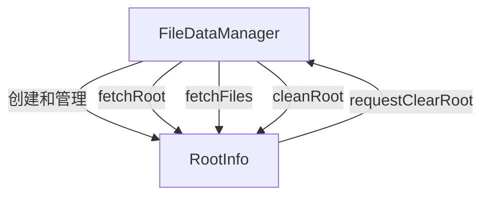
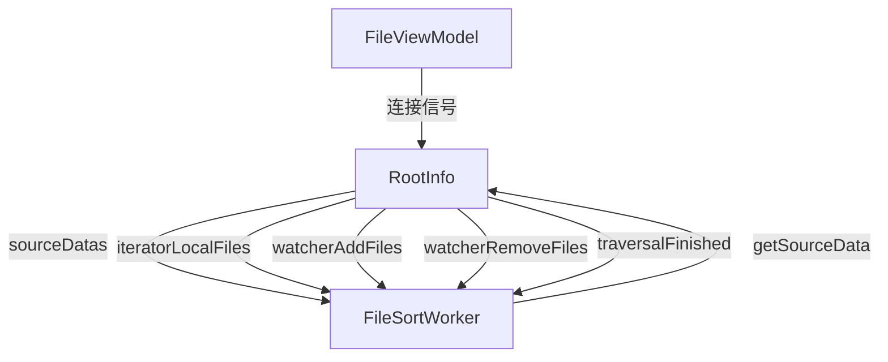

# RootInfo 现状分析文档

## 概述

`RootInfo` 是 `dfmplugin-workspace` 插件中的核心类，负责管理目录的文件数据、文件监控和多线程遍历。然而，该类目前存在严重的架构问题，违反了多项设计原则，代码混乱且难以维护。

## 核心职责分析

### 主要职责

1. **目录文件数据管理**
   - 维护目录下的文件列表 (`childrenUrlList`, `sourceDataList`)
   - 提供文件信息的缓存机制
   - 管理文件排序和过滤逻辑

2. **多线程目录遍历**
   - 管理多个 `TraversalDirThreadManager` 线程
   - 处理异步目录遍历结果
   - 支持缓存和增量更新

3. **文件系统监控**
   - 管理 `AbstractFileWatcher` 实例
   - 处理文件创建、删除、修改、重命名事件
   - 批量处理文件系统事件

4. **搜索关键字处理**
   - 集成 `KeywordExtractor` 进行关键字提取
   - 支持多种搜索模式（简单、布尔、通配符）

5. **信号中转站**
   - 向外部组件发送文件变更通知
   - 协调 UI 更新和数据同步

## 架构问题分析

### 违反 SOLID 原则

#### 1. 单一职责原则 (SRP) 违反
`RootInfo` 承担了过多职责：
- 文件数据管理
- 线程管理
- 文件监控
- 事件处理
- 搜索功能
- 缓存管理

#### 2. 开闭原则 (OCP) 违反
- 硬编码的事件类型 (`EventType` 枚举)
- 紧耦合的线程管理逻辑
- 难以扩展新的文件监控类型

#### 3. 依赖倒置原则 (DIP) 违反
- 直接依赖具体实现类 (`TraversalDirThreadManager`)
- 与 `FileDataManager` 紧耦合
- 缺乏抽象接口层

### 违反 KISS 原则

#### 复杂的线程管理
```cpp
// 复杂的线程状态管理
QMap<QString, QSharedPointer<DirIteratorThread>> traversalThreads;
QList<TraversalThreadPointer> discardedThread;
std::atomic_bool traversaling { false };
std::atomic_bool traversalFinish { false };
```

#### 复杂的事件处理逻辑
```cpp
void RootInfo::doWatcherEvent() {
    // 200+ 行的复杂事件处理逻辑
    // 包含多重嵌套循环、复杂的状态检查
    // 原子操作与普通变量混用
}
```

### 违反 DRY 原则

#### 重复的信号连接代码
在 `FileViewModel` 中存在大量重复的信号连接代码：
```cpp
// 在多个地方重复出现相同的连接模式
connect(root, &RootInfo::sourceDatas, filterSortWorker.data(), &FileSortWorker::handleSourceChildren, Qt::QueuedConnection);
connect(root, &RootInfo::iteratorLocalFiles, filterSortWorker.data(), &FileSortWorker::handleIteratorLocalChildren, Qt::QueuedConnection);
// ... 更多重复连接
```

#### 重复的文件信息处理逻辑
```cpp
// addChildren 有多个重载版本，逻辑重复
void addChildren(const QList<QUrl> &urlList);
void addChildren(const QList<FileInfoPointer> &children);
void addChildren(const QList<SortInfoPointer> &children);
```

## 线程安全问题

### 原子变量滥用
```cpp
std::atomic_bool traversalFinish { false };
std::atomic_bool traversaling { false };
std::atomic_bool isFirstBatch { false };
std::atomic_bool cancelWatcherEvent { false };
std::atomic_bool processFileEventRuning { false };
std::atomic_bool needStartWatcher { true };
std::atomic_bool isRefresh { false };
std::atomic_bool isDying { false };
```

### 锁机制混乱
- `QReadWriteLock childrenLock` 用于保护文件列表
- `QMutex watcherEventMutex` 用于保护事件队列
- 原子变量与锁混用，增加了复杂性

### 线程间通信复杂
- 使用 `QtConcurrent::run` 创建临时线程
- 复杂的信号槽连接（`Qt::DirectConnection` vs `Qt::QueuedConnection`）
- 线程生命周期管理困难

## 外部交互分析

### 与 FileDataManager 的交互


### 与 FileViewModel 的交互


### 与 TraversalDirThreadManager 的交互


## 信号接口分析

### 对外发送的信号（共13个）
1. **数据相关信号**
   - `iteratorLocalFiles` - 本地文件迭代完成
   - `iteratorAddFiles` - 添加文件到迭代器
   - `iteratorUpdateFiles` - 更新文件信息
   - `sourceDatas` - 源数据获取完成

2. **监控相关信号**
   - `watcherAddFiles` - 监控到文件添加
   - `watcherRemoveFiles` - 监控到文件删除
   - `watcherUpdateFile` - 监控到单个文件更新
   - `watcherUpdateFiles` - 监控到多个文件更新
   - `watcherUpdateHideFile` - 监控到隐藏文件更新

3. **控制相关信号**
   - `traversalFinished` - 遍历完成
   - `requestSort` - 请求排序
   - `requestCloseTab` - 请求关闭标签页
   - `requestClearRoot` - 请求清理根目录

### 接收的槽函数（共12个）
1. **文件监控槽**
   - `doFileDeleted` - 处理文件删除
   - `dofileMoved` - 处理文件移动
   - `dofileCreated` - 处理文件创建
   - `doFileUpdated` - 处理文件更新

2. **事件处理槽**
   - `doWatcherEvent` - 处理监控事件（核心逻辑）
   - `doThreadWatcherEvent` - 线程化监控事件处理

3. **遍历结果处理槽**
   - `handleTraversalResults` - 处理遍历结果
   - `handleTraversalResultsUpdate` - 处理遍历结果更新
   - `handleTraversalLocalResult` - 处理本地遍历结果
   - `handleTraversalFinish` - 处理遍历完成
   - `handleTraversalSort` - 处理遍历排序请求
   - `handleGetSourceData` - 处理获取源数据请求

## 关键问题总结

### 1. 代码复杂度过高
- 单个类承担过多职责
- 方法过长（`doWatcherEvent` 200+ 行）
- 嵌套层次过深
- 状态管理复杂

### 2. 线程安全设计混乱
- 原子变量与锁混用
- 线程生命周期管理困难
- 信号槽连接类型不一致
- 竞态条件风险

### 3. 可维护性差
- 紧耦合设计
- 缺乏清晰的抽象层
- 重复代码多
- 扩展性差

### 4. 测试困难
- 依赖注入困难
- 状态复杂难以模拟
- 多线程测试复杂

## 重构建议方向

### 1. 职责分离
- 将文件数据管理、线程管理、事件处理分离为独立组件
- 引入领域模型和服务层

### 2. 引入抽象接口
- 定义文件监控接口
- 定义数据管理接口
- 定义事件处理接口

### 3. 简化线程模型
- 统一线程管理策略
- 简化线程间通信
- 改进生命周期管理

### 4. 改进事件处理
- 引入事件总线模式
- 简化事件处理逻辑
- 提高事件处理的可测试性

### 5. 优化外部接口
- 减少信号数量
- 简化连接逻辑
- 提供更高层次的抽象

## 详细架构图

上面的 Mermaid 图展示了 RootInfo 类的复杂交互关系，可以清晰地看到：

1. **中心化问题**：RootInfo 成为了所有组件的中心，违反了分布式设计原则
2. **依赖关系复杂**：与多个外部组件和内部子系统都有直接依赖
3. **线程管理混乱**：同时管理多种类型的线程和并发任务
4. **状态管理复杂**：包含8个原子布尔变量和多个锁机制

## 具体代码问题示例

### 1. 过长的方法 - doWatcherEvent()

```cpp
void RootInfo::doWatcherEvent() {
    // 使用原子性的 test_and_set 操作
    bool expected = false;
    if (!processFileEventRuning.compare_exchange_strong(expected, true)) {
        return;   // 已经有其他线程在运行，直接返回
    }

    QElapsedTimer timer;
    timer.start();
    QList<QUrl> adds, updates, removes;
    qint64 oldtime = 0;
    int emptyLoopCount = 0;
    
    // 200+ 行的复杂逻辑...
    while (checkFileEventQueue() || timer.elapsed() < 200) {
        // 复杂的嵌套逻辑
        if (timer.elapsed() - oldtime >= 200) {
            // 批量处理逻辑
            if (!adds.isEmpty()) {
                addChildren(adds);
            }
            // 更多复杂逻辑...
        }
        // 更多嵌套条件...
    }
    processFileEventRuning.store(false);
}
```

**问题**：
- 方法过长（200+ 行）
- 职责过多（事件处理、批量操作、状态管理）
- 嵌套过深
- 难以测试和维护

### 2. 复杂的线程管理

```cpp
struct DirIteratorThread {
    TraversalThreadManagerPointer traversalThread { nullptr };
    dfmio::DEnumerator::SortRoleCompareFlag originSortRole;
    Qt::SortOrder originSortOrder { Qt::AscendingOrder };
    bool originMixSort { false };
};

QMap<QString, QSharedPointer<DirIteratorThread>> traversalThreads;
QList<TraversalThreadPointer> discardedThread;
QList<QFuture<void>> watcherEventFutures;
```

**问题**：
- 多种线程管理机制混用
- 生命周期管理复杂
- 内存泄漏风险
- 难以调试

### 3. 信号槽过多

```cpp
// 13个对外信号
Q_SIGNALS:
    void iteratorLocalFiles(...);
    void iteratorAddFiles(...);
    void iteratorUpdateFiles(...);
    void watcherAddFiles(...);
    void watcherRemoveFiles(...);
    void traversalFinished(...);
    void sourceDatas(...);
    // ... 更多信号

// 12个槽函数
public Q_SLOTS:
    void doFileDeleted(const QUrl &url);
    void dofileMoved(const QUrl &fromUrl, const QUrl &toUrl);
    void dofileCreated(const QUrl &url);
    // ... 更多槽函数
```

**问题**：
- 接口过于复杂
- 职责不清晰
- 外部组件需要连接大量信号
- 难以维护和扩展

## 性能问题

### 1. 频繁的锁操作
```cpp
void RootInfo::addChild(const FileInfoPointer &child) {
    QWriteLocker lk(&childrenLock);  // 每次添加都要加锁
    childrenUrlList.append(childUrl);
    sourceDataList.append(sort);
}
```

### 2. 不必要的原子操作
```cpp
// 8个原子布尔变量，增加了内存访问开销
std::atomic_bool traversalFinish { false };
std::atomic_bool traversaling { false };
std::atomic_bool isFirstBatch { false };
// ... 更多原子变量
```

### 3. 频繁的信号发射
```cpp
// 在批量操作中频繁发射信号
for (const auto &info : children) {
    auto sortInfo = addChild(info);
    if (!sortInfo) continue;
    sortInfos.append(sortInfo);
    infos.append(info);
}
// 每次批量操作都发射信号
Q_EMIT iteratorAddFiles(travseToken, sortInfos, infos, isFirst);
```

## 测试困难

### 1. 依赖注入困难
- 硬编码的依赖关系
- 无法轻松模拟外部组件
- 单元测试需要真实的文件系统

### 2. 状态复杂
- 8个原子变量的组合状态
- 多线程环境下的状态变化
- 时序相关的测试困难

### 3. 副作用多
- 文件系统操作
- 线程创建和销毁
- 信号发射的副作用

## 重构优先级

### 高优先级（立即处理）
1. **拆分 doWatcherEvent 方法**
   - 提取事件处理策略
   - 简化批量操作逻辑
   - 改进错误处理

2. **简化线程管理**
   - 统一线程池管理
   - 简化生命周期
   - 改进异常处理

### 中优先级（短期内处理）
3. **减少信号数量**
   - 合并相关信号
   - 引入事件对象
   - 简化外部连接

4. **改进数据管理**
   - 分离数据模型
   - 改进缓存策略
   - 优化锁机制

### 低优先级（长期规划）
5. **架构重构**
   - 引入领域模型
   - 实现依赖注入
   - 改进抽象层次

这份详细分析为 RootInfo 类的重构提供了全面的问题识别和具体的改进建议，有助于制定科学的重构计划。 