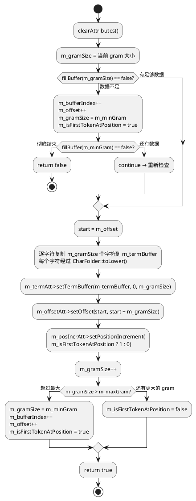
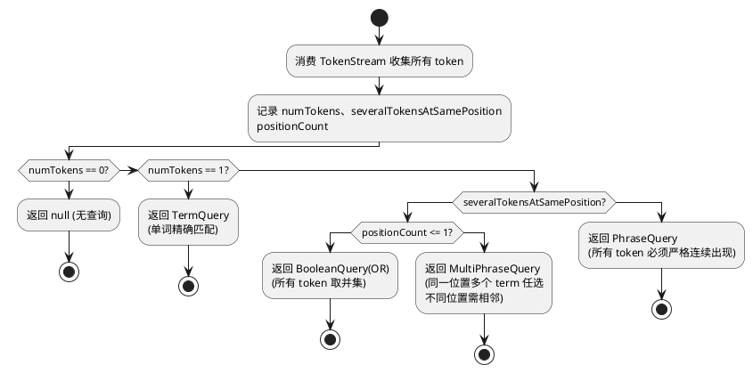
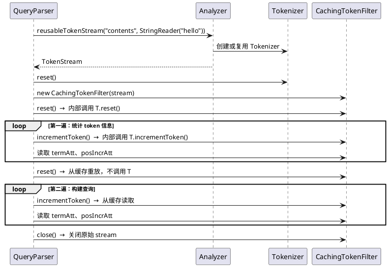
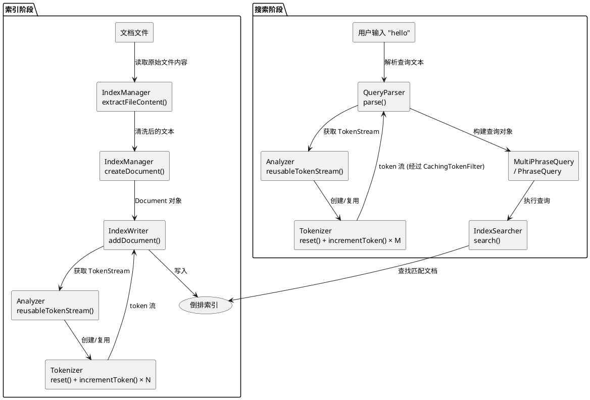

# NGramAnalyzer 与 NGramTokenizer 设计与实现

## 1. 概述

本文档详细讲解如何在 lucene++ 中从零实现一个自定义分词器（Analyzer + Tokenizer），
并以 NGram 分词器为例，覆盖以下内容：

- lucene++ 分词体系的核心类层次与 API
- Tokenizer 的实现要点与踩坑记录
- Analyzer 的实现与 Token 复用机制
- 分词器如何被 QueryParser 和 IndexWriter 消费
- lucene++ 头文件循环依赖问题及解决方案

---

## 2. lucene++ 分词体系类层次

### 2.1 核心继承关系

```plantuml
@startuml
abstract class LuceneObject
  + shared_from_this() : shared_ptr
  + getClassName() : String

abstract class LuceneSync
  + getSync() : SynchronizePtr
  + lock(timeout : int32)
  + unlock()

abstract class AttributeSource
  + addAttribute<T>() : T
  + getAttribute<T>() : T
  + clearAttributes()
  + captureState() : AttributeSourceState
  + restoreState(state : AttributeSourceState)

class AttributeFactory
  + createAttributeInstance(className : String) : AttributePtr

LuceneObject <|-- LuceneSync
LuceneObject <|-- AttributeSource
AttributeSource o-- AttributeFactory

abstract class TokenStream
  + incrementToken() : bool  <i>「纯虚函数，核心接口」</i>
  + reset()
  + end()
  + close()

AttributeSource <|-- TokenStream

abstract class Tokenizer
  # input : ReaderPtr
  # charStream : CharStreamPtr
  + close()
  + correctOffset(currentOff : int32) : int32
  + reset(input : ReaderPtr)

TokenStream <|-- Tokenizer

abstract class Analyzer
  # tokenStreams : CloseableThreadLocal
  + tokenStream(fieldName, reader) : TokenStreamPtr  <i>「纯虚函数」</i>
  + reusableTokenStream(fieldName, reader) : TokenStreamPtr
  + getPositionIncrementGap(fieldName) : int32
  + close()

LuceneObject <|-- Analyzer

class Attribute
  + clear()
  + clone() : LuceneObjectPtr

class TermAttribute
  + setTermBuffer(buffer, offset, length)
  + term() : String

class OffsetAttribute
  + setOffset(startOffset, endOffset)
  + startOffset() : int32
  + endOffset() : int32

class PositionIncrementAttribute
  + setPositionIncrement(positionIncrement)
  + getPositionIncrement() : int32

Attribute <|-- TermAttribute
Attribute <|-- OffsetAttribute
Attribute <|-- PositionIncrementAttribute

Tokenizer o-- TermAttribute
Tokenizer o-- OffsetAttribute
Tokenizer o-- PositionIncrementAttribute

Analyzer ..> TokenStream : 「创建并返回」
Tokenizer ..> Reader : 「消费字符流」
@enduml
```

### 2.2 各类的职责

| 类 | 职责 | 你需要做什么 |
|---|---|---|
| `Analyzer` | 分词策略的入口，负责创建 TokenStream | 实现 `tokenStream()`，可选覆盖 `reusableTokenStream()` |
| `Tokenizer` | 从 `Reader`（字符流）读取原始文本并切分为 token | 实现 `incrementToken()` |
| `TokenFilter` | 接收上游 TokenStream 的 token 并做变换 | 按需实现，可串联 |
| `TokenStream` | 抽象基类，定义了 token 流的生命周期协议 | 不直接继承 |
| `AttributeSource` | 管理当前 token 的属性集合 | 不直接操作，通过 `addAttribute<T>()` 使用 |
| `TermAttribute` | 存储当前 token 的文本内容 | 通过 `setTermBuffer()` 写入 |
| `OffsetAttribute` | 存储当前 token 在原文中的起止位置 | 通过 `setOffset()` 写入 |
| `PositionIncrementAttribute` | 当前 token 相对于前一个 token 的位置增量 | 通过 `setPositionIncrement()` 写入 |

### 2.3 LUCENE_CLASS 宏

lucene++ 的所有类都必须在 `public` 声明区域放置 `LUCENE_CLASS(ClassName)` 宏。
它的定义在 `LuceneObject.h` 中：

```cpp
#define LUCENE_CLASS(Name) \
    LUCENE_INTERFACE(Name); \
    boost::shared_ptr<Name> shared_from_this() { \
        return boost::static_pointer_cast<Name>(LuceneObject::shared_from_this()); \
    }
```

作用：
1. 声明 `_getClassName()` / `getClassName()` 返回类名字符串（用于 RTTI）
2. 提供类型安全的 `shared_from_this()` 强转

**如果不加这个宏**，编译可能通过但运行时 `dynamic_pointer_cast` 会失败，导致
`reusableTokenStream` 的缓存逻辑出错。

---

## 3. TokenStream 的生命周期协议

TokenStream 有一套固定的使用协议，消费者（IndexWriter、QueryParser 等）按如下顺序调用：

```plantuml
@startuml
participant "消费者\n(IndexWriter/QueryParser)" as Consumer
participant Tokenizer

note over Consumer
  创建 Tokenizer 实例
  （通过 Analyzer::tokenStream 或 reusableTokenStream）
end note

Consumer -> Tokenizer : reset()
note right of Tokenizer
  重置内部状态到初始位置。
  重要：这个方法可能被调用多次！
  实现必须保证多次调用是安全的。
end note

Consumer -> Tokenizer : incrementToken()
note right of Tokenizer
  前进到下一个 token。
  返回 true = 有下一个 token，
  返回 false = 流结束。
  必须在方法开头调用 clearAttributes()。
end note

Consumer -> Tokenizer : incrementToken()
Consumer -> Tokenizer : incrementToken()
... (循环直到返回 false)

Consumer -> Tokenizer : end()
note right of Tokenizer
  流结束后的收尾操作。
  通常用于设置最终的 offset。
end note

Consumer -> Tokenizer : close()
note right of Tokenizer
  释放资源。Tokenizer 基类默认关闭 input Reader。
end note
@enduml
```

### 3.1 `incrementToken()` 内部必须做的事

```cpp
bool MyTokenizer::incrementToken()
{
    // 1. 必须先清除所有属性的值
    clearAttributes();

    // 2. 读取下一个 token 的内容...
    //    如果已经没有数据，返回 false
    if (/* 没有更多 token */)
        return false;

    // 3. 设置属性值
    m_termAtt->setTermBuffer(...);       // token 文本
    m_offsetAtt->setOffset(start, end);  // 在原文中的位置

    // 4. 返回 true 表示成功产生了一个 token
    return true;
}
```

---

## 4. NGramTokenizer 的设计

### 4.1 NGram 分词原理

N-Gram 是一种将字符串按固定长度窗口切分的算法。对于输入文本，滑动窗口从每个字符位置开始，
产生 minGram 到 maxGram 长度的所有子串。

例如，输入 `"hello"`，minGram=2，maxGram=4：

| 起始位置 | 2-gram | 3-gram | 4-gram |
|---------|--------|--------|--------|
| 0 (h) | he | hel | hell |
| 1 (e) | el | ell | ello |
| 2 (l) | ll | llo | — |
| 3 (l) | lo | — | — |
| 4 (o) | — | — | — |

共 9 个 token。

### 4.2 核心数据结构

```cpp
class NGramTokenizer : public Tokenizer
{
private:
    int32_t m_minGram;        // 最小 gram 长度 (如 2)
    int32_t m_maxGram;        // 最大 gram 长度 (如 4)

    CharArray m_ioBuffer;     // IO 缓冲区，从 Reader 读取的数据暂存
    int32_t m_ioLen;          // 缓冲区中有效数据长度
    int32_t m_bufferIndex;    // 当前读取位置（缓冲区内的游标）
    bool m_inputExhausted;    // Reader 是否已读完

    int32_t m_offset;         // 逻辑流中的绝对偏移（用于 OffsetAttribute）
    int32_t m_gramSize;       // 当前正在生成的 gram 大小
    CharArray m_termBuffer;   // 当前 token 的字符缓冲

    // 三种 Attribute（通过 addAttribute 获取）
    TermAttributePtr m_termAtt;
    OffsetAttributePtr m_offsetAtt;
    PositionIncrementAttributePtr m_posIncrAtt;
    bool m_isFirstTokenAtPosition;
};
```

### 4.3 构造函数

```cpp
NGramTokenizer::NGramTokenizer(const ReaderPtr& input, int32_t minGram, int32_t maxGram)
    : Tokenizer(input)          // 基类会将 input 用 CharReader 包装后存入 this->input
    , m_minGram(minGram)
    , m_maxGram(maxGram)
    , m_isFirstTokenAtPosition(true)
{
    init();
}

void NGramTokenizer::init()
{
    // 分配缓冲区
    m_ioBuffer = CharArray::newInstance(kIoBufferSize);   // 1024 wchar_t
    memset(m_ioBuffer.get(), 0, kIoBufferSize);
    m_termBuffer = CharArray::newInstance(m_maxGram);
    memset(m_termBuffer.get(), 0, m_maxGram);

    // 注册 Attribute
    m_termAtt = addAttribute<TermAttribute>();
    m_offsetAtt = addAttribute<OffsetAttribute>();
    m_posIncrAtt = addAttribute<PositionIncrementAttribute>();
}
```

**关于 `Tokenizer(input)` 基类构造函数的行为**（源码位于 `Tokenizer.cpp`）：

```cpp
Tokenizer::Tokenizer(const ReaderPtr& input) {
    this->input = CharReader::get(input);   // 用 CharReader 包装原始 Reader
    this->charStream = boost::dynamic_pointer_cast<CharStream>(this->input);
}
```

`CharReader::get()` 会检查 input 是否已经是 CharStream，如果是就直接用，否则包装一层。
包装后的 `CharReader` 只是代理调用原始 Reader 的 `read()` 方法。

### 4.4 惰性读取：`fillBuffer()`

**设计决策：不在 `reset()` 中一次性读取全部输入，改为在 `incrementToken()` 中按需读取。**

原因：lucene++ 的 QueryParser 在 `getFieldQuery()` 中会调用两次 `reset()`：

```cpp
// QueryParser.cpp 第 299-300 行
source = analyzer->reusableTokenStream(field, newLucene<StringReader>(queryText));
source->reset();  // ← 第二次 reset！
```

如果在 `reset()` 中一次性 `input->read()` 消费完 Reader，第二次 `reset()` 时 Reader
已到 EOF，无法再产生任何 token。

惰性读取的实现：

```cpp
bool NGramTokenizer::fillBuffer(int32_t need)
{
    // 已有足够数据则直接返回
    int32_t available = m_ioLen - m_bufferIndex;
    if (available >= need)
        return true;

    if (m_inputExhausted)
        return false;

    // 将未读数据移到缓冲区前端（滑动窗口紧凑化）
    if (m_bufferIndex > 0) {
        int32_t remaining = m_ioLen - m_bufferIndex;
        if (remaining > 0)
            memmove(m_ioBuffer.get(), m_ioBuffer.get() + m_bufferIndex,
                    remaining * sizeof(wchar_t));
        m_ioLen = remaining;
        m_bufferIndex = 0;
    }

    // 从 Reader 继续读取直到填满缓冲区或读完
    while (m_ioLen < kIoBufferSize) {
        int32_t read = input->read(m_ioBuffer.get(), m_ioLen,
                                   kIoBufferSize - m_ioLen);
        if (read == -1) {
            m_inputExhausted = true;
            break;
        }
        m_ioLen += read;
        if (m_ioLen - m_bufferIndex >= need)
            return true;
    }

    return (m_ioLen - m_bufferIndex) >= need;
}
```

数据流示意（缓冲区大小 10，need=3）：

```
初始状态:  bufferIndex=0, ioLen=0
                    v
              [..........]

Reader 读入 "hello world" (11 chars):
              [h e l l o   w o r l d .]
              ^                ^
              bufferIndex=0     ioLen=11

消费 2 个字符后:
              [h e l l o   w o r l d .]
                    ^            ^
                    bufferIndex=2 ioLen=11
              available = 11 - 2 = 9

需要 10 个字符时 (need=10, available=9):
1. compact: memmove 把 "lloworld" 移到前端
              [l l o w   w o r l d . .]
              ^                       ^
              bufferIndex=0            ioLen=9
2. 继续读取，把 "." 读入
              [l l o w   w o r l d . .]
              ^                        ^
              bufferIndex=0              ioLen=10
```

### 4.5 `reset()` 实现

```cpp
void NGramTokenizer::reset()
{
    Tokenizer::reset();          // 基类 TokenStream::reset() 默认空操作
    m_bufferIndex = 0;          // 缓冲区游标归零
    m_ioLen = 0;                 // 清空缓冲区长度
    m_inputExhausted = false;   // 重置 EOF 标记
    m_offset = 0;               // 逻辑偏移归零
    m_gramSize = m_minGram;      // gram 大小回到最小值
    m_isFirstTokenAtPosition = true;
}
```

**关键：`reset()` 不读取任何数据。** 只重置状态，让 `incrementToken()` 通过 `fillBuffer()` 按需读取。
这样即使 `reset()` 被多次调用也是安全的。

### 4.6 `incrementToken()` 实现 — 核心算法



以输入 `"list"` (minGram=2, maxGram=2) 为例的执行轨迹：

```
incrementToken() #1:
  m_bufferIndex=0, m_gramSize=2
  fillBuffer(2) → buffer="list", available=4 ≥ 2 ✓
  复制 buffer[0..1] → "li" (toLower 不变)
  termAtt="li", offset=(0,2), posIncr=1 (isFirst=true)
  gramSize 2→3 > maxGram=2, 所以 gramSize→2, bufferIndex→1, isFirst→true
  return true → token: "li"

incrementToken() #2:
  m_bufferIndex=1, m_gramSize=2
  fillBuffer(2) → available=3 ≥ 2 ✓
  复制 buffer[1..2] → "is"
  termAtt="is", offset=(1,3), posIncr=1 (isFirst=true)
  gramSize 2→3 > 2, gramSize→2, bufferIndex→2, isFirst→true
  return true → token: "is"

incrementToken() #3:
  m_bufferIndex=2, m_gramSize=2
  fillBuffer(2) → available=2 ≥ 2 ✓
  复制 buffer[2..3] → "st"
  termAtt="st", offset=(2,4), posIncr=1
  gramSize→2, bufferIndex→3, isFirst→true
  return true → token: "st"

incrementToken() #4:
  m_bufferIndex=3, m_gramSize=2
  fillBuffer(2) → available=1 < 2 ✗
  bufferIndex→4, offset→4, gramSize→2, isFirst→true
  fillBuffer(2) → available=0 < 2 ✗
  return false → 流结束
```

### 4.7 PositionIncrementAttribute 的重要性

`PositionIncrementAttribute` 决定了 token 在倒排索引中的"位置"。默认值为 1，
表示"下一个位置"。设为 0 表示"和前一个 token 在同一位置"。

**为什么 NGramTokenizer 必须设置这个属性？**

因为 QueryParser 的 `getFieldQuery()` 会根据分词结果自动选择查询类型：



如果**不设置** `PositionIncrementAttribute`，每个 token 的 `positionIncrement` 默认为 1：

搜索 `"list"` → 分词产生 `["li", "is", "st"]` → `positionCount=3`,
`severalTokensAtSamePosition=false` → **PhraseQuery**

PhraseQuery 要求 `"li" "is" "st"` 三个词在索引中严格连续出现在相邻位置。
但 NGram 分词后的索引中，这三个词虽然确实是相邻的（pos0, pos1, pos2），
但如果 minGram > 1，对于搜索短语来说会产生多个 token 导致不必要的位置约束。

**设置了 `PositionIncrementAttribute` 后**：

搜索 `"list"` → 分词产生 `["li"(pos0), "is"(pos1), "st"(pos2)]`
（每个 token 的 positionIncrement=1，和上面相同，因为 minGram=2 只有 bigram）

但如果 minGram=2, maxGram=4，搜索 `"list"` 会产生 6 个 token：
`"li"(pos0), "lis"(pos0), "list"(pos0), "is"(pos1), "ist"(pos1), "st"(pos2)`

- 第 1 个 token: posIncrement=1 → 新位置 pos0
- 第 2 个 token: posIncrement=0 → 同位置 pos0
- 第 3 个 token: posIncrement=0 → 同位置 pos0
- 第 4 个 token: posIncrement=1 → 新位置 pos1
- ...

`severalTokensAtSamePosition=true`, `positionCount=3` → **MultiPhraseQuery**

MultiPhraseQuery 构建如下查询：
- pos 0: `["li", "lis", "list"]` 任选一个
- pos 1: `["is", "ist"]` 任选一个
- pos 2: `["st"]`

这是一个**松散的短语查询**，比 PhraseQuery 更灵活，适合 NGram 分词的语义。

### 4.8 大小写处理

```cpp
for (int32_t i = 0; i < m_gramSize; ++i) {
    m_termBuffer[i] = CharFolder::toLower(m_ioBuffer[m_bufferIndex + i]);
}
```

使用 `CharFolder::toLower()` 将每个字符转为小写。这确保索引和搜索时大小写一致，
使得搜索 `"List"` 和 `"list"` 产生相同的 token `"list"`。

`CharFolder` 是 lucene++ 提供的 Unicode 大小写转换工具，定义在 `CharFolder.h` 中。

### 4.9 `end()` 实现

```cpp
void NGramTokenizer::end()
{
    int32_t finalOffset = correctOffset(m_offset);
    m_offsetAtt->setOffset(finalOffset, finalOffset);
}
```

`end()` 在所有 token 消费完毕后被调用。设置最终 offset，表示流的结束位置。
`correctOffset()` 是 `Tokenizer` 基类提供的方法，如果 input 是 CharStream 会做偏移校正。

---

## 5. NGramAnalyzer 的设计

### 5.1 Analyzer 的职责

Analyzer 是分词策略的工厂/门面，它本身不做分词，而是：
1. 创建 Tokenizer（和可选的 TokenFilter 链）
2. 管理可复用的 TokenStream（性能优化）

### 5.2 `tokenStream()` — 每次创建新实例

```cpp
TokenStreamPtr NGramAnalyzer::tokenStream(const String& fieldName, const ReaderPtr& reader)
{
    return newLucene<NGramTokenizer>(reader, m_minGram, m_maxGram);
}
```

这是最简单的实现：每次调用都创建一个新的 Tokenizer。

`newLucene<T>(args...)` 是 lucene++ 的工厂宏，等价于 `boost::make_shared<T>(args...)`，
用于创建 `boost::shared_ptr<T>` 管理的对象。

### 5.3 `reusableTokenStream()` — 复用 TokenStream

```cpp
TokenStreamPtr NGramAnalyzer::reusableTokenStream(const String& fieldName, const ReaderPtr& reader)
{
    LuceneObjectPtr prev = getPreviousTokenStream();
    TokenizerPtr saved(boost::dynamic_pointer_cast<Tokenizer>(prev));

    if (!saved) {
        // 第一次调用：创建新 Tokenizer 并缓存
        saved = newLucene<NGramTokenizer>(reader, m_minGram, m_maxGram);
        setPreviousTokenStream(saved);
    } else {
        // 后续调用：复用缓存的 Tokenizer，仅更换输入
        saved->reset(reader);
    }
    return saved;
}
```

```plantuml
@startuml
participant "IndexWriter" as IW
participant Analyzer as A
participant "getPreviousTokenStream()" as GPS
participant Tokenizer as T

note over A, GPS
  tokenStreams 是 CloseableThreadLocal<LuceneObject>
  实现了线程本地存储：每个线程独立缓存
end note

IW -> A : reusableTokenStream(field, reader)
A -> GPS : getPreviousTokenStream()
GPS --> A : prev (第一次为 null)

alt 第一次调用
  A -> T : newLucene<NGramTokenizer>(reader)
  A -> GPS : setPreviousTokenStream(tokenizer)
else 后续调用（同一线程）
  A -> T : reset(reader)
  note right of T\n  基类 Tokenizer::reset(reader) 仅设置\n  this->input = reader\n  不调用无参 reset()\n  随后消费者会调用 source->reset()\n  即我们的 NGramTokenizer::reset()\n  end note
end

A --> IW : return tokenizer
IW -> T : reset()
IW -> T : incrementToken() [循环]
IW -> T : end()
IW -> T : close()
@enduml
```

**`getPreviousTokenStream()` 和 `setPreviousTokenStream()` 的实现：**

```cpp
// Analyzer.cpp
LuceneObjectPtr Analyzer::getPreviousTokenStream() {
    return tokenStreams.get();   // CloseableThreadLocal::get()
}

void Analyzer::setPreviousTokenStream(const LuceneObjectPtr& stream) {
    tokenStreams.set(stream);   // CloseableThreadLocal::set()
}
```

`CloseableThreadLocal` 使用线程本地存储（thread-local storage），确保每个线程
有独立的缓存，不会产生并发问题。

### 5.4 为什么用 `boost::dynamic_pointer_cast<Tokenizer>` 而非 `NGramTokenizer`

因为 `getPreviousTokenStream()` 返回的是 `LuceneObjectPtr`（基类指针），
需要向下转型。使用 `Tokenizer` 作为中间类型是因为 `saved->reset(reader)` 调用的是
`Tokenizer::reset(ReaderPtr)` 基类方法（只设置 `this->input`），这是所有 Tokenizer
共有的行为，无需转型到具体子类。

**为什么不用 `NGramTokenizerPtr`？** 因为 `LUCENE_CLASS` 宏只对在 lucene++ 核心库中
通过 `DECLARE_SHARED_PTR` 声明的类自动生成 `Ptr` typedef。我们自定义的类没有注册到
这个系统，所以 `NGramTokenizerPtr` 不存在。使用 `TokenizerPtr` 是等价且正确的。

---

## 6. 分词器如何被 lucene++ 消费

### 6.1 索引阶段：IndexWriter → DocInverterPerField

当调用 `IndexWriter::addDocument(doc)` 时，内部的 `DocInverterPerField`
负责将 Document 中的每个字段分词并写入倒排索引。

核心代码（`DocInverterPerField.cpp`）：

```cpp
// 第 113 行：获取 TokenStream
stream = docState->analyzer->reusableTokenStream(fieldInfo->name, reader);

// 第 117 行：重置到起始位置
stream->reset();

// 第 125-174 行：循环消费所有 token
while (true) {
    if (!stream->incrementToken())
        break;

    // 读取 positionIncrement，更新文档内的 position 计数器
    int32_t posIncr = posIncrAttribute->getPositionIncrement();
    fieldState->position += posIncr;

    // 将 token 写入倒排索引
    consumer->add();

    ++fieldState->position;
    offsetEnd = fieldState->offset + offsetAttribute->endOffset();
}
```

**关键观察**：IndexWriter 在获取 TokenStream 后立即调用 `reset()`，
然后循环调用 `incrementToken()` 直到返回 false。这就是为什么 `reset()` 必须
是安全的（可多次调用）且 `incrementToken()` 必须是高效的。

### 6.2 搜索阶段：QueryParser → Analyzer

当用户搜索 `"hello world"` 时，QueryParser 需要将查询文本分词来构建查询对象。

核心流程（`QueryParser.cpp`）：

```cpp
QueryPtr QueryParser::getFieldQuery(const String& field, const String& queryText) {
    // 步骤 1：获取 TokenStream
    source = analyzer->reusableTokenStream(field, newLucene<StringReader>(queryText));

    // 步骤 2：立即 reset
    source->reset();

    // 步骤 3：用 CachingTokenFilter 包装，缓存所有 token
    CachingTokenFilterPtr buffer(newLucene<CachingTokenFilter>(source));
    buffer->reset();

    // 步骤 4：第一遍扫描 — 统计 token 数量、位置信息
    while (buffer->incrementToken()) {
        ++numTokens;
        int32_t posIncr = posIncrAtt ? posIncrAtt->getPositionIncrement() : 1;
        if (posIncr != 0)
            positionCount += posIncr;
        else
            severalTokensAtSamePosition = true;
    }

    // 步骤 5：倒回缓存
    buffer->reset();

    // 步骤 6：第二遍扫描 — 根据 token 特征构建查询类型
    if (numTokens == 1)
        return newTermQuery(...);       // TermQuery
    else if (severalTokensAtSamePosition) {
        if (positionCount <= 1)
            return BooleanQuery(OR);   // 布尔 OR 查询
        else
            return MultiPhraseQuery();  // 多词短语查询
    } else
        return PhraseQuery();           // 精确短语查询
}
```



### 6.3 完整数据流：从文档到搜索结果



---

## 7. 注册与集成

### 7.1 AnalyzerFactory 注册

 AnalyzerFactory 是一个简单的注册表模式，使用 `QHash<QString, AnalyzerInfo>` 存储所有注册的分词器：

```cpp
struct AnalyzerInfo {
    QString id;           // 唯一标识符，如 "ngram"
    QString displayName;  // UI 显示名称
    QString description;  // 描述
    std::function<Lucene::AnalyzerPtr()> creator;  // 工厂函数
};

// 注册
AnalyzerFactory::instance()->registerAnalyzer(
    "ngram",
    "NGram Analyzer (2-4)",
    "Generates n-gram tokens of sizes 2 to 4",
    []() { return newLucene<NGramAnalyzer>(2, 4); }
);
```

### 7.2 自动集成到 UI

MainWindow 的 `refreshAnalyzers()` 方法遍历 `AnalyzerFactory` 注册的所有分析器，
为每个分析器创建一个 Tab 页：

```cpp
void MainWindow::refreshAnalyzers()
{
    QStringList analyzers = AnalyzerFactory::instance()->registeredAnalyzers();
    for (const QString& analyzerId : analyzers) {
        AnalyzerTab* tab = new AnalyzerTab(analyzerId);
        m_tabWidget->addTab(tab, info.displayName);
    }
}
```

因此，注册新的 Analyzer 后，UI 自动出现对应的 Tab，无需修改界面代码。

---

## 8. 踩坑记录

### 8.1 lucene++ 头文件循环依赖

lucene++ 的头文件存在循环依赖：

```
Lucene.h → Collection.h → LuceneSync.h → Lucene.h (include guard 阻断)
```

如果直接 `#include <Tokenizer.h>`，包含链为：

```
Tokenizer.h → TokenStream.h → AttributeSource.h → ... → LuceneSync.h
  → Lucene.h → Collection.h → LuceneSync.h (guard 已定义，跳过！)
```

此时 `LuceneSync` 类体尚未被解析，导致 `Collection : public LuceneSync` 编译报错：
```
error: expected class-name before '{' token
```

**解决方案：始终通过 `<lucene++/LuceneHeaders.h>` 引入。** 它保证 `Lucene.h` 被完整解析，
后续的 `Collection.h → LuceneSync.h` 时 guard 命中，直接进入 `LuceneSync` 类定义。

```cpp
// ❌ 错误 — 触发循环依赖
#include <Tokenizer.h>
#include <Analyzer.h>

// ✅ 正确 — 通过统一入口引入
#include <lucene++/LuceneHeaders.h>
```

### 8.2 `reset()` 不可消费 Reader

如前所述，QueryParser 会调用 `source->reset()` 两次。如果在 `reset()` 中
调用 `input->read()` 消费 Reader，第二次 `reset()` 将读到 EOF。

**解决方案：在 `reset()` 中只重置状态，数据读取延迟到 `incrementToken()` 中。**

### 8.3 `Tokenizer::reset(ReaderPtr)` 不调用无参 `reset()`

基类实现（`Tokenizer.cpp`）：

```cpp
void Tokenizer::reset(const ReaderPtr& input) {
    this->input = input;  // 仅设置 input，不做其他事
}
```

这意味着当我们通过 `reusableTokenStream` 调用 `saved->reset(reader)` 时，
只有 `this->input` 被更新，我们自己的状态变量不会被重置。

但这是安全的，因为 QueryParser 在 `getFieldQuery` 中获取 TokenStream 后会显式调用
`source->reset()`（无参版本），这会触发我们的 `NGramTokenizer::reset()` 虚函数 override。

时序：
1. `reusableTokenStream` → `Tokenizer::reset(reader)` → 设置新 input
2. QueryParser → `source->reset()` → `NGramTokenizer::reset()` → 重置所有状态
3. QueryParser → `source->incrementToken()` → 按需从新 input 读取

### 8.4 构造函数中不要调用 `reset()`

`init()` 应该只做内存分配和 Attribute 注册，不要调用 `reset()`。原因：

1. 构造时 `Tokenizer(input)` 基类已设置好 `this->input`
2. 如果 `init()` 调用 `reset()` → `reset()` 调用 `input->read()` → 消费 Reader
3. 然后 QueryParser 又调用 `source->reset()` → 第二次 `input->read()` → EOF

**解决方案：`init()` 只做分配和注册，`reset()` 只重置状态变量。**

### 8.5 `newLucene` 与 `DECLARE_SHARED_PTR`

`newLucene<T>(args...)` 是 lucene++ 的对象创建宏，内部调用 `boost::make_shared<T>(args...)`。
返回 `T` 的 `shared_ptr`（即 `T` 的父类指针对应的 `Ptr` 类型）。

lucene++ 核心库通过 `DECLARE_SHARED_PTR(ClassName)` 宏为每个类生成 `ClassNamePtr` typedef。
自定义类不在核心库中声明，所以没有自动生成的 `Ptr` 类型。需要使用父类的 Ptr 类型
（如 `TokenizerPtr`、`AnalyzerPtr`）。

### 8.6 `CharArray` 的使用

`CharArray` 是 lucene++ 对 `boost::shared_ptr<wchar_t[]>` 的封装。创建方式：

```cpp
CharArray buf = CharArray::newInstance(size);  // 分配 size 个 wchar_t，初始值为 0
```

访问底层指针：

```cpp
buf.get()       // 返回 wchar_t*，可读写
buf[0]          // 通过 operator[] 访问
```

### 8.7 `clearAttributes()` 的重要性

`incrementToken()` 的第一行**必须**调用 `clearAttributes()`。它会清除所有已注册
Attribute 的值（将 TermAttribute 的 buffer 清零、OffsetAttribute 设为 0 等）。

如果不调用，上一次 token 的属性值可能残留在 Attribute 对象中。因为 lucene++ 的
Attribute 是复用的（同一个实例在多次 `incrementToken()` 间共享），不清除会导致
脏数据被传递给下游消费者。

---

## 9. 文件清单

| 文件 | 作用 |
|------|------|
| `tests/luceneindex/ngramtokenizer.h` | NGramTokenizer 类声明 |
| `tests/luceneindex/ngramtokenizer.cpp` | NGramTokenizer 实现 |
| `tests/luceneindex/ngramanalyzer.h` | NGramAnalyzer 类声明 |
| `tests/luceneindex/ngramanalyzer.cpp` | NGramAnalyzer 实现 |
| `tests/luceneindex/analyzerfactory.cpp` | 注册 NGramAnalyzer 到工厂 |

无需修改 CMakeLists.txt，因为它使用 `GLOB_RECURSE` 自动收集所有 `.h/.cpp` 文件。
